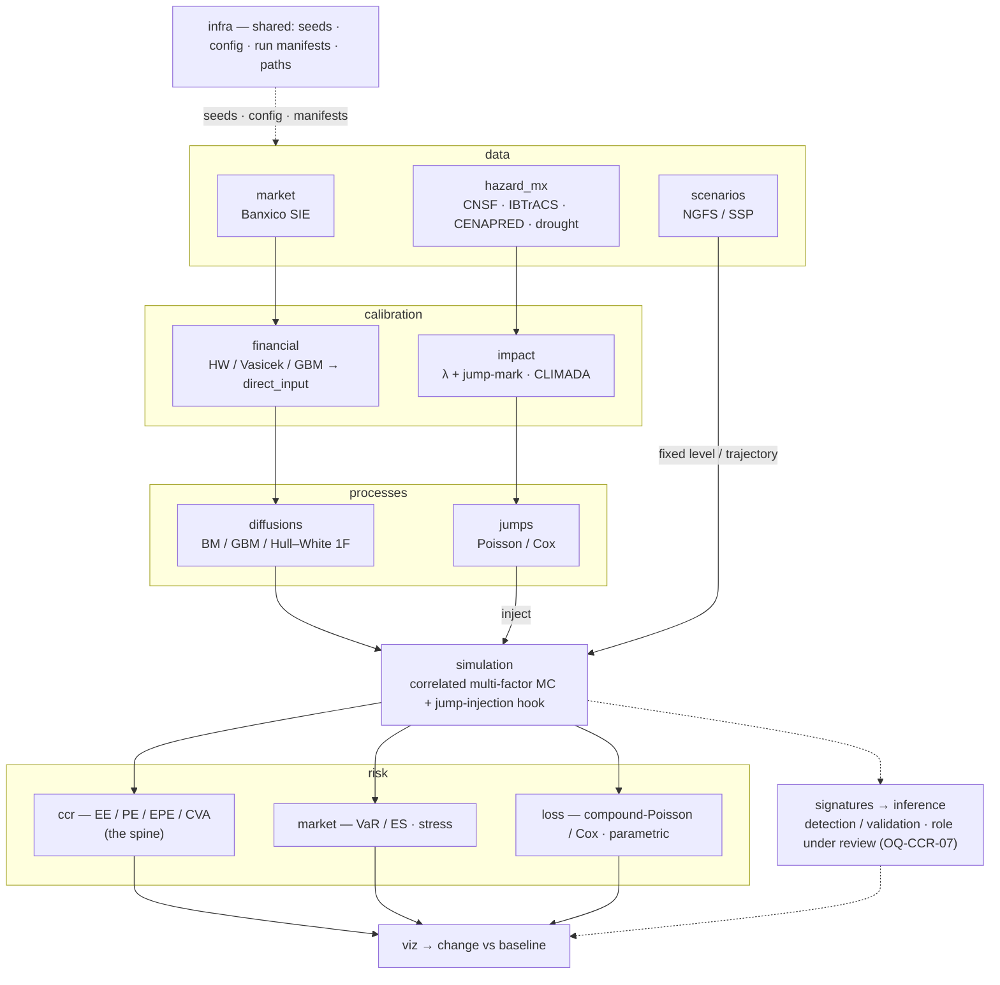

# climateCCR

> **Name:** `climateCCR` — the project keeps its original name (`INT-02`) even though scope now
> exceeds counterparty credit. Repo, distribution, and import package are all `climateCCR`.

A computational module that takes a financial institution through the full risk chain —
**data retrieval → calibration → simulation → risk metrics** — with **climate-related risk wired
into every stage**, applied to **Mexico**.

This repository unifies three previously-separate thesis workstreams into one installable package and
one reproducible workflow. **The counterparty-credit-risk (CCR) workstream is the architectural
spine**; the market/rate (MKT) and physical-hazard/insurance-loss (HAZ) workstreams feed the same
pipeline.

---

## The three arms

| Arm | Role in the machine | Origin project |
|---|---|---|
| **CCR — the framework & spine** | The installable `src/` package, the reproducible `infra` layer (seeding, config, run manifests, path resolution — *built and tested*), the **PIMPA** counterparty-credit exposure engine (EE/PE, netting, collateral) plus its multi-factor simulation structure, and a rough-path **signatures + inference** core (role now under review — `OQ-CCR-07`). Runs calibration → simulation → risk and reads out the change. | `Tesis QF` / `climateCCR` |
| **MKT — the calibration & simulation engine** | Hull–White / Vasicek calibration to Banxico SIE data (one risk-factor model alongside GBM, inside the shared stochastic subsystem), NGFS rate-shock translation, Monte-Carlo VaR/ES, a physical-risk exposure dashboard, a climate-credit overlay, and weather-derivative literature. | `financial_instruments` |
| **HAZ — the estimation engine for the climate↔price link** | Nature Mexican hazard & loss pipelines (CNSF, IBTrACS, CENAPRED, drought) that yield the **intensity `λ`** and the **impact/jump-mark** that drive the climate shock; CLIMADA subnational impact-function calibration; compound-Poisson/Cox loss modelling + parametric pricing. | `Climate-Nature-Risks_Calibration` |

The arms share **Mexico as the unit of analysis** and the **same reproducibility standard**, and they
form **one machine** with one objective: **find, test, and quantify a relationship between financial
asset prices / risk factors and climate events, and measure via Monte Carlo how financial risk changes
when climate is incorporated** (`INT-09`). The integrating mechanism is a **climate-driven jump
process** (`INT-10`): HAZ estimates the arrival intensity `λ` and the per-event impact; a
compound-Poisson / Cox jump carries those shocks through time and translates each into a move on a
diffusion — an asset price (**GBM**) or a risk factor (**Hull–White** rate); Monte Carlo over the
resulting **jump-diffusion** gives the climate-vs-baseline change in risk. Climate assumptions enter
as either a **fixed level** or a **trajectory** (`INT-12`).

---

## How the arms map onto the architecture

The CCR arm's layered design is kept; the other arms slot into the same layers. The `data`,
`calibration`, and `risk` layers are partitioned by arm so the layers stay coherent while each arm
keeps its own domain logic.

**End-to-end (the integrating path):** ingest market/scenario/hazard data → calibrate the diffusion
parameters into PIMPA's `'direct_input'` form (HW/GBM) **and** the climate `λ` + impact (HAZ) →
simulate a **jump-diffusion**: GBM/HW1F diffusion with a Poisson/Cox **climate jump** superimposed via
the injection hook → compute risk metrics → **read how risk changes vs a no-climate baseline**.
A climate assumption can be a **fixed** parameter shift (the old Path B) or a **trajectory** (a time
path of rates or of `λ(t)`). **HAZ** supplies the shock (frequency + impact); **MKT/PIMPA** supply the
diffusion and the exposure read-out; **climateCCR** is the framework that runs and compares.

---

## Status & roadmap

**Built and working (CCR `infra`):** `set_seed`/`get_rng`, typed `Config` from YAML, console+file
logger, `RunManifest`, `ProjectPaths`; infra tests pass; a smoke pipeline writes a real manifest.

**Mature, migrating in:**
- *PIMPA* (CCR `risk.ccr`): Basel-III-style EE/PE with netting + collateral; consumes pre-calibrated
  CSVs via `calibration_method='direct_input'`. Needs a pandas-2.0 fix (`iteritems`→`items`) and a
  locked EE/PE regression test on migration.
- *HAZ pipelines* (~5,600 lines): CNSF, IBTrACS (Holland-to-Vmax fix, Kaplan–DeMaria decay,
  wind-field attribution), CENAPRED (A/B/A′ outputs), drought (SPEI). Land under `data/hazard_mx/`.
- *MKT theory + dashboard*: Hull–White/Vasicek calibration design, NGFS translation, Excel
  physical-risk dashboard. Theory → `notes/theory/`; estimators → `calibration/financial`.

**Known issues to clear early** (see `context/OPEN_QUESTIONS.md` and `notes/reviews/CODE_REVIEW.md`):
the randomized-signature prototype has an unseeded reservoir and solver arg/shape mismatches (cannot
run as shipped); `calibration` is genuinely new work; EPE/CVA are not yet implemented; CDMX drops out
of the IBTrACS wind-field panel (discretization artifact).

**Immediate sequence:** ① confirm the unifying research question (`OQ-INT-01`, now largely settled)
and the headline risk object (`OQ-INT-02`); ② initialise the `climateCCR` repo from the existing
scaffold + first commit; ③ migrate PIMPA behaviour-unchanged + lock its regression test; ④ fix the
signature reservoir; ⑤ ship one climate-scenario connector end-to-end (`OQ-CCR-03`).

---

## Repository conventions

- **Reproducible by construction** — seeds, run manifests, raw-data provenance, deterministic
  reconstructors (never pickles), idempotent pipelines, config-over-hard-coding. See
  `context/WORKFLOW.md` §4.
- **Version-controlled throughout** — small commits; behaviour vs packaging changes separated;
  `data/` and `results/` git-ignored, `notes/`/`context/`/`literature/*.md` tracked. §5.
- **Bilingual boundary, documented** — public Python APIs in English; Spanish data identifiers,
  peril names, and CLI flags kept **verbatim** because they are literal artifacts in Mexican data
  (`INT-07`).
- **Every analytical decision carries a reference** — or is marked `[eng]`. No invented citations.

---

## Where to start

1. **Read `context/00_README_CONTEXT.md`** — the entry point to the project's decisions, contracts,
   glossary, references, open questions, and workflow.
2. **Read `REPO_STRUCTURE.md`** — the recommended repository layout and how the modules wire together.
3. **Read `ASSET_MAP.md`** — where every existing note and script from the three origin projects lands
   in this repo.
4. **Skim `context/OPEN_QUESTIONS.md`** — the integration questions (`OQ-INT-*`) gate everything else.

> Set-up note: the `infra`, packaging, and config scaffolding already exist in the CCR origin project
> (`pyproject.toml`, `environment.yml`, `configs/default.yaml`, `.gitignore`, `.pre-commit-config.yaml`)
> under the name `climateCCR`, which the integrated project keeps (`INT-02`) — so no package rename is
> needed; the existing scaffold carries straight over.

---

## Related
Reads with: [[00_README_CONTEXT]] (the context entry point) · [[REPO_STRUCTURE]] · [[ASSET_MAP]] · MOCs: [[CCR_MOC]] · [[MKT_MOC]] · [[HAZ_MOC]] · Home: [[_INDEX]]
#arm/int #type/workflow
