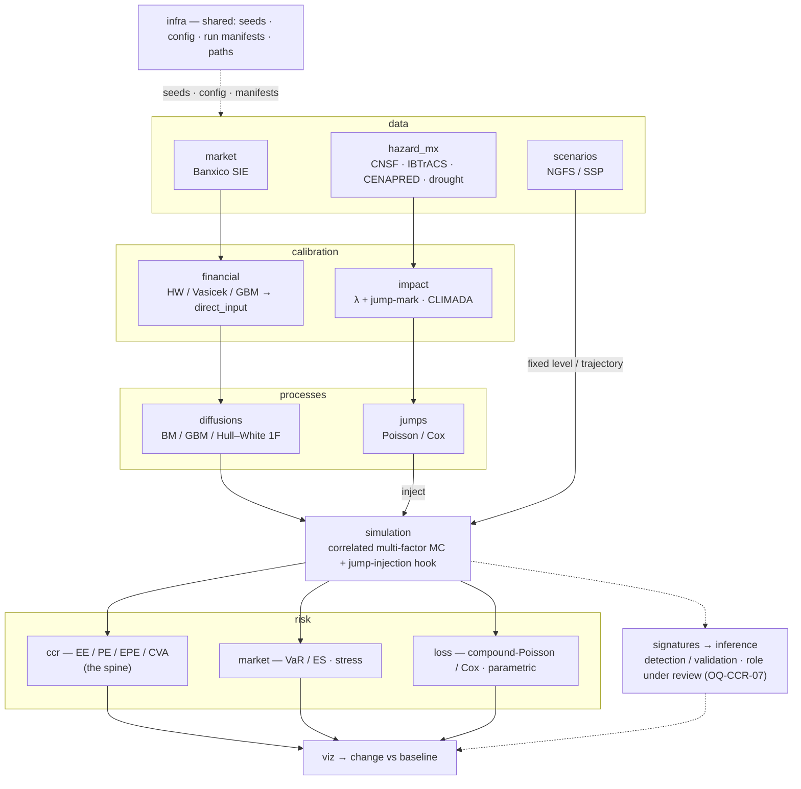

# climateCCR

> **Name (`INT-02`).** The project keeps its original name — `climateCCR` for repo, distribution,
> and import package — even though its scope now exceeds counterparty credit. A broad rename to
> `climrisk` was rejected (that name is taken by an existing UNAM package). The **PIMPA** exposure
> engine becomes the `risk.ccr` subpackage; the **randomized-signature** code becomes the
> `signatures` subpackage.

**MSc Quantitative Finance thesis — University of Zurich & ETH Zurich.**

A computational module that carries a financial institution through the full risk chain —
**data retrieval → calibration → simulation → risk metrics** — with **climate-related risk wired into
every stage**, applied to **Mexico**.

This repository unifies three previously-separate thesis workstreams into one installable package and
one reproducible workflow. **The counterparty-credit-risk (CCR) workstream is the architectural
spine**; the market/rate (MKT) and physical-hazard/insurance-loss (HAZ) workstreams feed the same
pipeline. This file is the **project map** — read it first. The authoritative *context* (decisions,
contracts, glossary, references, open questions, workflow) lives in `context/`; start at
`context/00_README_CONTEXT.md`.

---

## The three arms

| Arm | Role in the machine | Origin project |
|---|---|---|
| **CCR — the framework & spine** | The installable `src/` package, the reproducible `infra` layer (seeding, config, run manifests, path resolution — *built and tested*), the **PIMPA** counterparty-credit exposure engine (EE/PE, netting, collateral) plus its multi-factor simulation structure, and a rough-path **signatures + inference** core (role now under review — `OQ-CCR-07`). Runs calibration → simulation → risk and reads out the change. | `Tesis QF` / `climateCCR` |
| **MKT — the calibration & simulation engine** | Hull–White / Vasicek calibration to Banxico SIE data (one risk-factor model alongside GBM, inside the shared stochastic subsystem), NGFS rate-shock translation, Monte-Carlo VaR/ES, a physical-risk exposure dashboard, a climate-credit overlay, and weather-derivative literature. | `financial_instruments` |
| **HAZ — the estimation engine for the climate↔price link** | Mexican hazard & loss pipelines (CNSF, IBTrACS, CENAPRED, drought) that yield the **intensity `λ`** and the **impact/jump-mark** that drive the climate shock; CLIMADA subnational impact-function calibration; compound-Poisson/Cox loss modelling + parametric pricing. | `Climate-Nature-Risks_Calibration` |

The arms share **Mexico as the unit of analysis** and the **same reproducibility standard**, and they
form **one machine** with one objective (`INT-09`).

---

## Aim, research questions, and the integrating mechanism

**Unifying objective (`INT-09`).** Find, test, and quantify a relationship between **financial asset
prices / risk factors and climate events**, and measure via **Monte Carlo** how financial risk
changes once climate is incorporated. The three arms are one machine, not three theses.

**RQ1 — detection / distillation.** Can the impact of climate-related events on asset prices and
macro-financial risk factors (interest rates, equity indices, FX) be *identified and quantified*? In
the integrated design the **primary estimation engine is the HAZ arm**: the Mexican hazard & loss
panels yield the arrival intensity `λ` and the per-event impact / jump-mark. Rough-path methods — the
**signature transform** and **randomized signatures** (Compagnoni et al. 2023) — were the CCR arm's
original price-series detection route; their role is now **under review** (`OQ-CCR-07`): a
complementary detector/validator of a climate signal in price series *independent of* the hazard
panels, a robustness probe on the jump channel, or repositioned to future work.

**RQ2 — modelling / propagation.** Given an estimated effect, calibrate it and **inject it into a
Monte-Carlo simulation** of the risk factors, then read the resulting change in risk metrics — CCR
(EE/PE/EPE/CVA, the spine), market (VaR/ES), and parametric loss.

**The integrating mechanism — a climate-driven jump process (`INT-10`).** Climate enters the
simulation as a **jump (compound-Poisson / Cox) component superimposed on the diffusion**:
HAZ-estimated `λ(t; covariates)` governs shock arrivals, and a HAZ-estimated impact/jump-mark maps
each shock onto a diffusion — an asset price (**GBM**) or a risk factor (**Hull–White 1F** rate).
Monte Carlo over the resulting **jump-diffusion** — `dX = (diffusion) + (Σ marks at Poisson/Cox
times)` — yields the climate-vs-baseline change in risk.

**Fixed vs trajectory (`INT-12`).** A climate assumption enters either as a **fixed** level /
parameter shift (e.g. an NGFS `Δr` level, a drift or curve perturbation) or as a **trajectory** (a
path over time — an NGFS rate path, a time-varying `λ(t)`). Both go through the same injection hook.
This subsumes the earlier **Path A / Path B** split: the **HAZ→jump injection is the concrete Path A**
(estimate the effect, inject it dynamically); the **fixed parameter shift is Path B** (a justified
perturbation rule, reported as sensitivity).

**Arm roles (`INT-11`).** **HAZ** = the estimation engine (`λ` + impact). **MKT (Hull–White) +
PIMPA** = the calibration & simulation engine — HW and GBM are interchangeable risk-factor / asset
models inside the shared stochastic subsystem, alongside PIMPA's exposure/valuation. **climateCCR** =
the framework that runs calibration → simulation → risk and reads out the change.

**Market scope.** Mexico is the shared unit of analysis; the data layer is source-agnostic so broader
markets can be swapped in without changing the pipeline. The BMV equity universe is small (a known
scope risk, `OQ-INT-04`). **All calibration uses publicly available data; the final comparison relies
on controlled random simulation.**

---

## Architecture

The CCR arm's layered design is kept; the other arms slot into the same layers. The `data`,
`calibration`, and `risk` layers are partitioned by arm so each layer stays coherent while each arm
keeps its own domain logic. The full repository layout and module wiring are in **`REPO_STRUCTURE.md`**
(authoritative); the diagram below is the at-a-glance view.



**End-to-end (the integrating path).** Ingest market / scenario / hazard data → calibrate the
diffusion parameters into PIMPA's `'direct_input'` form (HW/GBM) **and** the climate `λ` + impact
(HAZ) → simulate a **jump-diffusion** (GBM/HW1F diffusion with a Poisson/Cox **climate jump**
superimposed via the injection hook) → compute risk metrics → **read how risk changes vs a no-climate
baseline**. HAZ supplies the shock (frequency + impact); MKT/PIMPA supply the diffusion and the
exposure read-out; climateCCR is the framework that runs and compares.

### The import problem, solved (`CCR-ARCH-01/02`)

Neither origin codebase shipped `__init__.py` files or a `pyproject.toml`; PIMPA's data path was
current-working-directory-relative (`GLOBAL_DATA_PATH = 'data/'`), and the randomized-signature tests
relied on `sys.path.append("..")` — which is exactly why imports only worked from one directory. The
fix is to package everything as **one installable distribution with a `src/` layout, installed
editable** (`pip install -e .`). After a one-time install, every module imports cleanly from anywhere
— notebook, test, or pipeline — with paths resolved centrally via `infra.ProjectPaths`:

```python
from climateCCR.simulation import MultiRiskFactorSimulation
from climateCCR.processes import GeometricBrownianMotion, HW1F          # diffusions
from climateCCR.calibration.financial import fit_gbm, fit_hull_white    # NEW (statistical calibration)
from climateCCR.risk.ccr import CCRValuationSession, Portfolio          # was PIMPA
from climateCCR.signatures import RandomisedSignature                   # role under review
```

> Exact public-API names are being finalized (e.g. `CCR_Valuation_Session` vs `CCRValuationSession`,
> `OQ-CCR-01`); treat the snippet above as illustrative.

---

## What already exists (read before re-implementing)

**PIMPA — a working Basel-III-style CCR exposure engine** with a clean ABC design. Key components:
`RiskFactor` (name → evolution model), `MarketDataBuilder` with `Curve` / `Surface` /
`CorrelationMatrix`; `RiskFactorEvolution` (ABC) with `BrownianMotion`, `GeometricBrownianMotion`
(constant **or** term-structure vol), `HW1F` (Andersen–Piterbarg scheme); `MultiRiskFactorSimulation`
(correlated, **seeded** Gaussian increments); `InterestRateSwapPricer` / `EquityEuropeanOptionPricer`;
`Trade` / `Portfolio` (netting sets, VM collateral with thresholds + MTA); and the
`CCR_Valuation_Session` orchestrator that builds Basel default + close-out grids with an MPOR and
computes **uncollateralised & collateralised EE** and **PE at quantiles** (default 99%).

> **Important.** PIMPA performs **no statistical calibration** — it reads *pre-calibrated* parameter
> CSVs via `calibration_method='direct_input'`. The historical-data calibration module is genuinely
> new work. PIMPA computes EE/PE but **not** EPE / Effective-EPE / CVA.

**Randomized-signature code (`pyrandsigSDE`)** — implements the Compagnoni et al. (2023) reservoir:
`RandomisedSignature` (`Z_i = Z_{i-1} + Σ_k σ(A_k Z_{i-1} + b_k) dX^k_i` with random `A`, `b`, `z0`)
and a `RandomizedSignatureSDESolver` with a **Ridge** linear readout.

> **Important.** This prototype has known correctness/reproducibility bugs (solver argument-signature
> mismatches, an **unseeded reservoir**, 2D/3D shape inconsistencies, a missing
> `simulate_random_increments`). Catalogued with fixes in `notes/reviews/CODE_REVIEW.md`; must be
> resolved before any thesis result depends on it.

**HAZ pipelines (~5,600 lines)** — CNSF, IBTrACS (Holland-to-Vmax fix, Kaplan–DeMaria decay,
wind-field attribution), CENAPRED (A/B/A′ outputs), drought (SPEI). Land under `data/hazard_mx/`.

---

## Module map & status

| Layer / subpackage | Role | Status |
|---|---|---|
| `infra` | seeds, typed YAML config, logger, `RunManifest`, `ProjectPaths` | **Built & tested** — smoke pipeline writes a real manifest |
| `data.market` | Banxico SIE retrieval (rates, curves, Bonos M) | design in canon; migrating |
| `data.scenarios` | NGFS / SSP scenario ingestion | planned |
| `data.hazard_mx` | CNSF · IBTrACS · CENAPRED · drought | **Mature**, migrating in |
| `calibration.financial` | HW / Vasicek / GBM estimators → `direct_input` | **New work** (PIMPA does none) |
| `calibration.impact` | CLIMADA subnational impact functions; `λ` + jump-mark | design complete; building |
| `processes.diffusions` | BM / GBM / Hull–White 1F | **Implemented** in PIMPA; promote |
| `processes.jumps` | Poisson / Cox climate jump | **New** — integrating contract (`DC-CCR-SIM-2`) |
| `simulation` | correlated multi-factor MC + jump-injection hook | **Implemented** (correlated, seeded); add hook |
| `signatures` → `inference` | rough-path features + detection / validation | **Prototype with bugs**; role under review (`OQ-CCR-07`) |
| `risk.ccr` (PIMPA) | EE / PE; + EPE / Effective-EPE / CVA | EE/PE **implemented**; EPE/CVA to add |
| `risk.market` | VaR / ES, stress shocks | planned (MKT theory exists) |
| `risk.loss` | compound-Poisson / Cox loss, parametric pricing | planned |
| `viz` | publication-quality figures; change-vs-baseline | planned |

---

## Data sources

High-level index only; the **binding contracts** (series IDs, columns, units, conventions) are in
`context/DATA_CONTRACTS.md`, and the source decisions in `context/DECISIONS.md`.

| Arm | Domain | Source(s) | Use |
|---|---|---|---|
| MKT | Interest rates / curves | Banxico SIE (CA684, CA766, CF300) | HW1F calibration; zero curve + Bonos M strip |
| MKT | Transition scenarios | NGFS (long-term + May-2025 short-term) | rate-shock translation `Δr` |
| MKT / HAZ | Physical pathways | IPCC SSP2-4.5 / SSP5-8.5 (CMIP6) | hazard scenarios; physical-risk dashboard |
| CCR | Equity & FX prices | public feeds (source-agnostic) | GBM calibration, event windows, signature detection |
| HAZ | Tropical cyclone | IBTrACS v04r01 (basins EP + NA) | `λ` covariates, wind-field attribution |
| HAZ | Insurance loss | CNSF (sectors + autos) | insured-loss panels (`MONTO PAGADO`) |
| HAZ | Socioeconomic impact | CENAPRED | total damage per event; CLIMADA calibration |
| HAZ | Drought | ERA5 / Copernicus CDS; official SPI/SPEI | SPEI (primary) / SPI indices |
| shared | Deflator / geography | INEGI (INPC; 32-entity shapefile) | current-MXN deflation; state grain |

Calibration inputs must be **publicly available**; proprietary feeds, if used, sit behind the same
interface and are clearly flagged.

---

## Reproducibility & engineering conventions

The full standard is in `context/WORKFLOW.md` (§4 reproducibility, §5 version control) and
`context/DECISIONS.md` → `GEN-*`. In brief:

- **Seeds** — every stochastic operation routes through `infra.set_seed` / `get_rng`; the seed is
  recorded in the run manifest. (The randomized-signature reservoir must be fixed to comply.)
- **Run manifests** — every stochastic run writes `results/manifests/<run_id>.json` (config + git
  commit + seed + package versions + timestamps). Nothing stochastic runs outside one.
- **Raw-data provenance** — every raw artifact carries a provenance record (URL/dataset, sha256,
  bytes, date, version/DOI/request).
- **Deterministic reconstructors**, never pickles; **idempotent** pipelines (re-runs skip completed
  work unless `--forzar`/`--force`); **config over hard-coding** (`configs/*.yaml`, paths via
  `ProjectPaths`).
- **Currency** held in **current MXN**; deflation (INEGI INPC) is a downstream step.
- **Version control** — small commits, feature branches, milestone tags; **separate behaviour changes
  from packaging/move changes** in distinct commits. `data/` and `results/` are git-ignored;
  `notes/`, `context/`, and `literature/*.md` are tracked; large data goes out-of-band (DVC or a
  documented store).
- **Tests** — `pytest` units per module + ≥1 end-to-end integration test on a tiny fixture (PIMPA's
  prototype CSVs are an ideal regression fixture). **Quality**: black/ruff via pre-commit; type hints
  on public APIs. **Secrets** via environment variables / a git-ignored `.env`.
- **Compatibility** — PIMPA's `DataFrame.iteritems()` (removed in pandas ≥ 2.0) is migrated to
  `.items()` on the way in.
- **Bilingual boundary (`INT-07`)** — public Python APIs in English; Spanish data identifiers, peril
  names, and CLI flags kept **verbatim** because they are literal artifacts in Mexican data.
- **Every analytical decision carries a reference** (`GEN-01`) — or is marked `[eng]`. No invented
  citations; unconfirmed refs go to `REFERENCES.md` §99. **Diagrams are authored in Mermaid**
  (`GEN-14`); directory/file trees stay plain code blocks.

---

## Environment & installation

```bash
conda env create -f environment.yml          # or: python -m venv .venv && source .venv/bin/activate
conda activate climateCCR
pip install -e .                             # editable install — enables clean imports everywhere
pip install -e ".[dev]" && pre-commit install   # optional dev extras
```

After the editable install, `import climateCCR` works from any working directory. The `infra`,
packaging, and config scaffolding (`pyproject.toml`, `environment.yml`, `configs/default.yaml`,
`.gitignore`, `.pre-commit-config.yaml`) already exist under the name `climateCCR` (`INT-02`), so no
package rename is needed — the scaffold carries straight over.

---

## Status & roadmap

**Built & working:** the CCR `infra` layer (seeding, config, logger, `RunManifest`, `ProjectPaths`);
infra tests pass.

**Mature, migrating in:** PIMPA (`risk.ccr`) with the pandas-2.0 fix + a locked EE/PE regression test;
the HAZ pipelines under `data/hazard_mx/`; the MKT theory + estimators (`calibration.financial`) and
the Excel physical-risk dashboard.

**Known issues to clear early** (`context/OPEN_QUESTIONS.md`, `notes/reviews/CODE_REVIEW.md`): the
randomized-signature prototype cannot run as shipped (unseeded reservoir, solver arg/shape
mismatches); `calibration` is genuinely new work; EPE/CVA are not yet implemented; CDMX drops out of
the IBTrACS wind-field panel (discretization artifact).

**Build order.** `infra` → `src/` packaging + editable install (absorb PIMPA & rand-sig, fix
pandas/seed/solver bugs) → promote `processes`/`simulation` (add the jump-injection hook) → `data` →
`calibration` → end-to-end smoke test on real data → `signatures`/`inference` → `viz`. A time-boxed
plan is in `notes/plan/PROJECT_PLAN.md`.

**Immediate sequence.** ① confirm the unifying RQ (`OQ-INT-01`, largely settled) and the headline risk
object (`OQ-INT-02`); ② initialise the repo from the existing scaffold + first commit; ③ migrate
PIMPA behaviour-unchanged and lock its regression test; ④ fix the signature reservoir; ⑤ ship one
climate-scenario connector end-to-end (`OQ-CCR-03`).

---

## Where to start

1. **`context/00_README_CONTEXT.md`** — the entry point to the project's decisions, contracts,
   glossary, references, open questions, and workflow.
2. **`REPO_STRUCTURE.md`** — the recommended repository layout and how the modules wire together.
3. **`ASSET_MAP.md`** — where every existing note and script from the three origin projects lands.
4. **`context/OPEN_QUESTIONS.md`** — the integration questions (`OQ-INT-*`) gate everything else.

**References** are verified in `context/REFERENCES.md` (the climate-finance BibTeX lives at
`literature/refs.bib`); **terms and acronyms** are defined in `context/GLOSSARY.md` (with a
content-word retrieval index). Do not invent citations or re-define terms here — those two files are
the single source of truth.

---

## Related
Reads with: [[00_README_CONTEXT]] (the context entry point) · [[REPO_STRUCTURE]] · [[ASSET_MAP]] ·
[[DECISIONS]] · [[OPEN_QUESTIONS]] · MOCs: [[CCR_MOC]] · [[MKT_MOC]] · [[HAZ_MOC]] · Home: [[_INDEX]]
#arm/int #type/workflow
