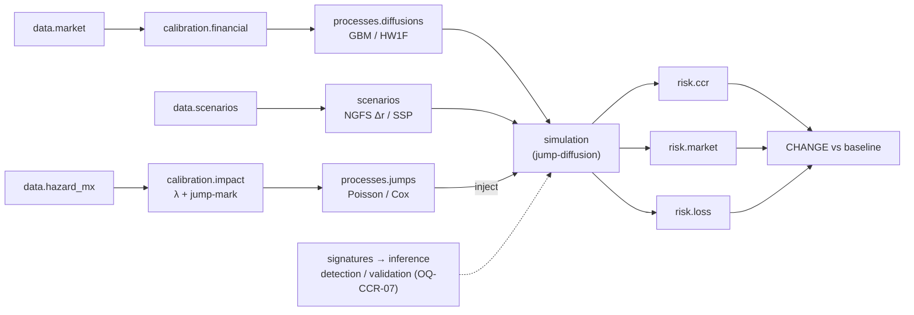

# REPO_STRUCTURE — Recommended integrated repository layout

This is the recommended single-repository layout for `climateCCR`. It keeps the CCR arm's
`src/`-layout package as the spine and gives the MKT and HAZ arms first-class homes inside the same
package and the same reproducible workflow. The tree is a **recommendation**, not a constraint —
adjust names as the research narrative firms up (`context/OPEN_QUESTIONS.md` → `OQ-INT-*`).

Conventions referenced here are defined in `context/DECISIONS.md` (`GEN-*`, `INT-*`) and
`context/DATA_CONTRACTS.md` (`DC-*`).

---

## 1. Top-level tree

```
climateCCR/
├── pyproject.toml              # distribution name "climateCCR"; import pkg "climateCCR"; src-layout
├── environment.yml             # conda env (python=3.11) + pip install -e ".[dev]"
├── README.md                   # project map (the integrated_knowledge_base/README.md)
├── .gitignore                  # data/ and results/ ignored; notes/, context/, literature/*.md tracked
├── .pre-commit-config.yaml     # ruff + black (line length 100)
│
├── context/                    # ← the canon (drop in the integrated_knowledge_base/context/ folder)
│   ├── 00_README_CONTEXT.md
│   ├── DECISIONS.md
│   ├── DATA_CONTRACTS.md
│   ├── GLOSSARY.md
│   ├── REFERENCES.md
│   ├── OPEN_QUESTIONS.md
│   └── WORKFLOW.md
│
├── notes/                      # tracked prose: theory, sources, pipelines, plan, reviews
│   ├── theory/                 # MKT Hull–White/Vasicek/measure notes; HAZ catastrophe-risk master doc; CLIMADA design
│   ├── sources/                # per-source provenance notes (cenapred.md, ibtracs.md, mexican_data_sources.md, …)
│   ├── pipelines/              # how-to / design docs for the data pipelines (CNSF scraper, drought, autos)
│   ├── plan/                   # PROJECT_PLAN.md, PHASE_0.md
│   └── reviews/                # CODE_REVIEW.md (PIMPA + randomized-signature findings)
│
├── literature/                 # marker output folders (Author_Year_ShortTitle/) + refs.bib (47 climate-finance entries)
│
├── configs/                    # YAML configs (default.yaml: seed 233423, n_paths 10000, …); per-experiment overrides
│
├── data/                       # GIT-IGNORED. Raw → interim → processed, partitioned by source
│   ├── raw/                    # immutable; each artifact + _procedencia.json (provenance)
│   │   ├── market/             #   Banxico SIE (CF300, CA684, CA766)
│   │   ├── scenarios/          #   NGFS, SSP/CMIP6, Copernicus C3S/ERA5
│   │   └── hazard_mx/          #   CNSF (crudos), IBTrACS v04r01, CENAPRED, drought, INEGI shapefiles
│   ├── interim/                # consolidated / cleaned intermediates
│   └── processed/              # analysis-ready panels (e.g. estado×peril×año), strip outputs, calibration tables
│
├── results/                    # GIT-IGNORED. Run outputs
│   ├── manifests/              #   <run_id>.json — config + git commit + seed + versions (one per stochastic run)
│   ├── figures/
│   └── logs/
│
├── notebooks/                  # exploratory only; promoted logic moves into src/ (numbered, e.g. 01_strip_curve.ipynb)
│
├── pipelines/                  # thin CLI entry points orchestrating src/ modules (reproducible, idempotent)
│
├── tests/                      # pytest; PIMPA prototype CSVs live here as the EE/PE regression fixture
│   ├── fixtures/
│   ├── infra/                  #   (passing) seeding, config, manifest, paths
│   ├── risk_ccr/               #   PIMPA EE/PE regression (lock before refactor)
│   └── ...
│
└── src/
    └── climateCCR/               # the import package
        ├── __init__.py
        ├── infra/              # ✅ BUILT: seeds, Config, logging, RunManifest, ProjectPaths
        ├── data/               # ingestion → tidy contracts; partitioned by arm
        │   ├── market/         #   MKT: Banxico SIE loaders (CF300/CA684/CA766), conventions
        │   ├── scenarios/      #   NGFS + SSP/CMIP6 + Copernicus loaders, scenario taxonomy
        │   └── hazard_mx/      #   HAZ: the ~5,600-line pipelines (CNSF, IBTrACS, CENAPRED, drought)
        ├── processes/          # CCR: diffusions (BM / GBM / Hull–White 1F) + jumps (Poisson / Cox climate shocks)
        │   ├── diffusions/     #   BM, GBM, Hull–White 1F evolution; correlated increments
        │   └── jumps/          #   compound-Poisson / Cox process driven by HAZ λ + impact (the climate shock carrier)
        ├── calibration/        # split by domain (INT-05)
        │   ├── financial/      #   MKT+CCR: yield-curve strip, HW/Vasicek/GBM estimators → 'direct_input' objects
        │   └── impact/         #   HAZ: λ(t) intensity + jump-mark/impact (climate shock); CLIMADA impf (v_half, LitPop, PyMC)
        ├── signatures/         # CCR: randomized-signature reservoir (fix seeding + solver contract)
        ├── inference/          # CCR: readout → Path A effect | Path B perturbation rule
        ├── simulation/         # CCR: multi-factor MC; jump-diffusion = diffusion + climate-jump injection hook
        ├── scenarios/          # scenario application: NGFS Δr → recalibrate θ*; SSP → hazard bands
        ├── risk/               # split by metric family (INT-06)
        │   ├── ccr/            #   PIMPA (EE/PE; add EPE/Effective-EPE/CVA) — the spine
        │   ├── market/         #   MKT: VaR/ES, stress shocks (parallel/non-parallel/vol/mean-reversion)
        │   └── loss/           #   HAZ: compound-Poisson/Cox loss distributions, parametric pricing
        └── viz/                # plotting/reporting helpers
```

---

## 2. Why this shape

- **CCR is the spine, intact (`INT-01`).** The `src/climateCCR/` layout, `infra`, and reproducibility
  model are exactly the CCR origin project's, kept under the same name `climateCCR` (`INT-02`).
  Nothing about the working `infra` changes.
- **One editable install kills the import pain (`CCR-ARCH-01/02`).** `pip install -e .` once; every
  module imports from anywhere. No `sys.path` hacks, no CWD-relative data paths (`ProjectPaths`).
- **Arms get first-class homes without colliding.** `data`, `calibration`, and `risk` are each
  partitioned by arm (`market`/`scenarios`/`hazard_mx`; `financial`/`impact`; `ccr`/`market`/`loss`).
  The layers stay coherent; each arm keeps its domain logic and its language (`INT-07`).
- **Notes/literature travel with the code, tracked in git (`GEN-10`).** Theory docs and `marker`
  paper folders live in `notes/` and `literature/`, so the substance that backs each decision is one
  click from the code — but `data/` and `results/` stay ignored.
- **The provenance + manifest split is honoured (`INT-08`).** Raw artifacts carry
  `_procedencia.json`; runs carry `results/manifests/<run_id>.json`. Both standards coexist.
- **`pipelines/` vs `notebooks/`.** Notebooks are exploratory; anything a result depends on graduates
  into `src/` and is driven by a thin, idempotent CLI in `pipelines/`. Keeps figures reproducible.

---

## 3. Module wiring (data flow)



The **climate jump channel** (`INT-10`) is the integrating wire: `data.hazard_mx` →
`calibration.impact` estimates the intensity `λ` and the impact/jump-mark → `processes.jumps` builds a
Poisson/Cox shock → `simulation` superimposes it on the GBM/HW1F diffusion (a **jump-diffusion**) →
`risk.*` reads out the change vs a no-climate baseline. A *fixed* climate assumption instead enters as
a parameter shift through `scenarios`/`calibration.financial` (`INT-12`).

Key contracts that make the wiring work (full text in `context/DATA_CONTRACTS.md`):

- **`DC-CCR-CAL-1` — the `'direct_input'` contract.** `calibration.financial` must emit objects PIMPA
  already accepts (GBM `drift`/`volatility`; HW1F `alpha`/`sigma`/`theta(t)`), so the engine stays
  untouched. *These same knobs are what Path B perturbs.*
- **`DC-CCR-SIM-1` — the event-injection hook.** `simulation` gains a hook to add a calibrated
  climate component or perturbed parameters without altering the core engine.
- **`DC-CCR-SIM-2` — the climate jump-injection (the integrating contract, `INT-10`).**
  `processes.jumps` consumes HAZ's `λ` + jump-mark and superimposes a Poisson/Cox shock on the
  diffusion; open knobs (which target it hits, jump↔diffusion dependence, fixed vs trajectory `λ`) are
  `OQ-INT-03/07`.
- **`DC-MKT-NGFS-1` — scenario shock, not level.** `scenarios` computes `Δr = NGFS − baseline`,
  applies it to the current curve, and recalibrates `θ*` — never substitutes NGFS levels for F-TIIE.
- **`DC-XWALK-1` — state↔storm crosswalk.** CENAPRED `nombre_evento` → IBTrACS `SID` pairs per-event
  hazard with observed damage, the input the CLIMADA `v_half` calibration needs.
- **`DC-XWALK-4/5` — the cross-arm wires.** HAZ `λ` + impact → `processes.jumps` → jump-diffusion
  (the climate channel, mechanism firm); HAZ loss panels → `risk.loss`; MKT FX → HAZ `MONEDA`
  normalization (closes `OQ-HAZ-03`).

---

## 4. Setup checklist (one-time)

1. Copy the existing CCR scaffold (`pyproject.toml`, `environment.yml`, `configs/default.yaml`,
   `.gitignore`, `.pre-commit-config.yaml`, `src/.../infra/`) into the new repo root.
2. Keep the name `climateCCR` (`INT-02`): distribution `name = "climateCCR"` in `pyproject.toml`
   and import package `src/climateCCR/` carry over unchanged — **no rename needed**.
3. Drop in `integrated_knowledge_base/context/` → `context/`, and `README.md` → repo root.
4. `conda env create -f environment.yml && conda activate <env> && pip install -e ".[dev]"` then
   `pre-commit install`.
5. Create the empty tracked structure: `data/{raw,interim,processed}/…` and `results/{manifests,figures,logs}/`
   with `.gitkeep`; confirm `.gitignore` covers `data/` and `results/`.
6. Migrate per `ASSET_MAP.md`, committing **moves separately from behaviour changes** (`GEN-09`).
7. First green test: run the `infra` suite, then lock the PIMPA EE/PE regression fixture
   (`CCR-MIG-03`) before any refactor.


---

## Related
Reads with: [[README]] · [[ASSET_MAP]] (what fills this tree) · [[DATA_CONTRACTS]] (the wiring contracts) · [[00_README_CONTEXT]]. Home: [[_INDEX]]
#arm/int #type/workflow
