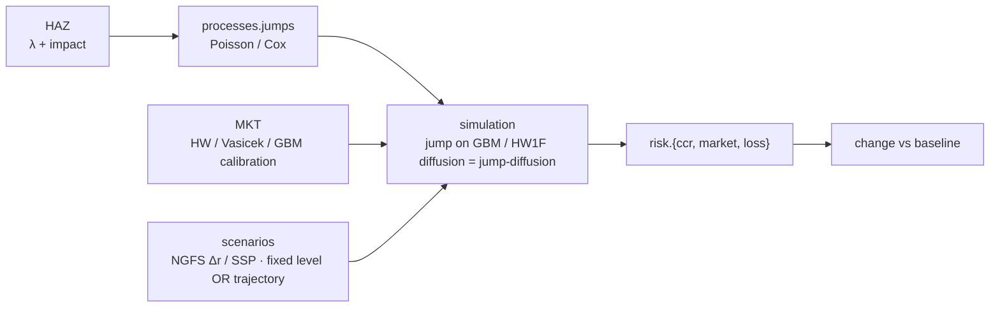

# _INDEX — climateCCR knowledge vault

> Home note. Start here. This is the hub of the Obsidian graph — it branches to the three arm MOCs
> and to the project canon. Setup and link conventions: [[OBSIDIAN_SETUP]].

**The project in one line:** find, test, and quantify a relationship between financial asset prices /
risk factors and climate events, and measure via Monte Carlo how financial risk changes once climate
is incorporated — applied to Mexico. The integrating mechanism is a **climate-driven jump process**
(HAZ-estimated `λ` + impact → jump on a GBM/Hull–White diffusion → MC → change vs baseline).

---

## Maps of content (one per arm)

- [[CCR_MOC]] — **the framework & spine**: package, `infra`, PIMPA, simulation, signatures.
- [[MKT_MOC]] — **the calibration & simulation engine**: Hull–White/Vasicek, SIE curve, NGFS, VaR/ES, dashboard.
- [[HAZ_MOC]] — **the estimation engine for the climate↔price link**: hazard/loss pipelines, `λ`, CLIMADA, loss models.

## The canon (single source of truth)

- [[00_README_CONTEXT]] — entry point, arm map, ID scheme, maintenance rules.
- [[DECISIONS]] — every decision, one line, stable ID, date, reference key.
- [[DATA_CONTRACTS]] — I/O specs, conventions, crosswalks.
- [[GLOSSARY]] — terms + content-word retrieval index.
- [[REFERENCES]] — verified bibliography (+ §99 to-confirm).
- [[OPEN_QUESTIONS]] — open items; integration questions first.
- [[WORKFLOW]] — the end-of-chat ritual + reproducibility/version-control standard.

## Repository docs

- [[README]] — the project map (vision, pipeline diagram, status, roadmap).
- [[REPO_STRUCTURE]] — recommended repository layout + module wiring.
- [[ASSET_MAP]] — where every origin note/script lands in the new repo.
- [[CONSOLIDATION_PLAN]] — uploaded-archive → repo destinations + migration order.
- [[OBSIDIAN_SETUP]] — vault conventions + link maintenance.
- [[CLAUDE_CODE_ONBOARDING]] — Claude Code setup steps (`GEN-15`).

## Literature

- `literature/refs.bib` — the 47-entry climate-finance BibTeX bibliography (authoritative for DOIs).
- [[Compagnoni_2023_RandomizedSignatures]] — the randomized-signature paper (CCR).
- [[Cuchiero_2022_DiscreteTimeSignatures]] — discrete-time signatures & reservoir computing (CCR).
- [[Mandel_2025_MappingFinancialRisks]] — mapping global financial risks under climate change (INT).

---

## The integration at a glance

- **What gates everything:** [[OPEN_QUESTIONS]] → `OQ-INT-02` (headline risk metric),
  `OQ-INT-03` (jump-channel knobs), `OQ-INT-07` (jump-mark estimation), `OQ-CCR-07` (where signatures fit).
- **What's built:** the CCR `infra` layer. **What's mature, migrating in:** PIMPA, the HAZ pipelines,
  the MKT theory + dashboard. See [[README]] → Status & roadmap.

## First moves

1. Read [[README]] and [[00_README_CONTEXT]].
2. Skim the integration open questions in [[OPEN_QUESTIONS]].
3. Set up the repo from [[REPO_STRUCTURE]] and migrate per [[ASSET_MAP]].
4. Import your theory notes (see [[OBSIDIAN_SETUP]] §4) so the MOC links light up.

#arm/int #type/workflow
