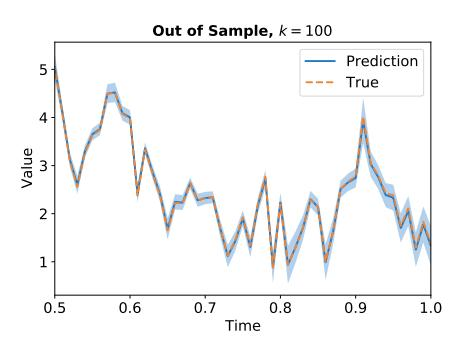
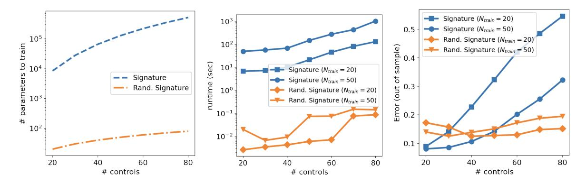
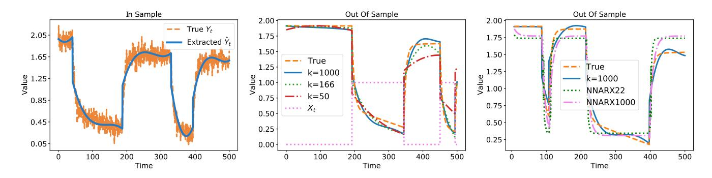
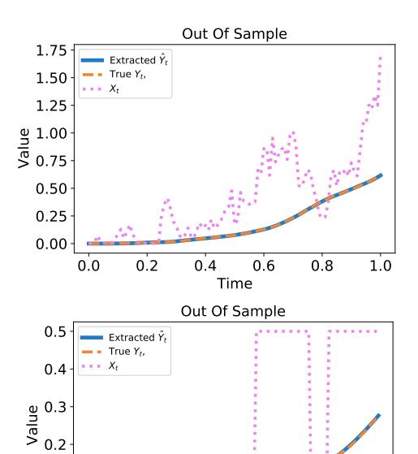
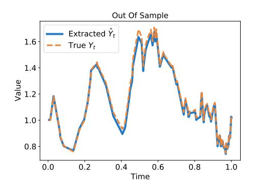

# On the effectiveness of Randomized Signatures as Reservoir for Learning Rough Dynamics

Enea Monzio Compagnoni\*, Anna Scampicchio†, Luca Biggio‡, Antonio Orvieto‡, Thomas Hofmann‡ and Josef Teichmann§

\*Department of Mathematics and Computer Science, University of Basel, Basel, Switzerland, Email: enea.monziocompagnoni@unibas.ch

†Institute for Dynamic Systems and Control, ETH Zürich, Zürich, Switzerland. Email: ascampicc@ethz.ch †Department of Computer Science, ETH Zürich, Zürich, Switzerland Emails: {luca.biggio, antonio.orvieto, thomas.hofmann}@inf.ethz.ch

§ Department of Mathematics, ETH Zürich, Zürich, Switzerland. Email: josef.teichmann@math.ethz.ch

Abstract—Many finance, physics, and engineering phenomena are modeled by continuous-time dynamical systems driven by highly irregular (stochastic) inputs. A powerful tool to perform time series analysis in this context is rooted in rough path theory and leverages the so-called Signature Transform. This algorithm enjoys strong theoretical guarantees but is hard to scale to high-dimensional data. In this paper, we study a recently derived random projection variant called Randomized Signature, obtained using the Johnson-Lindenstrauss Lemma. We provide an in-depth experimental evaluation of the effectiveness of the Randomized Signature approach, in an attempt to showcase the advantages of this reservoir to the community. Specifically, we find that this method is preferable to the truncated Signature approach and alternative deep learning techniques in terms of model complexity, training time, accuracy, robustness, and data hungriness.

Index Terms—stochastic differential equations, reservoir computing, signature transform, randomized signatures

## I. Introduction

We consider dynamical systems that are described by the stochastic differential equation

$$dY_t = f(Y_t)dX_t, Y_0 = y_0 \in \mathbb{R}^m, (1)$$

where  $f(\cdot): \mathbb{R}^m \to \mathbb{R}^d$  is an unknown smooth map, and  $X: [0,T] \to \mathbb{R}^d$  is a piece-wise smooth stochastic process, also known as *control*, forcing the system evolution1. The problem under investigation consists in predicting the solution  $\bar{V}_t$  of (1) given a new, unseen control  $\bar{X}_t$ , using an algorithm trained on a set of control-output trajectories. Two main challenges are the fact that data is observed on a possibly unevenly spaced time grid, and that controls are often highly irregular (we will mainly focus on rough paths, which are formally defined, e.g., in [30], Chapter 3). This setting is of particular interest, e.g., in high-frequency trading, as tick-level prices are not observed regularly in time [14], and where fundamental quantities such as the volatility of prices are rough [17].

A first strategy consists in performing system identification, i.e., learning  $f(\cdot)$  from data. The theory is well established for the particular case of linear systems, both for parametric [27] and non-parametric approaches leveraging the theory of Reproducing Kernel Hilbert Spaces [1], [39], and is mainly deployed for discrete-time systems; its extension to the continuous-time case is investigated, e.g., in [16] and references therein. Nonlinear system identification is an active area of research, and the methods currently deployed revolve around kernel techniques [38], sparse regression [4], random features [40], [41], and deep neural networks (see, e.g., [33] for discrete-time models, and [12] for continuous-time ones).

The advantage of estimating f is that it allows for retrieving the output trajectory also for different initial conditions and different time intervals. However, solving the identification problem of a general continuous-time system is typically hard if observations are made on an uneven time grid and f is nonlinear. Moreover, if the control signal is highly irregular, as typical in finance and physical models [25], [28], integrating the differential equation with the estimated f is far from trivial. Thus, an alternative viewpoint consists in focusing on estimating the solution  $Y_t$  directly. To this aim, deep neural networks have been successfully deployed [11], [15]: see also the works on neural controlled differential equations [24], [35]. Nevertheless, their outstanding performance comes at the price of over-parametrization, data hungriness, and expensive training cost [32], [36]. Furthermore, the resulting models learn representations of the input data that are highly specialized to the training task. In addition, the remarkable performance of these methods is often the result of a substantial engineering effort and is not supported by theoretical results.

Another approach consists in reservoir computing [43], in which learning is divided into two phases: first, data go through an untrained reservoir that extracts a set of task-independent features; second, a simple and efficient-to-train linear map (the readout map) projects such features into the desired output. An example is Echo State Networks [23]. The critical point is that the design of the reservoir determines the expressiveness of the features, and several alternatives can be found in the literature (see [18] and references therein).

A powerful reservoir is offered by the Signature Transform, often simply referred to as Signature, stemming from rough path theory [13], [20]. The Signature of a path is an infinitedimensional tensor. Intuitively, it consists of enhancing the path with additional curves corresponding to iterated integrals of the curve with itself. A strong mathematical result supports the choice of the Signature as a reservoir: it can be shown [26] that the solution of a rough differential equation can be approximated arbitrarily well by a linear map of the Signature of the controls. On the other hand, it is often the case that this reservoir is very high-dimensional, and hence particularly expensive to calculate and computationally intractable for use in downstream tasks. Furthermore, the high dimensionality of the Signature poses additional challenges for modern gradientbased optimizers, as convergence rates suffer from a linear dependence in the model dimension [3].

Inspired by the remarkable theoretical properties of the Signature reservoir and motivated to fix its practical pitfalls, the so-called *Randomized Signatures* was introduced in [7], [8]. The Randomized Signature is obtained by numerically integrating a set of random linear stochastic differential equations driven by the control path. Importantly, based on a non-trivial Johnson-Lindenstraus argument, [8] showed that calculating the Randomized Signature of a path this way is equivalent to projecting its Signature using a random linear operator. These random features provably retain the expressive power of Signature, yet dramatically reduce the computational burden. In fact, differently from [34], calculating the Randomized does not require computing the (truncated) path: the projection can be obtained directly in the compre space. However, the lack of an in-depth experimental study comparing its performance to Signature, Reservoir Computing, and Deep Learning limits its popularity to the theoretical community.

The contribution of the present paper is twofold: first, we extend the theoretical analysis of Randomized Signature, using results from Malliavin Calculus to prove that the Randomized Signature has the power of representing the behavior of any dynamical system of interest; second, we provide a rich set of experiments showing that this approach achieves performances comparable with, if not superior to, competitive Deep Learning, Reservoir Computing, and Signature-based models. In particular, we find that Randomized Signature requires less trainable parameters, i.e. has lower model complexity, which in turn implies a reduced training time and memory usage. In terms of performance, our models are more accurate out-of-sample, more robust, and less data-hungry – especially in high dimensions.

Notation: The canonical basis for  $\mathbb{R}^d$  will be denoted as  $\{e_1,\ldots,e_d\}$ . The symbol  $\otimes$  represents a tensor product: e.g.,  $e_i\otimes e_j$  is the  $d\times d$  matrix of all zeros except for the term at the i-th row and j-th columns, which equals 1. In general,  $(\mathbb{R}^d)^{\otimes l}$  is the space of tensors of shape  $(d,\ldots,d)$  given by  $\mathbb{R}^d\otimes\cdots\otimes\mathbb{R}^d$  for l times. The tensor algebra on  $\mathbb{R}^d$ , and its truncated version of order  $M\geq 0$ , are written

as  $\mathcal{T}\left(\mathbb{R}^d\right):=\prod_{l=0}^{\infty}\left(\mathbb{R}^d\right)^{\otimes l}$  and  $\mathcal{T}^M\left(\mathbb{R}^d\right):=\prod_{l=0}^{M}\left(\mathbb{R}^d\right)^{\otimes l}$ , respectively. Given two vector fields  $V_1$  and  $V_2$  mapping  $\mathbb{R}^k$  into itself, and denoting with  $DV_i(z)$  the Fréchet derivative of  $V_i$  evaluated at  $z\in\mathbb{R}^k$ , the Lie bracket is defined as  $[V_1,V_2](z)=DV_1(z)V_2(z)-DV_2(z)V_1(z)$ .

## II. BACKGROUND

Referring to the stochastic differential equation (1), we let the control  $X = (X^1, \cdots, X^d) : [0, T] \to \mathbb{R}^d$  be a continuous and piece-wise smooth path – in particular, we will mainly regard X as a rough path2 on  $\mathbb{R}^d$ . We start by defining its Signature, which is a tensor of iterated integrals of X with itself.

**Definition II.1** (Signature). For any  $t \in [0,T]$ , the Signature of  $X:[0,T] \to \mathbb{R}^d$  on [0,t] is the countable collection  $\mathbf{S}_t := (1,S_t^1,S_t^2,\ldots) \in \mathcal{T}\left(\mathbb{R}^d\right)$  where, for each  $l \geq 1$ , the entries  $S_t^l$  are defined as

$$S_t^l := \sum_{\substack{(i_1, \dots, i_l) \\ \in \{1, \dots, d\}^l}} \left( \int_{0 \le s_1 \le \dots \le s_l \le t} dX_{s_1}^{i_1} \dots dX_{s_l}^{i_l} \right) e_{i_1} \otimes \dots \otimes e_{i_l}.$$

Given that this object is infinite-dimensional, to actually compute the reservoir, one can use only a finite amount of terms  $S_t^l$ . Therefore, we consider the following object:

**Definition II.2** (Truncated Signature). The Truncated Signature of X of order M > 0 is defined as

$$\mathbf{S}_{t}^{M} := \left(1, S_{t}^{1}, \dots, S_{t}^{M}\right) \in \mathcal{T}^{M}\left(\mathbb{R}^{d}\right). \tag{2}$$

To give an intuition on how to compute the (truncated) Signature, we provide the following

**Example II.3.** Let  $X:[0,T]\to\mathbb{R}$ ; then  $S^1_t=\int_0^t dX_s$ , which is exactly  $X_t-X_0$ . To get  $S^2_t$ , we instead have to compute the following iterated integral:  $S^2_t=\int_0^t \left(\int_0^v dX_s\right)dX_v$ . Iterated integrals of higher order  $S^j_t$  are computed in a similar way, by iteratively integrating the path j times. As a practical example, let  $X_t=t$ . Then it is easy to see that  $S^j_t=\frac{t^j}{j!}$ . Now let  $Y_t$  be an analytic function of time for which we have  $Y_t=\sum_{j=0}^\infty Y_0^{(j)} \frac{t^j}{j!}$ . Taylor's theorem combined with the previous computation implies that Y can be approximated as a linear map of the Truncated Signature of t. Finally, note that  $S^j_t$  gets smaller and smaller in magnitude as j increases, which can be proven in general. This suggests that the Truncated Signature can be safely used to approximate Y.

The following result given in [8] proves that the solutions of differential equations of the type given in (1) can be expanded in terms of the iterated integrals stored in the Signature:

**Theorem II.4** (Theorem 2.3, [8]). Let  $V_i: \mathbb{R}^m \to \mathbb{R}^m, i = 1, \ldots, d$  be vector fields regular enough such that  $dY_t = \sum_{i=1}^d V^i(Y_t) dX_t^i, Y_0 = y \in \mathbb{R}^m$ , admits a unique solution

 $Y_t: [0,T] \to \mathbb{R}^m$ . Then, for any smooth test function  $F: \mathbb{R}^m \to \mathbb{R}$  and for every  $M \geq 0$  there is a time-homogeneous linear operator  $L: \mathcal{T}^M(\mathbb{R}^d) \to \mathbb{R}$ , which depends only on  $(V_1, \ldots, V_d, F, M, y)$ , such that

$$F(Y_t) = L(\mathbf{S}_t^M) + \mathcal{O}(t^{M+1}), \quad t \in [0, T].$$
 (3)

Interpreting the linear operator L as a readout layer, such a result strongly motivates the use of (truncated) Signature as a valuable reservoir under rough dynamics (note that smooth controls constitute a particular case).

The drawback of using  $\mathbf{S}_t^M$  is that it has an  $\mathcal{O}(d^M)$  computational complexity3, which becomes intractable for high-dimensional systems and/or for large values of M aimed at obtaining a finer representation of the solution. To cope with this issue, instead of calculating the Signature, one can extract a new quantity, called Randomized Signature, which is easier to compute and inherits the expressiveness and inductive bias of the Signature.

**Definition II.5** (Randomized Signature). Given  $k \in \mathbb{N}$  and random matrices  $A_1, \ldots, A_d$  in  $\mathbb{R}^{k \times k}$ , random shifts  $b_1, \ldots, b_d$  in  $\mathbb{R}^{k \times 1}$ , random starting point z in  $\mathbb{R}^k$ , and any fixed activation function  $\sigma$ , the Randomized Signature of X in  $t \in [0,T]$  is the solution of the differential equation

$$dZ_t = \sum_{i=1}^d \sigma \left( A_i Z_t + b_i \right) dX_t^i, \quad Z_0 = z \in \mathbb{R}^k. \tag{4}$$

The Randomized Signature is constructed in [8] as a random projection of the Truncated Signature according to an argument based on the Johnson-Lindenstrauss Lemma [45]. We refer the reader to [8] for all the details on the theoretical derivation. The key message is the following:

**Theorem II.6** (Informal). For any number of features k big enough, the Randomized Signature of X defined in (4) can be linearly mapped to the solution of any differential equation controlled by it, up to a small error vanishing at  $k \to \infty$ .

This result leads to the practical recipe for extracting the Randomized Signature, summarized in Algorithm 1.

**Algorithm 1 Generate Randomized Signature**

**Require:**  $X \in \mathbb{R}^d$  sampled at  $0 = t_0 < \cdots < t_N = T$ , dimension k of the Randomized Signature, and activation function  $\sigma$ .

Initialize:  $Z_0 \in \mathbb{R}^k, A_i \in \mathbb{R}^{k \times k}, b_i \in \mathbb{R}^k$  to have i.i.d. standard normal entries.

$$\begin{array}{l} \textbf{for } n=1,\cdots,N \textbf{ do} \\ Z_{t_n}=Z_{t_{n-1}}+\sum_{i=1}^d\sigma\left(A_iZ_{t_{n-1}}+b_i\right)\left(X_{t_n}^i-X_{t_{n-1}}^i\right) \\ \textbf{end for} \end{array}$$

The computational complexity for calculating Z is  $\mathcal{O}(k^2d)$ , and its dimensionality is  $\mathcal{O}(k)$ . In Section V-B we show experimentally that, in order to match the approximation capabilities of the Truncated Signature of order M, the number k of required Randomized Signatures is fairly small – in particular, it is not exponential in M. This confirms that working with Randomized Signatures is often less computationally demanding and results in lower-dimensional – yet expressive – features.

## III. RANDOMIZED SIGNATURE AS RESERVOIR: THE PROCEDURE

Combining Theorems II.4 and II.6, one can perform linear (ridge) regression to find the sought readout map. This is computed using observed (sampled) control-output trajectories, and can then be used to predict the solution of (1) given a new control sequence. The complete procedure for retrieving the output sequence  $\bar{Y}$  given a new control  $\bar{X}$  is summarized in Algorithm 2.

**Algorithm 2 Simulate solution of (1)**

**Require:** Time grid  $\mathcal{D}=\{0=t_0,\cdots,t_N=T\};\ N_{train}$  input-output trajectories indexed by m,  $\{(X_t(m),Y_t(m))\}_{t\in\mathcal{D}},$  with common initial condition  $y_0\in\mathbb{R}^m;$  new control  $\{\bar{X}_t\}_{t\in\mathcal{D}};$  order of Randomized Signature k; regularization parameter  $\lambda.$ 

for  $m=1,...,N_{train}$  do

compute the Randomized Signature  $\{Z_t(m)\}_{t\in\mathcal{D}}$  via Algorithm 1.

end for

Define  $\mathbf{Y} \in \mathbb{R}^{(N+1)*N_{train} \times m}$  and  $\mathbf{Z} \in \mathbb{R}^{(N+1)*N_{train} \times k}$  such that

$$\mathbf{Y} = \begin{bmatrix} Y_{t_0}(1)^\top \\ \vdots \\ Y_{t_N}(1)^\top \\ \vdots \\ Y_{t_N}(N_{train})^\top \end{bmatrix}, \quad \mathbf{Z} = \begin{bmatrix} Z_{t_0}(1)^\top \\ \vdots \\ Z_{t_N}(1)^\top \\ \vdots \\ Z_{t_N}(N_{train})^\top \end{bmatrix}$$

Solve

$$\hat{\beta} = \arg\min_{\beta \in \mathbb{R}^{k \times m}} \|\mathbf{Y} - \mathbf{Z}\beta\|^2 + \lambda \|\beta\|^2.$$

Compute the Randomized Signature of  $\bar{X}$ ,  $\{\bar{Z}_t\}_{t\in\mathcal{D}}$ , and store it in  $\bar{\mathbf{Z}} = [\bar{Z}_{t_0}, \cdots, \bar{Z}_{t_N}]^{\top}$ . Retrieve  $\bar{\mathbf{Y}} = [\bar{Y}_{t_0}, \cdots, \bar{Y}_{t_N}] = \bar{\mathbf{Z}}\hat{\beta}$ .

Note that, while the choice of the activation function  $\sigma$  does not affect the theoretical results [7], [8], selecting it carefully positively impacts expressiveness. Inspired by seminal works on the stability of deep linear networks [19] and by the connection to neural ordinary differential equations [6], it turns out that a good choice for  $\sigma$  is a linear function with  $\frac{1}{d \times \sqrt{k}}$  as slope4. The performance is further affected by the Randomized

Signature order k, and by the regularization parameter  $\lambda$ : we select the first via cross-validation, and typically set the latter to the value 0.001. Further investigation into these choices will be carried out in future work.

## IV. THEORETICAL CONTRIBUTION

We now provide a novel insight into the expressive power of Randomized Signature built as in Algorithm 1. Instead of relying on the theory of rough paths or on approximation estimates, as done in the backbone of Theorem II.6, we consider tools from Malliavin Calculus [5], [31].

**Theorem IV.1.** Let us assume that  $k \geq 2$ , that X is a d-dimensional Brownian motion, and that the random matrices  $A_i \in \mathbb{R}^{k \times k}$  and shifts  $b_i \in \mathbb{R}^k$  are independent and identically distributed following a law absolutely continuous with respect to the Lebesgue measure on the space of matrices. If the activation function  $\sigma$  is real and analytic, then the Randomized Signature  $Z_t$  at time t has a density with respect to Lebesgue measure on  $\mathbb{R}^k$  for almost all initial values  $Z_0 = z \in \mathbb{R}^k$ .

*Proof.* Considering the vector fields  $V_i(z) = \sigma(A_i z + b_i)$ for  $i = 1, \dots, d$ , it holds that the Lie bracket  $[V_i, V_i](z)$  is independent with respect to  $V_i(z)$  and  $V_i(z)$  almost surely: in fact, independent random samples only meet with probability zero into zero sets of non-constant analytic functions [9]. By an inductive argument, it follows that the vector fields  $z \to \sigma(A_i z + b_i)$  satisfy Hörmander condition, i.e. the Lie algebra generated by  $\{V_i(z)\}_{i=1}^d$  spans  $\mathbb{R}^k$ . The conclusion follows by applying, e.g., Theorem 7.4 in [37]. Theorem IV.1 shows that the process  $Z_t$  will move in all directions with positive probability: in other words, the obtained coordinate curves  $t \to Z_t^i$  form k curves which are almost surely linearly independent in time. As a further consequence, if the control  $X_t$  is a Brownian motion, for any partition  $\mathcal{D} = \{t_0, \dots, t_N\}$  of [0, T] of size N + 1, also the sampling  $(Z_{t_0}^i, \cdots, Z_{t_N}^i)$  are almost surely linearly independent among each other if  $k \geq N+1$ . Therefore, for an appropriate choice of  $k \geq N+1$ , Randomized Signature allows representing the behavior of any target dynamical system on time grids  $\mathcal{D}$ . We highlight that while this result is only proven when the control X is a Brownian motion, Theorem II.6 holds for any, possibly time-varying, rough path (control) X. In the next Section, we show this experimentally.

## V. NUMERICAL EXPERIMENTS

We test the effectiveness of the Randomized Signature as a reservoir computer in multiple challenging scenarios. We start by demonstrating the robustness of our approach (Section V-A), as we show that the predictions of Algorithm 2 over multiple random initializations are consistent up to a negligible deviation. Then, we display that it is an effective and efficient low-dimensional compression of the Truncated Signature (Section V-B), and then we show the resulting advantage in terms of data hungriness and computational time (Section V-C). Next, Section V-D compares the performance of Randomized Signatures against state-of-the-art techniques for simulation

and system identification methods in the presence of a control that is so irregular that it does not even allow a formal definition of Signature. In Section V-E we deepen such a comparison on the real-world scenario of an electrochemical battery, where measurements are affected by noise. Next, we use the enzyme-substrate model [22] to show the generalization property of the Randomized Signature on out-of-distribution trajectories. Finally, we show on a scalar Langevin equation with double-well potential that our proposed approach can effectively deal with irregularly sampled time grids, which is a main criticality in most of the state-of-the-art methods for trajectory prediction.

### A. Robustness over different random initializations

In this experiment, we show that the outputs of Algorithm 2 are stable across different realizations of  $A_i$ ,  $b_i$ , and  $Z_0$ . We consider the Fractional Ornstein-Uhlenbeck process

$$dY_t = \Theta\left(\mu - Y_t\right)dt + \Sigma dB_t^{(H)}, \quad Y_0 = y_0 \in \mathbb{R}^m, \quad (5)$$

where  $B_t^{(H)}$  is an m-dimensional fractional Brownian motion of Hurst parameter  $H \in (0,1), \ \mu \in \mathbb{R}^m$ , and  $\Theta$ ,  $\Sigma$  are both  $m \times m$  positive semi-definite matrices. Relating this model to (1), we have that  $X_t = [t, (B_t^{(H)})^\top]^\top \in \mathbb{R}^d$  with d = m + 1, and  $f(Y_t) = [\Theta(\mu - Y_t), \Sigma] \in \mathbb{R}^{m \times (m+1)}$ . In this experiment, we take m = 1,  $y_0 = 1$  and  $(\mu = 2, \Theta = 1, \Sigma = 2)$ ; we let H = 0.2, and the partition  $\mathcal{D}$  of [0,1] is made of N = 101 equally spaced times. For 10 different random seeds, we draw different instances of  $A_i$ ,  $b_i$ , and  $Z_0$ , generate the reservoir  $Z_t$  with k = 100 and apply Algorithm 2 to map  $N_{\text{Train}} = 100$  train samples of Z into the respective solution  $Y_t$ , to which we add white noise with variance 0.01. Figure 1 shows the average prediction  $(\pm 3 \times \text{ standard deviation})$  on a test sample across the above-mentioned 10 random seeds. Because the signal-to-noise ratio is  $\approx 50$ , this shows that the model is robust to different realizations of the Randomized Signature.

Fig. 1. Experiment of Section V-A: average prediction with  $\pm 3\times$  standard deviation bounds.

We conclude by highlighting that k = 100 is a relatively low value with respect to those used in the other experiments: we selected it to make the error bars clearly visible.

*Remark* V.1. We observed the same behavior consistently in all the other proposed experiments, so we omit the Monte Carlo study in the next sections.

### B. Randomized Signature as compression of the Truncated one

Consider a 10-dimensional control  $X_t = [t, (W_t)^{\top}]^{\top}$ where  $W_t$  is a 9-dimensional Brownian motion with independent components, and fix the order of truncation of the Signature to M=6. Divide the time interval [0,1] uniformly into  $0 = t_0 < \cdots < t_N = 1$  with N = 100, and for each element in the grid we compute both the Truncated Signature and the Randomized Signature of order k, with ktaking values in  $\{1, \dots, 200\}$ . Reshaping the two objects into matrices with dimension  $(N \times ((d^{(M+1)}-1)/(d-1)-1))$ and  $N \times k$ , respectively, we perform linear regression to find  $\beta \in \mathbb{R}^{k \times \left(\left(d^{(M+1)}-1\right)/(d-1)-1\right)}$  mapping the Randomized Signature into the Truncated Signature. We observed that, in order to obtain an approximation error of  $10^{-4}$ , we needed the Randomized Signature to be of dimension approximately k = 190. Therefore, instead of calculating  $((d^{(M+1)}-1)/(d-1)-1) = 1111110$  integrals per time step, we could just perform  $k^2d = 36100$  calculations per time step, which is 3 times cheaper.

### C. Effectiveness of Randomized versus Truncated Signatures

We now deploy Truncated and Randomized Signatures to estimate the dynamics of the Fractional Ornstein-Uhlenbeck process given in (5). In this experiment, we fix  $y_0 = 1$ ,  $\mu = 1, \Sigma = I_d, [\Theta]_{i,j} = i/j$ , the partition  $\mathcal{D}$  of [0,1] to have N = 101 equally spaced time steps, and H = 0.3. The order of truncation for the Signature is set to M=3, and we consider different experiments with increasing values of m taking range in  $\{20, \dots, 80\}$ . To have a more complete picture, we repeat the experiment in two cases, i.e. when the number of training trajectories is  $N_{train} = 20$  and  $N_{train} = 50$ . To keep the computational cost of extracting features equal to  $\mathcal{O}(d^3)$  in both the models given by Truncated and Randomized Signatures, we let k = d. As a result, the number of features for the two models are  $\mathcal{O}(d^3)$  and  $\mathcal{O}(d)$ , respectively, strongly impacting the computational time (middle panel of Figure 2). The right panel of Figure 2 shows also that the performance of the Truncated Signature degenerates as the underlying optimization problem explodes in dimension, while that of the Randomized one is stable. This result clearly highlights the data hungriness of Signature-based models when the number of dimensions is high.

### D. Comparison with baseline methods

In this experiment, we consider again the Fractional Ornstein-Uhlenbeck process presented in (5) with m=1,  $y_0=1$ , and the same time grid  $\mathcal{D}$  of 101 equally spaced points on [0,1], but we take a Hurst coefficient H=0.1 corresponding to a highly irregular control. We benchmark a Randomized Signature of order k=50 with the following: (a) Neural Controlled Differential Equations (NCDEs) [24], a model which parametrizes the vector fields of a latent controlled differential equation of dimension  $n_{latent}=100$  with feedforward neural networks with 1 hidden layer of  $n_{nodes}=70$  nodes each, followed by a linear layer mapping the latent variable into the output; (b) Echo State Networks

(ESN) [23], which evolve the input state according to an update rule which is that of an untrained recurrent neural network that is ultimately linearly mapped into the output. We chose the internal state to be of size 50 (such that we have the same number of trainable parameters as the model based on Randomized Signature) and the activation functions to be hyperbolic tangents. The spectral radius and leaking rate have been selected in cross-validation and set to 0.7 and 0.4, respectively; (c) Neural Network Autoregressive model with Exogenous Input (NNARX) as presented in [42], i.e. with  $n_a = n_b = 12$ ,  $n_k = 1$ , and using a feedforward neural network with input dimension  $n_a + n_b + 1 = 25$  and 2 hidden layers each with 100 hidden units; (d) a Long Short-Term Memory (LSTM) neural network [21] with 2 hidden recursive layers of dimension 35. In this experiment, we use  $N_{train} =$ 1000 trajectories to train the models, and  $N_{test} = 1000$ to test the results. For the NNARX and NCDE models, we minimized the mean square error optimizing with Adam with a learning rate of 0.01 for 100 epochs. Similarly, for the LSTM model, we used Adam with a learning rate of 0.001 for 1000 epochs. The results, showing the superior performance of the Randomized Signature in terms of accuracy and computational load, are presented in Table I.

|       | Average $L^2$ relative error    | Training time [s] | # parameters |
|-------|---------------------------------|-------------------|--------------|
| RS    | $(1.02 \pm 1.67) \cdot 10^{-5}$ | 1.59              | 50           |
| NCDE  | $(7.57 \pm 7.95) \cdot 10^{-2}$ | 3296.63           | 14471        |
| ESN   | $(4.24 \pm 3.27) \cdot 10^{-2}$ | 3.01              | 50           |
| NNARX | $(2.96 \pm 8.33) \cdot 10^{-5}$ | 323.73            | 12801        |
| LSTM  | $(4.49 \pm 6.95) \cdot 10^{-4}$ | 535.21            | 15436        |

TABLE I
RESULTS FOR BASELINE COMPARISON PRESENTED IN SECTION V-D

### E. Real-world experiment: electrochemical battery model with noisy observations

In this experiment, we learn the dynamics of the electrochemical battery model proposed in [10], which returns the voltage Y as the current X is injected into the battery. This system is of real-world relevance, as it relies on highdimensional nonlinear physic-based differential equations that ensure the high fidelity of the simulated data. We use the opensource NASA Prognostic Model Package [44] to simulate voltage trajectories given input current control paths. On a fixed equally spaced partition  $\mathcal{D}$  of [0,500], we model the input current with step functions taking values 0 or 1 on random sub-intervals of [0,500]. We apply Algorithm 2 to map  $N_{Train} = 1000$  instances of k-dimensional Randomized Signature of the controls into the respective solutions to which we add white noise with variance 0.01. We consider  $k = \{50, 166, 1000\}$ . We compare our results with NNARX - which, consistently with the experiment in Section V-D, is the best-performing benchmark on this task. Specifically, we choose the parameters as  $n_a = n_b = 12$  and  $n_k = 1$ , which leads to the best results, and we use a feedforward neural network with input dimension  $n_a + n_b + 1 = 25$ and 2 hidden layers each with either 22 (NNARX22) or

Fig. 2. Experiment of Section V-C: Randomized Signature vs. Truncated Signature model. (Left) The number of trainable parameters for Randomized Signature is significantly smaller regardless of the number of controls. (Middle) Truncated Signature is much slower than Randomized Signature in high dimensions. (Right) As opposed to Randomized Signature, the performance of Truncated Signature degrades as the number of controls increases, and even more so when the training set is small, thus indicating data hungriness.

Fig. 3. Experiment of Section V-E with electrochemical battery model. (Left) Comparison between the ground truth and our prediction on a sample trajectory. (Middle) Predictions on Test Sample for different values of k. Consistently, the fit quality improves as k increases. (Right) Comparison with NNARX.

 $1000~({\rm NNARX1000})$  hidden units. We minimized the mean square error optimizing with Adam with a learning rate of  $0.01~{\rm for}~100$  epochs. The results are presented in Figure 3. Furthermore, Table II presents the out-of-sample comparison in terms of Mean Squared Error with respect to the ground truth averaged across  $N_{test}=1000~{\rm test}$  trajectories. Note that the NNARX22 has around  $1000~{\rm trainable}$  parameters just like our model with  $k=1000~{\rm and}$  that NNARX1000, which matches our best model in terms of MSE, has around  $10^3~{\rm more}$  trainable parameters.

|                   |                      |                      |                      |                      | NNARX 1000           |
|-------------------|----------------------|----------------------|----------------------|----------------------|----------------------|
| $N_{Test} = 1000$ | $3.15 \cdot 10^{-4}$ | $2.66 \cdot 10^{-4}$ | $2.59 \cdot 10^{-4}$ | $3.88 \cdot 10^{-4}$ | $2.62 \cdot 10^{-4}$ |

TABLE II

### F. Out-of-sample generalization on enzyme-substrate model

We consider the controlled differential equation describing the reaction between concentrations of a substrate  $S_t$  and of an enzyme  $E_t=1-S_t$ , yielding the enzyme-substrate complex  $C_t$  according to the Michaelis-Menten model. Additional substrate is injected through a control  $X_t$ , and the observed quantity of interest  $Y_t$  is the chemical product of the reaction

 for instance, the latter can be glucose obtained from lactoselactase reaction. The overall kinetics can be described by the model

$$\begin{cases} dS_t &= (k_{-1}C_t - k_1S_t (1 - C_t)) dt + X_t dt \\ dC_t &= -(k_{-1}C_t - k_1S_t (1 - C_t)) dt - k_2C_t dt \\ dY_t &= k_2C_t dt. \end{cases}$$

Following [22], we choose  $(k_1, k_{-1}, k_2) = (30, 1, 10)$ , set  $(S_0, C_0, Y_0) = (0, 0, 0)$  and consider the evolution on  $t \in$ [0,1]. We fix the time grid to have N=101 equally spaced time steps and the control  $X_t$  to follow the law of  $W_t^2$ where  $W_t$  is a 1-dimensional Brownian Motion (to ensure positivity). We apply Algorithm 2 to map 105 instances of 222-dimensional Randomized Signature Z of the controls into the respective solution  $Y_t$ . On the top of Figure 4, we plot the comparison of the true and the generated time series on a test sample. As we can see, the model has learned to correctly map a trajectory of  $X_t$  to the respective system response  $Y_t$ . More surprisingly, the bottom of such a figure shows that our model is able to predict the correct output even if we stimulate the system with a substrate injection that follows a completely different law with respect to those used in training, i.e.  $X_t = 0.5 \cdot \mathbb{1}_{\{W_t^2 > 0.5\}}$ . This suggests that the system was correctly identified even out-of-distribution.

Fig. 4. Experiment of Section V-F. Enzyme-Substrate Reactions stimulated with: (Top) squared Brownian motion; (Bottom) step function, which is out-of-distribution.

### G. Test on irregularly sampled grid

We consider the 1-dimensional Langevin equation with double-well potential given by

$$dY_t = \theta Y_t \left( \mu - Y_t^2 \right) dt + \sigma dW_t, \quad Y_0 = y_0 \in \mathbb{R}, \quad (6)$$

where  $t \in [0,1]$ ,  $W_t$  is a 1-dimensional Brownian motion, and  $(\mu, \theta, \sigma) \in \mathbb{R} \times \mathbb{R}^+ \times \mathbb{R}^+$ ; in this experiment, we fix  $y_0 = 1$  and  $(\mu = 2, \theta = 1, \sigma = 1)$ . For each train and test sample, the partition  $\mathcal{D}$  of [0,1] is made of N randomly drawn times. More precisely,  $\mathcal{D} = \{0, t_1, \dots, t_{N-1}, 1\}$  such that  $t_k = 1/(1 - \exp(-s_k))$  and  $\{s_1, \dots, s_{N-1}\}$  are N-2independent realizations of a uniform distribution  $\mathcal{U}[0,1]$ sorted in increasing order. As a result, the probability that two samples share the same  $\mathcal{D}$  is null. We apply Algorithm 2 with  $N_{\text{Train}} = 10000$  train samples, and Figure 5 shows the comparison on an out-of-sample generated and true trajectory. Finally, Table III shows the Relative  $L^2$  Error on 10000 test samples as we vary the number of time steps N and k, and we compare it to the respective experiment in case the time grid is regularly spaced. As we can see, even though the performance is worse than the regularly sampled setup, this technique proves to be anyway reliable on irregularly sampled regimes.

|           | (N,k) = (11,111) | (N,k) = (101, 222) | (N,k) = (1001, 332) |
|-----------|------------------|--------------------|---------------------|
| Irregular | 0.082735         | 0.016885           | 0.010902            |
| Regular   | 0.026759         | 0.004465           | 0.003004            |

TABLE III RELATIVE  $L^2$  ERROR COMPARISON WITH REGULARLY AND IRREGULARLY SAMPLED GRID (SECTION V-G)

Fig. 5. Experiment of Section V-G with Langevin equation. Simulation of an out-of-sample trajectory using an irregularly sampled time grid.

## VI. CONCLUSIONS

A challenging problem emerging in a plethora of fields consists in solving a controlled stochastic differential equation. The main difficulties that can arise in this situation may be: (a) the law governing the differential equation is unknown, so one needs to rely on sampled input/output trajectories; (b) the samples are observed on an irregular time grid; (c) the input trajectory is highly irregular, e.g., is a rough path. To cope with them, this work investigated the power of Randomized Signature as a reservoir. Such an approach proved to be very effective in estimating the solution of the stochastic differential equation driven by a new control input, showing its low data hungriness and robustness compared with state-of-the-art system identification and deep learning-based methods. Further investigations will aim at providing deeper theoretical results on the generalization capability of Randomized Signature.

## REFERENCES

- [1] Nachman Aronszajn. Theory of reproducing kernels. *Transactions of the American Mathematical Society*, 68:337–404, 1950.
- [2] Francesca Biagini, Yaozhong Hu, Bernt Øksendal, and Tusheng Zhang. Stochastic Calculus for Fractional Brownian Motion and Applications. Springer, 2008.
- [3] Léon Bottou, Frank E. Curtis, and Jorge Nocedal. Optimization methods for large-scale machine learning. Siam Review, 60(2):223–311, 2018.
- [4] Steven L. Brunton, Joshua L. Proctor, and J. Nathan Kutz. Discovering governing equations from data by sparse identification of nonlinear dynamical systems. *Proceedings of the National Academy of Sciences*, 113(15):3932–3937, 2016.
- [5] Thomas Cass and Peter K. Friz. Densities for rough differential equations under hormander's condition. *Annals of Mathematics*, 171:2115– 2141, 2007.
- [6] Ricky T.Q. Chen, Yulia Rubanova, Jesse Bettencourt, and David Duvenaud. Neural ordinary differential equations. In *Proceedings of the 32nd International Conference on Neural Information Processing Systems*, pages 6572–6583, 2018.
- [7] Christa Cuchiero, Lukas Gonon, Lyudmila Grigoryeva, Juan-Pablo Ortega, and Josef Teichmann. Discrete-time signatures and randomness in reservoir computing. IEEE Transactions on Neural Networks and Learning Systems, 2021.
- [8] Christa Cuchiero, Lukas Gonon, Lyudmila Grigoryeva, Juan-Pablo Ortega, and Josef Teichmann. Expressive power of randomized signature. In The Symbiosis of Deep Learning and Differential Equations, 2021.
- [9] Christa Cuchiero, Martin Larsson, and Josef Teichmann. Deep neural networks, generic universal interpolation, and controlled ODEs. SIAM Journal on Mathematics of Data Science, 2(3):901–919, 2020.
- [10] Matthew Daigle and Chetan S. Kulkarni. Electrochemistry-based battery modeling for prognostics. In *Annual Conference of the PHM Society*, volume 5, 2013.

- [11] Hassan Ismail Fawaz, Germain Forestier, Jonathan Weber, Lhassane Idoumghar, and Pierre-Alain Muller. Deep learning for time series classification: a review. *Data mining and knowledge discovery*, 33(4):917– 963, 2019.
- [12] Marco Forgione and Dario Piga. Continuous-time system identification with neural networks: Model structures and fitting criteria. *European Journal of Control*, 59:69–81, 2021.
- [13] Peter K. Friz and Martin Hairer. *A course on rough paths*. Springer, 2020.
- [14] Tak-chung Fu. A review on time series data mining. *Engineering Applications of Artificial Intelligence*, 24(1):164–181, 2011.
- [15] John Cristian Borges Gamboa. Deep learning for time-series analysis. *arXiv preprint arXiv:1701.01887*, 2017.
- [16] Hugues Garnier and Peter C. Young. The advantages of directly identifying continuous-time transfer function models in practical applications. *International Journal of Control*, 87(7):1319–1338, 2014.
- [17] Jim Gatheral, Thibault Jaisson, and Mathieu Rosenbaum. Volatility is rough. *Quantitative finance*, 18(6):933–949, 2018.
- [18] Daniel J. Gauthier, Erik Bollt, Aaron Griffith, and Wendson A.S. Barbosa. Next generation reservoir computing. *Nature Communications*, 12(1), Sep 2021.
- [19] Xavier Glorot and Yoshua Bengio. Understanding the difficulty of training deep feedforward neural networks. In *Proceedings of the thirteenth international conference on artificial intelligence and statistics*, pages 249–256. JMLR Workshop and Conference Proceedings, 2010.
- [20] Ben Hambly and Terry J. Lyons. Uniqueness for the signature of a path of bounded variation and the reduced path group. *Annals of Mathematics*, 171:109–167, 2010.
- [21] Sepp Hochreiter and Jurgen Schmidhuber. Long Short-Term Memory. ¨ *Neural Computation*, 9(8):1735–1780, 11 1997.
- [22] Brian P. Ingalls. *Mathematical modeling in systems biology: an introduction*. MIT press, 2013.
- [23] Herbert Jaeger. Adaptive nonlinear system identification with echo state networks. *NIPS*, 06 2003.
- [24] Patrick Kidger, James Morrill, James Foster, and Terry J. Lyons. Neural controlled differential equations for irregular time series, 2020.
- [25] Peter E. Kloeden and Eckhard Platen. *Numerical Solution of Stochastic Differential Equations*. Stochastic Modelling and Applied Probability. Springer Berlin Heidelberg, 2013.
- [26] Daniel Levin, Terry J. Lyons, and Hao Ni. Learning from the past, predicting the statistics for the future, learning an evolving system. *arXiv preprint arXiv:1309.0260*, 2013.
- [27] Lennart Ljung. *System Identification, Theory for the User*. Prentice Hall, 1997.
- [28] Terry J. Lyons. Rough paths, signatures and the modelling of functions on streams. *arXiv preprint arXiv:1405.4537*, 2014.
- [29] Terry J. Lyons, Michael Caruana, and Thierry Levy. ´ *Differential Equations Driven by Rough Paths*. Springer, 2004.
- [30] Terry J. Lyons and Zhongmin Qian. *System Control and Rough Paths*. Oxford University Press, 12 2002.
- [31] P. Malliavin. *Stochastic Analysis*. Grundlehren der mathematischen Wissenschaften. Springer Berlin Heidelberg, 1998.
- [32] Gary Marcus. Deep learning: A critical appraisal. *arXiv preprint arXiv:1801.00631*, 2018.
- [33] Daniele Masti and Alberto Bemporad. Learning nonlinear state-space models using deep autoencoders. In *2018 IEEE Conference on Decision and Control (CDC)*, pages 3862–3867. IEEE, 2018.
- [34] James Morrill, Adeline Fermanian, Patrick Kidger, and Terry J. Lyons. A generalised signature method for multivariate time series feature extraction. *arXiv preprint arXiv:2006.00873*, 2020.
- [35] James Morrill, Patrick Kidger, Lingyi Yang, and Terry J. Lyons. Neural controlled differential equations for online prediction tasks. *arXiv preprint arXiv:2106.11028*, 2021.
- [36] Behnam Neyshabur, Zhiyuan Li, Srinadh Bhojanapalli, Yann LeCun, and Nathan Srebro. The role of over-parametrization in generalization of neural networks. In *International Conference on Learning Representations*, 2018.
- [37] David Nualart. *Malliavin Calculus and Its Applications*. Regional conference series in mathematics. Conference Board of the Mathematical Sciences, 2009.
- [38] Gianluigi Pillonetto. System identification using kernel-based regularization: New insights on stability and consistency issues. *Automatica*, 93:321–332, 2018.

- [39] Gianluigi Pillonetto, Tianshi Chen, Alessandro Chiuso, Giuseppe De Nicolao, and Lennart Ljung. *Regularized system identification - Learning dynamic models from data*. Communications and Control Engineering. Springer Cham, 2022.
- [40] Ali Rahimi and Benjamin Recht. Random features for large-scale kernel machines. In J. Platt, D. Koller, Y. Singer, and S. Roweis, editors, *Advances in Neural Information Processing Systems*, volume 20. Curran Associates, Inc., 2008.
- [41] Alessandro Rudi and Lorenzo Rosasco. Generalization properties of learning with random features. In *NIPS*, pages 3215–3225, 2017.
- [42] Johan Schoukens and Lennart Ljung. Nonlinear system identification: A user-oriented road map. *IEEE Control Systems Magazine*, 39(6):28–99, 2019.
- [43] Benjamin Schrauwen, David Verstraeten, and Jan Van Campenhout. An overview of reservoir computing: theory, applications and implementations. In *Proceedings of the 15th european symposium on artificial neural networks. p. 471-482 2007*, pages 471–482, 2007.
- [44] Christopher Teubert, Matteo Corbetta, Chetan Kulkarni, and Matthew Daigle. Prognostics models python package, August 2021.
- [45] Santosh S. Vempala. *The Random Projection Method*. DIMACS Series. American Mathematical Society, 2005.

---

## Footnotes

1For instance, letting d=2, one can have  $X_t=[t, W_t]^\top$ , where  $W_t$  is a 1-dimensional Wiener process.

$^2$ For the rigorous definition, we refer the reader to, e.g., [28], [29], due to space limitations. For ease of visualization, one can think of X as a d-dimensional fractional Brownian motion with Hurst coefficient H > 1/4 (Theorem D.3.2, [2]).

$^3$  Indeed, consider d=2:  $S_t^2$  is a  $2\times 2$  matrix with elements  $\int_0^t \left(\int_0^v dX_s^1\right) dX_v^1, \ \int_0^t \left(\int_0^v dX_s^1\right) dX_v^2, \ \int_0^t \left(\int_0^v dX_s^2\right) dX_v^1$  and  $\int_0^t \left(\int_0^v dX_s^2\right) dX_v^2$ . For M=3, the object to compute is instead a  $2\times 2\times 2$  tensor, containing all integrals of the type  $\int_0^t \left(\int_0^w \left(\int_0^v dX_s^{i_1}\right) dX_s^{i_2}\right) dX_w^{i_2}$  for all  $i_1,i_2,i_3\in\{1,2\}$ . Hence, the complexity — as well as the dimensionality of the features — scales exponentially in M.

$^4$ The dynamics or Randomized Signature is intrinsically exponential. This initialization guarantees that the growth does not depend on the number of controls d nor on the number of features k.
