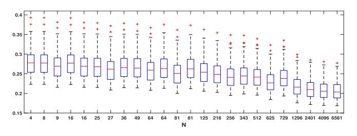
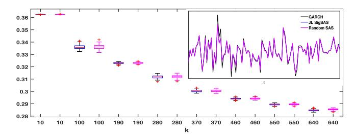

# Discrete-Time Signatures and Randomness in Reservoir Computing

Christa Cuchiero, Lukas Gonon®, Lyudmila Grigoryeva, Juan-Pablo Ortega®, and Josef Teichmann

Abstract-A new explanation of the geometric nature of the reservoir computing (RC) phenomenon is presented. RC is understood in the literature as the possibility of approximating input-output systems with randomly chosen recurrent neural systems and a trained linear readout layer. Light is shed on this phenomenon by constructing what is called strongly universal reservoir systems as random projections of a family of state-space systems that generate Volterra series expansions. This procedure yields a state-affine reservoir system with randomly generated coefficients in a dimension that is logarithmically reduced with respect to the original system. This reservoir system is able to approximate any element in the fading memory filters class just by training a different linear readout for each different filter. Explicit expressions for the probability distributions needed in the generation of the projected reservoir system are stated, and bounds for the committed approximation error are provided.

Index Terms—Echo state network (ESN), Johnson-Lindenstrauss (JL) lemma, machine learning, recurrent neural network (RNN), reservoir computing (RC), signature state-affine system (SigSAS), state-affine system (SAS), Volterra series.

## I. INTRODUCTION

MANY dynamical problems in engineering, signal processing, forecasting, time-series analysis, recurrent neural networks (RNNs), or control theory can be described using input—output (IO) systems. These mathematical objects establish a functional link that describes the relationship

Manuscript received 17 September 2020; revised 7 February 2021; accepted 27 April 2021. Date of publication 26 May 2021; date of current version 28 October 2022. The work of Christa Cuchiero was supported in part by the Vienna Science and Technology Fund (WWTF) under Grant MA16-021 and in part by Fonds zur Förderung der wissenschaftlichen Forschung (FWF) START under Grant Y 1235. The work of Lukas Gonon was supported in part by the Research Commission of the Universität Sankt Gallen and in part by the Swiss National Science Foundation under Grant 200021 175801/1. The work of Juan-Pablo Ortega was supported in part by the Research Commission of the Universität Sankt Gallen, in part by the Swiss National Science Foundation under Grant 200021 175801/1, and in part by the French Agence Nationale de la Recherche (ANR) through the Brain Inspired Photonic Processor ("BIPHOPROC") Project under Grant ANR-14-OHRI-0002-02. The work of Josef Teichmann was supported in part by the ETH Foundation and in part by the Swiss National Science Foundation, "Machine Learning in Finance" under Grant 179114. (Corresponding author: Juan-Pablo Ortega.)

Christa Cuchiero is with the Department of Statistics and Operations Research, University of Vienna, 1010 Vienna, Austria.

Lukas Gonon is with the LMU Mathematics Institute, Ludwig-Maximilians-Universität München, 80336 Munich, Germany.

Lyudmila Grigoryeva is with the Department of Mathematics and Statistics, Universität Konstanz, 78464 Konstanz, Germany.

Juan-Pablo Ortega is with the Nanyang Technological University, Singapore (e-mail: juan-pablo.ortega@ntu.edu.sg).

Josef Teichmann is with ETH Zürich, 8092 Zürich, Switzerland.

This article has supplementary material provided by the authors and color versions of one or more figures available at https://doi.org/10.1109/TNNLS.2021.3076777.

Digital Object Identifier 10.1109/TNNLS.2021.3076777

between the time evolution of one or several explanatory variables (the input) and the second collection of dependent or explained variables (the output).

A generic question in all those fields is to determine the IO system underlying an observed phenomenon. This is the so-called *system identification problem*. For this purpose, first, principles coming from physics or chemistry can be invoked, when either these are known or the setup is simple enough to apply them. In complex situations, in which access to all the variables that determine the behavior of the systems is difficult or impossible, or when a precise mathematical relationship between input and output is not known, it has proved more efficient to carry out the system identification using generic families of models with strong approximation abilities that are estimated using observed data. This approach, which we refer to as *empirical system identification*, has been developed using different techniques coming simultaneously from engineering, statistics, and computer science.

In this article, we focus on a particularly promising strategy for empirical system identification known as reservoir computing (RC). RC capitalizes on the revolutionary idea that there are learning systems that attain universal approximation properties without the need to estimate all their parameters using, for instance, supervised learning. More specifically, RC can be seen as a RNNs approach to model IO systems using state-space representations in which the following holds.

- 1) The state equation is randomly generated, sometimes with sparsity features.
- 2) Only the (usually very simple) functional form of the observation equation is tailored to the specific problem using observed data.

RC can be found in the literature under other denominations, such as *liquid state machines* [1]–[5], and is represented by various learning paradigms, with echo state networks (ESNs) [6]–[8] being a particularly important example.

RC has shown superior performance in many forecasting and classification engineering tasks (see [9]–[12], and references therein) and has shown unprecedented abilities in the learning of the attractors of complex nonlinear infinite dimensional dynamical systems [8], [13]–[15]. In addition, RC implementations with dedicated hardware have been designed and built (see [16]–[24]) that exhibit information processing speeds that largely outperform standard Turing-type computers.

The most far-reaching and radical innovation in the RC approach is the use of untrained, randomly generated, and, sometimes, sparse state maps. This circumvents well-known difficulties in the training of generic RNNs arising bifurcation phenomena [25], which, despite recent progress in the regularization and training of deep RNN structures (see [26]–[28], and references therein), renders classical gradient descent methods nonconvergent. Randomization has already been

successfully applied in a static setup using neural networks with randomized weights, in particular, in seminal works on random feature models [29] and extreme learning machines [30]. This built-in randomness makes reservoir models different from other conventional approaches where statespace systems appear. For instance, the Kalman filtering [31] has been used for decades in signal processing, and in that case, both linear and nonlinear [32], [33] Kalman techniques hinge on the idea of designing the state map to result in a posteriori residual errors of minimal variance. This requires a significant computational effort in relation to recursive parameter estimation, which is not needed for RC systems. In the context of the dynamical systems, an important result in [34] shows that randomly drawn ESNs can be trained by exclusively optimizing a linear readout using generic 1-D observations of a given invertible and differentiable dynamical system to produce dynamics that are topologically conjugate to that given system; in other words, randomly generated ESNs are capable of learning the attractors of invertible dynamical systems. More generally, the approximation capabilities of randomly generated ESNs have been established in [35] in the more general setup of IO systems. There, approximation bounds have been provided in terms of their architecture parameters.

In this article, we provide additional insight on the randomization question for another family of RC systems, namely, for the nonhomogeneous state-affine systems (SAS). These systems have been introduced and proved to be universal approximants in [36] and [37]. We here show that they also have this universality property when they are *randomly* generated. The approach pursued in this work is considerably different from the one in the above-cited references and is based on the following steps. First, we consider causal and time-invariant (TI) analytic filters with semi-infinite inputs. The Taylor series expansion of these objects coincides with what is known as their Volterra series representation. Second, we show that the truncated Volterra series representation (whose associated truncation error can be quantified) admits a state-space representation with linear readouts in a (potentially) high-dimensional adequately constructed tensor space. We refer to this system as the signature SAS (SigSAS): on the one hand, it belongs to the SAS family, and on the other hand, it shares fundamental properties with the so-called signature process from the (continuous-time) theory of rough paths, which inspired the title of the article.

The rough path theory, as introduced by Lyons [38] in the seminal work, has initially been developed to deal with controlled differential equations driven by rough signals in a pathwise way. These equations can be seen as a continuous-time analog of time-series models, where the rough signals play the role of the model innovations. The key object in this theory is the *signature*, which was first studied by Chen [39], [40] and consists in enhancing the rough input with additional curves (satisfying certain algebraic properties) mimicking what, in the smooth case, corresponds to *iterated integrals* of the curve with itself.

It is a deep mathematical fact that unique solutions of the rough differential equation exist and are a continuous map of the signature (in appropriately chosen topologies). Surprisingly, this nonlinear continuous map can be arbitrarily well approximated by *linear maps* of the signature. More generally, on compact sets of so-called "nontree-like" paths (see [41] for a precise definition), every continuous path functional (with respect to a certain *p*-variation norm) can be uniformly

approximated by a linear function of the signature. Indeed, linear functionals of the signature form a point separating algebra on sets of "nontree-like" paths, which, by the Stone–Weierstrass theorem, then yields a universal approximation theorem for general path functionals (see [42]). The rough path theory has been substantially extended by Hairer [43] toward the theory of regularity structures and is, nowadays, *the* tool to analyze deep analytic properties of continuous-time IO systems.

From a machine learning perspective, the signature can be thought of as a feature map capturing *all* specific characteristics of a given path. More precisely, it serves as a linear regression basis and can, thus, be interpreted as an abstract reservoir (for the moment without random specifications) for solutions of rough differential equations. These appealing properties made signature methods highly popular for machine learning applications both for streamed data (in particular, in finance) and complex classification tasks. For inspiring examples of the rapidly growing literature on machine learning using signature methods, we refer to [44]–[51], and references therein.

Returning to the SAS family, we will show that the solutions of the SigSAS introduced in this article share exactly the two crucial properties, which makes signature central in rough path theory: first, the SigSAS solutions fully characterize the input sequences; second, any (sufficiently regular) IO system can be written as a linear map of the SigSAS system. These properties have been exploited in the continuous-time setup in [52].

Finally, we use the Johnson–Lindenstrauss (JL) Lemma [53] to prove that a random projection of the SigSAS system yields a smaller dimensional SAS system with random matrix coefficients (that can be chosen to be sparse) that approximate the original system. Moreover, this constructive procedure gives us full knowledge of the law that needs to be used to draw the entries of the low-dimensional SAS approximating system, without ever having to use the original large dimensional SigSAS, which amounts to a form of information compression with efficient reconstruction in this setup [54]. An important feature of the dimension-reduced randomly drawn SAS system is that it serves as a universal approximator for any reasonably behaved IO system and that only the linear output layer that is applied to it depends on the individual system that needs to be learned. We refer to this feature as the strong universality property.

This approach to the approximation problem in RNNs using randomized systems provides a new explanation of the geometric nature of the RC phenomenon. The results in the following show that randomly generated SAS reservoir systems approximate well any sufficiently regular IO system just by tuning a linear readout because they coincide with an error-controlled random projection of a higher dimensional Volterra series expansion of that system.

## II. TRUNCATED VOLTERRA REPRESENTATIONS OF ANALYTIC FILTERS

We start by describing the setup that we shall be working on, together with the main approximation tool that we will be using later on in the article, namely, Volterra series expansions. Details on the concepts introduced in the following can be found in, for instance, [55]–[57], and references therein.

All along this article, the symbol  $\mathbb{Z}$  denotes the set of all integers, and  $\mathbb{Z}_-$  stands for the set of negative integers with the zero element included. Let  $D_d \subset \mathbb{R}^d$  and  $D_m \subset \mathbb{R}^m$ . We refer

to the maps of the type  $U:(D_d)^{\mathbb{Z}}\longrightarrow (D_m)^{\mathbb{Z}}$  between infinite sequences with values in  $D_d$  and  $D_m$ , respectively, as *filters*, *operators*, or discrete-time *IO systems*, and to those like  $H:(D_d)^{\mathbb{Z}}\longrightarrow D_m$  (or  $H:(D_d)^{\mathbb{Z}_-}\longrightarrow D_m$ ) as  $\mathbb{R}^m$ -valued *functionals*. These definitions will be, sometimes, extended to accommodate situations where the domains and the targets of the filters are not necessarily product spaces but just arbitrary subsets of  $(\mathbb{R}^d)^{\mathbb{Z}}$  and  $(\mathbb{R}^m)^{\mathbb{Z}}$ , such as, for instance,  $\ell^{\infty}(\mathbb{R}^d)$  and  $\ell^{\infty}(\mathbb{R}^m)$ .

A filter  $U:(D_d)^{\mathbb{Z}} \longrightarrow (D_m)^{\mathbb{Z}}$  is called *causal* when, for any two elements  $\mathbf{z}, \mathbf{w} \in (D_d)^{\mathbb{Z}}$  that satisfy that  $\mathbf{z}_{\tau} = \mathbf{w}_{\tau}$  for any  $\tau \leq t$ ; for a given  $t \in \mathbb{Z}$ , we have that  $U(\mathbf{z})_t = U(\mathbf{w})_t$ . Let  $T_{\tau}:(D_d)^{\mathbb{Z}} \longrightarrow (D_d)^{\mathbb{Z}}$  be the *time delay* operator defined by  $T_{\tau}(\mathbf{z})_t := \mathbf{z}_{t-\tau}$ . The filter U is called TI when it commutes with the time delay operator, that is,  $T_{\tau} \circ U = U \circ T_{\tau}$ , for any  $\tau \in \mathbb{Z}$  (in this expression, the two operators  $T_{\tau}$  have to be understood as defined in the appropriate sequence spaces). There is a bijection between causal and TI filters and functionals. We denote by  $U_H:(D_d)^{\mathbb{Z}} \longrightarrow (D_m)^{\mathbb{Z}}$  (respectively,  $H_U:(D_d)^{\mathbb{Z}_-} \longrightarrow D_m$ ) the filter (respectively, the functional) associated with the functional  $H:(D_d)^{\mathbb{Z}_-} \longrightarrow D_m$  (respectively, the filter  $U:(D_d)^{\mathbb{Z}} \longrightarrow (D_m)^{\mathbb{Z}}$ ). Causal and TI filters are fully determined by their restriction to semi-infinite sequences, that is,  $U:(D_d)^{\mathbb{Z}_-} \longrightarrow (D_m)^{\mathbb{Z}_-}$ , which will be denoted using the same symbol.

In most cases, we work in the situation in which  $D_d$  and  $D_m$  are compact and the sequence spaces  $(D_d)^{\mathbb{Z}_-}$  and  $(D_m)^{\mathbb{Z}_-}$  are endowed with the product topology. It can be shown (see [55]) that this topology is equivalent to the norm topology induced by any weighted norm defined by  $\|\mathbf{z}\|_w := \sup_{t \in \mathbb{Z}_-} \{\mathbf{z}_t w_{-t}\}$ ,  $\mathbf{z} \in (D_d)^{\mathbb{Z}_-}$ , where  $w : \mathbb{N} \longrightarrow (0, 1]$  is an arbitrary strictly decreasing sequence (we call it *weighting sequence*) with zero limit and such that  $w_0 = 1$ . Filters and functionals that are continuous with respect to this topology are said to have the fading memory property (FMP).

A particularly important class of IO systems is those generated by *state-space systems* in which the output  $\mathbf{y} \in (D_m)^{\mathbb{Z}_-}$  is obtained out of the input  $\mathbf{z} \in (D_d)^{\mathbb{Z}_-}$  as the solution of the equations

$$\begin{cases} \mathbf{x}_t = F(\mathbf{x}_{t-1}, \mathbf{z}_t) \\ \mathbf{y}_t = h(\mathbf{x}_t) \end{cases} \tag{1}$$

where  $F:D_N\times D_d\longrightarrow D_N$  is the so-called *state map*, for some  $D_N\subset\mathbb{R}^N,\ N\in\mathbb{N}$ , and  $h:D_N\longrightarrow D_m$  is the *readout* or *observation* map. When, for any input  $\mathbf{z}\in(D_d)^{\mathbb{Z}_-}$ , there is only one output  $\mathbf{y}\in(D_m)^{\mathbb{Z}_-}$  that satisfies (1) and (2), we say that this state-space system has the echo state property (ESP); in that case, it determines a unique filter  $U_h^F:(D_d)^{\mathbb{Z}_-}\longrightarrow (D_m)^{\mathbb{Z}_-}$ . When the ESP holds at the level of the state (1), then it determines another filter  $U^F:(D_d)^{\mathbb{Z}_-}\longrightarrow (D_N)^{\mathbb{Z}_-}$ , and then,  $U_h^F=h(U^F)$ . The filters  $U_h^F$  and  $U^F$ , when they exist, are automatically causal and TI (see [55]). The continuity and the differentiability properties of the state and observation maps F and h imply continuity and differentiability for  $U_h^F$  and  $U^F$  under very general hypotheses; see [56] for an indepth study of this question.

We denote by  $\|\cdot\|$  the Euclidean norm if not stated otherwise and use the symbol  $\|\|\cdot\|$  for the operator norm with respect to the two-norms in the target and the domain spaces. In addition, for any  $\mathbf{z} \in (\mathbb{R}^d)^{\mathbb{Z}_-}$ , we define p-norms as  $\|\mathbf{z}\|_p := (\sum_{t \in \mathbb{Z}_-} \|\mathbf{z}_t\|^p)^{1/p}$ , for  $1 \leq p < \infty$ , and  $\|\mathbf{z}\|_{\infty} := \sup_{t \in \mathbb{Z}_-} \{\|\mathbf{z}_t\|\}$ , for  $p = \infty$ . Given M > 0, we denote by  $K_M := \{\mathbf{z} \in (\mathbb{R}^d)^{\mathbb{Z}_-} \mid \|\mathbf{z}_t\| \leq M \text{ for all } t \in \mathbb{Z}_-\}$ . It is easy

to see that  $K_M = \overline{B_M} \subset \ell_-^\infty(\mathbb{R}^d)$ , with  $B_M := B_{\|\cdot\|_\infty}(\mathbf{0}, M)$  and  $\ell_-^\infty(\mathbb{R}^d) := \{\mathbf{z} \in (\mathbb{R}^d)^{\mathbb{Z}_-} \mid \|\mathbf{z}\|_\infty < \infty\}$ . We define  $\widetilde{B}_M := B_M \cap \ell_-^1(\mathbb{R}^d)$  with  $\ell_-^1(\mathbb{R}^d) := \{\mathbf{z} \in (\mathbb{R}^d)^{\mathbb{Z}_-} \mid \|\mathbf{z}\|_1 < \infty\}$  and use the same symbol  $\widetilde{B}_M$  whenever d = 1. In addition, we will write L(V, W) to refer to the space of linear maps between the real vector spaces V and W. The following statement is the main approximation result that will be used in the article.

Theorem 1: Let M, L > 0 and  $U : K_M \subset \ell^{\infty}_{-}(\mathbb{R}^d) \longrightarrow K_L \subset \ell^{\infty}_{-}(\mathbb{R}^m)$  be a causal and TI fading memory filter whose restriction  $U|_{B_M}$  is analytic as a map between open sets in the Banach spaces  $\ell^{\infty}_{-}(\mathbb{R}^d)$  and  $\ell^{\infty}_{-}(\mathbb{R}^m)$  and satisfies  $U(\mathbf{0}) = \mathbf{0}$ . Then, for any  $\mathbf{z} \in \widetilde{B}_M$ , there exists a Volterra series representation of U given by

$$U(\mathbf{z})_{t} = \sum_{j=1}^{\infty} \sum_{m_{1}=-\infty}^{0} \dots \sum_{m_{j}=-\infty}^{0} g_{j}(m_{1}, \dots, m_{j}) \times (\mathbf{z}_{m_{1}+t} \otimes \dots \otimes \mathbf{z}_{m_{j}+t}) \quad (3)$$

with  $t \in \mathbb{Z}_{-}$  and where the map  $g_j : (\mathbb{Z}_{-})^j \longrightarrow L(\mathbb{R}^d \otimes \cdots \otimes \mathbb{R}^d, \mathbb{R}^m)$  is given by

$$g_j(m_1,\ldots,m_j)(\mathbf{e}_{i_1}\otimes\cdots\otimes\mathbf{e}_{i_j})=\frac{1}{j!}D^jH_U(\mathbf{0})(\mathbf{e}_{m_1}^{i_1},\ldots,\mathbf{e}_{m_j}^{i_j})$$
(4)

where, for any  $\mathbf{z}_0$  in some open subset of  $\ell_-^{\infty}(\mathbb{R}^d)$ ,  $D^j H_U(\mathbf{z}_0)$  with  $j \geq 1$  denotes the j-order Fréchet differential at  $\mathbf{z}_0$  of the functional  $H_U$  associated with the filter U,  $\{\mathbf{e}_1, \ldots, \mathbf{e}_d\}$  is the canonical basis of  $\mathbb{R}^d$ , and the sequences  $\mathbf{e}_{m_k}^i \in \ell_-^{\infty}(\mathbb{R}^d)$  are defined by

$$\left(\mathbf{e}_{m_k}^{i_l}\right)_t := \begin{cases} \mathbf{e}_{i_l} \in \mathbb{R}^d, & \text{if } t = m_k \\ \mathbf{0}, & \text{otherwise.} \end{cases}$$

Moreover, there exists a monotonically decreasing sequence  $w^U$  with zero limit such that, for any  $p, l \in \mathbb{N}$ 

$$\left\| U(\mathbf{z})_{t} - \sum_{j=1}^{p} \sum_{m_{1}=-l}^{0} \dots \sum_{m_{j}=-l}^{0} g_{j}(m_{1}, \dots, m_{j}) \times (\mathbf{z}_{m_{1}+t} \otimes \dots \otimes \mathbf{z}_{m_{j}+t}) \right\|$$

$$\leq w_{l}^{U} + L \left(1 - \frac{\|\mathbf{z}\|_{\infty}}{M}\right)^{-1} \left(\frac{\|\mathbf{z}\|_{\infty}}{M}\right)^{p+1}.$$
 (5)

### A. Signature State-Affine System

We now show that the filter obtained out of the truncated Volterra series expansion in the expression (5) can be written down as the unique solution of a nonhomogeneous SAS with linear readouts that, as we shall show in Section II-B, have particularly strong universal approximation properties. We first briefly recall how the SAS family is constructed.

Let  $\boldsymbol{\alpha} = (\alpha_1, \dots, \alpha_d)^{\top} \in \mathbb{N}^d$  and  $\mathbf{z} = (z_1, \dots, z_d)^{\top} \in \mathbb{R}^d$ , and define the monomials  $\mathbf{z}^{\boldsymbol{\alpha}} := z_1^{\alpha_1} \dots z_d^{\alpha_d}$ . We denote by  $\mathbb{M}_{N_1,N_2}$  the space of real  $N_1 \times N_2$  matrices with  $N_1, N_2 \in \mathbb{N}$  and use  $\mathbb{M}_{N_1,N_2}[\mathbf{z}]$  to refer to the space of polynomials in  $\mathbf{z} \in \mathbb{R}^d$  with matrix coefficients in  $\mathbb{M}_{N_1,N_2}$ , that is, the set of elements p of the form

$$p(\mathbf{z}) = \sum_{\alpha \in V_n} \mathbf{z}^{\alpha} A_{\alpha}$$

with  $V_p \subset \mathbb{N}^d$  being a finite subset and  $A_{\alpha} \in \mathbb{M}_{N_1,N_2}$  the matrix coefficients. An SAS is given by

$$\begin{cases} \mathbf{x}_t = p(\mathbf{z}_t)\mathbf{x}_{t-1} + q(\mathbf{z}_t) \\ \mathbf{y}_t = W\mathbf{x}_t. \end{cases}$$
 (6)

 $p \in \mathbb{M}_{N,N}[\mathbf{z}]$  and  $q \in \mathbb{M}_{N,1}[\mathbf{z}]$  are polynomials with matrix and vector coefficients, respectively, and  $W \in \mathbb{M}_{m,N}$ . If we consider inputs in the set  $K_M$  and p and q in the state-space system (6) such that

$$\begin{split} M_p &:= \sup_{\mathbf{z} \in \overline{B_{\|\cdot\|}(\mathbf{0}, M)}} \{ \| \| p(\mathbf{z}) \| \} < 1 \\ M_q &:= \sup_{\mathbf{z} \in \overline{B_{\|\cdot\|}(\mathbf{0}, M)}} \{ \| \| q(\mathbf{z}) \| \} < \infty \end{split}$$

where  $\overline{B_{\|\cdot\|}(\mathbf{0}, M)}$  denotes the closed ball in  $\mathbb{R}^d$  of radius M and center  $\mathbf{0}$  with respect to the Euclidean norm, then a unique state-filter  $U^{p,q}: K_M \longrightarrow K_L$  can be associated with it, with  $L := M_q/(1-M_p)$ . It has been shown in [36] and [37] that SAS systems are universal approximants in the fading memory and in the  $L^p$ -integrable categories in the sense that, given a filter in any of those two categories, there exists an SAS system of type (6) that uniformly, or in the  $L^p$ -sense, approximates it.

The SigSAS that we construct in this section exhibits what we call the *strong universality property*. This means that the state equation for this state-space representation is *the same* for any fading memory filter that is being approximated, and it is only the linear readout that changes. In other words, we provide a result that yields the approximation (as accurate as desired) of any fading memory IO system, as the linear readout of the solution of a fixed nonhomogeneous SAS system that *does not depend on the filter being approximated*.

Since the important property that we just described is reminiscent of an analogous feature of the signature process in the context of the representation of the solutions of controlled stochastic differential equations [52], we shall refer to this state system as the *SigSAS* system.

Before we proceed, we need to introduce some notation. First, for any  $l, d \in \mathbb{N}$ , we denote by  $T^{l}(\mathbb{R}^{d})$  the space of tensors of order l on  $\mathbb{R}^{d}$ , that is

$$T^{l}(\mathbb{R}^{d}) := \left\{ \sum_{i_{1},\ldots,i_{-l}=1}^{d} a_{i_{1},\ldots,i_{-l}} \mathbf{e}_{i_{1}} \otimes \cdots \otimes \mathbf{e}_{i_{l}} \mid a_{i_{1},\ldots,i_{-l}} \in \mathbb{R} \right\}.$$

The tensor space  $T^l(\mathbb{R}^d)$  will be understood as a normed space with a crossnorm [58] that we shall leave unspecified for the time being. We shall be using an *order lowering map*  $\pi_l: T^{l+1}(\mathbb{R}^d) \longrightarrow T^l(\mathbb{R}^d)$  that, for any vector  $\mathbf{v} := \sum_{i_1,\dots,i_{l+1}=1}^d a_{i_1,\dots,i_{l+1}} \mathbf{e}_{i_1} \otimes \dots \otimes \mathbf{e}_{i_{l+1}} \in T^{l+1}(\mathbb{R}^d)$ , is defined as

$$\pi_l(\mathbf{v}) := \sum_{i_2,\dots,i_{l+1}=1}^d a_{1,i_2,\dots,i_{l+1}} \mathbf{e}_{i_2} \otimes \dots \otimes \mathbf{e}_{i_{l+1}} \in T^l(\mathbb{R}^d).$$

The order lowering map is linear, and its operator norm satisfies that  $\||\pi_l|\| = 1$ .

We shall restrict the presentation to 1-D inputs, that is, we consider input sequences  $\mathbf{z} \in K_M \subset \ell_-^{\infty}(\mathbb{R})$ . Now, for fixed  $l, p \in \mathbb{N}$ , we define for any  $\mathbf{z} \in K_M$  and  $t \in \mathbb{Z}_-$ 

$$\widetilde{\mathbf{z}}_t := \sum_{i=1}^{p+1} z_t^{i-1} \mathbf{e}_i \in \mathbb{R}^{p+1} \text{ and } \widehat{\mathbf{z}}_t := \widetilde{\mathbf{z}}_{t-1} \otimes \cdots \otimes \widetilde{\mathbf{z}}_t.$$
 (7)

Note that  $\widetilde{\mathbf{z}}_t$  is the *Vandermonde vector* [59] associated with  $z_t$  and that  $\widehat{\mathbf{z}}_t$  is a tensor in  $T^{l+1}(\mathbb{R}^{p+1})$  whose components in the canonical basis are all the monomials on the variables  $z_t, \ldots, z_{t-l}$  that contain powers up to order p in each of those variables, namely

$$\widehat{\mathbf{z}}_{l} = \sum_{i_1,\dots,i_{l+1}=1}^{p+1} z_{t-l}^{i_1-1} \dots z_t^{i_{l+1}-1} \mathbf{e}_{i_1} \otimes \dots \otimes \mathbf{e}_{i_{l+1}}.$$

Finally, given  $I_0 \subset \{1, ..., p+1\}$  an arbitrarily chosen but fixed subset of cardinality higher than 1 that contains the element 1, we define

$$\widehat{\mathbf{z}}_{t}^{0} = \sum_{i \in I_{0}} z_{t}^{i-1} \underbrace{\mathbf{e}_{1} \otimes \cdots \otimes \mathbf{e}_{1}}_{l\text{-times}} \otimes \mathbf{e}_{i} \in T^{l+1}(\mathbb{R}^{p+1}). \tag{8}$$

The next proposition introduces the SigSAS state system for fixed  $l, p \in \mathbb{N}$ , whose solution is used later on in Theorem 4 to represent the truncated Volterra series expansions in Theorem 1 of polynomial degree p and lag -l [see expression (5)].

Proposition 2 (SigSAS System): Let M > 0 and  $l, p \in \mathbb{N}$ . Let  $0 < \lambda < \min\{1, 1/\sum_{j=0}^p M^j\}$ . Consider the state system with uniformly bounded scalar inputs in  $K_M = [-M, M]^{\mathbb{Z}_-}$  and states in  $T^{l+1}(\mathbb{R}^{p+1})$  given by the recursion

$$\mathbf{x}_t = \lambda \pi_t(\mathbf{x}_{t-1}) \otimes \widetilde{\mathbf{z}}_t + \widehat{\mathbf{z}}_t^0. \tag{9}$$

This state equation is induced by the state map  $F_{\lambda,l,p}^{\mathrm{SigSAS}}$ :  $T^{l+1}(\mathbb{R}^{p+1}) \times \mathbb{R} \longrightarrow T^{l+1}(\mathbb{R}^{p+1})$  defined by

$$F_{\lambda,l,p}^{\text{SigSAS}}(\mathbf{x},z) := \lambda \pi_l(\mathbf{x}) \otimes \widetilde{\mathbf{z}} + \widehat{\mathbf{z}}^0$$
 (10)

which is a contraction in the state variable with contraction constant

$$\lambda \widetilde{M} < 1$$
, where  $\widetilde{M} := \sum_{j=0}^{p} M^{j}$  (11)

and, hence, restricts to a map  $F_{\lambda,l,p}^{\text{SigSAS}}: \overline{B_{\|\cdot\|}(\mathbf{0},L)} \times [-M,M] \longrightarrow \overline{B_{\|\cdot\|}(\mathbf{0},L)}$ , with

$$L := \widetilde{M}/(1 - \lambda \widetilde{M}). \tag{12}$$

This state system has the echo state and the fading memory properties and its continuous, and TI, and a causal associated filter  $U_{\lambda,l,p}^{\mathrm{SigSAS}}:K_M\longrightarrow K_L\subset T^{l+1}(\mathbb{R}^{p+1})$  is given by

$$U_{\lambda,l,p}^{\text{SigSAS}}(\mathbf{z})_{t} = \frac{\lambda^{l+1}}{1-\lambda} \widehat{\mathbf{z}}_{t} + \lambda^{l} \underbrace{\pi_{l} (\pi_{l} (\cdots (\pi_{l} (\widehat{\mathbf{z}}_{t-l}^{0}) \otimes \widetilde{\mathbf{z}}_{t-(l-1)}))}_{l\text{-times}} \otimes \cdots) \otimes \widetilde{\mathbf{z}}_{t-1}) \otimes \widetilde{\mathbf{z}}_{t}$$

 $+\cdots + \lambda \pi_l(\widehat{\mathbf{z}}_{t-1}^0) \otimes \widehat{\mathbf{z}}_t + \widehat{\mathbf{z}}_t^0$ . (13) 
 
 *Remark 3:* The state (9) is, indeed, an SAS with states defined in  $T^{l+1}(\mathbb{R}^{p+1})$  as it has the same form as the first equality in (6). Indeed, this equation can be written as  $\mathbf{x}_t = p(z_t)\mathbf{x}_{t-1} + q(z_t)$  with  $p(z_t)$  and  $q(z_t)$  being the polynomials in  $z_t$  with coefficients in  $L(T^{l+1}(\mathbb{R}^{p+1}), T^{l+1}(\mathbb{R}^{p+1}))$  and  $T^{l+1}(\mathbb{R}^{p+1})$ , respectively, given by

$$p(z_t)\mathbf{x}_{t-1} := \lambda \pi_l(\mathbf{x}_{t-1}) \otimes \widetilde{\mathbf{z}}_t = \sum_{i=1}^{p+1} z_t^{i-1} (\lambda \pi_l(\mathbf{x}_{t-1}) \otimes \mathbf{e}_i)$$
$$q(z_t) := \widehat{\mathbf{z}}_t^0 = \sum_{i \in L} z_t^{i-1} \mathbf{e}_1 \otimes \cdots \otimes \mathbf{e}_1 \otimes \mathbf{e}_i.$$

### B. SigSAS Approximation Theorem

As we already pointed out,  $\widehat{\mathbf{z}}_t$  is a vector in  $T^{l+1}(\mathbb{R}^{p+1})$  whose components in the canonical basis are all the monomials on the variables  $z_t,\ldots,z_{t-l}$  that contain powers up to order p in each of those variables. Moreover, it is easy to see that all the other summands in the expression (13) of the filter  $U_{\lambda,l,p}^{\mathrm{SigSAS}}$  are proportional (with a positive constant) to monomials already contained in  $\widehat{\mathbf{z}}_t$ . This implies the existence of a linear map  $A_{\lambda,l,p} \in L(T^{l+1}(\mathbb{R}^{p+1}),T^{l+1}(\mathbb{R}^{p+1}))$  with an invertible matrix representation with nonnegative entries such that

$$U_{\lambda,l,p}^{\text{SigSAS}}(\mathbf{z})_t = A_{\lambda,l,p}\widehat{\mathbf{z}}_t. \tag{14}$$

In the sequel, we will denote the matrix representation of  $A_{\lambda,l,p}$  using the same symbol  $A_{\lambda,l,p} \in \mathbb{M}_{N,N}$ ,  $N := (p+1)^{l+1}$ . This observation, together with Theorem 1, can be used to prove the following result.

Theorem 4: Let M, L > 0 and  $U : K_M \subset \ell^\infty_-(\mathbb{R}) \longrightarrow K_L \subset \ell^\infty_-(\mathbb{R}^m)$  be a causal and TI fading memory filter whose restriction  $U|_{B_M}$  is analytic as a map between open sets in the Banach spaces  $\ell^\infty_-(\mathbb{R})$  and  $\ell^\infty_-(\mathbb{R}^m)$  and satisfies  $U(\mathbf{0}) = \mathbf{0}$ . Then, there exists a monotonically decreasing sequence  $w^U$  with zero limit such that, for any  $p, l \in \mathbb{N}$  and any  $0 < \lambda < \min\{1, 1/\sum_{j=0}^p M^j\}$ , there exists a linear map  $W \in L(T^{l+1}(\mathbb{R}^{p+1}), \mathbb{R}^m)$  such that, for any  $\mathbf{z} \in \widetilde{B}_M$ 

$$\|U(\mathbf{z})_{t} - WU_{\lambda,l,p}^{\operatorname{SigSAS}}(\mathbf{z})_{t}\|$$

$$\leq w_{l}^{U} + L\left(1 - \frac{\|\mathbf{z}\|_{\infty}}{M}\right)^{-1} \left(\frac{\|\mathbf{z}\|_{\infty}}{M}\right)^{p+1}. \quad (15)$$

Remark 5: Theorem 4 establishes the strong universality of the SigSAS system in the sense that the state equation of this system is the same for any fading memory filter U that is being approximated, and it is only the linear readout that changes. Nevertheless, we emphasize that the quality of the approximation is not filter independent, as the decreasing sequence  $w^U$  in the bound (15) depends on how fast the filter U "forgets" past inputs.

Remark 6: The analyticity hypothesis in the statement of Theorem 4 can be dropped by using the fact that finite order and finite memory Volterra series are universal approximators in the fading memory category (see [60] and [56, Th. 31]). In that situation, the bound for the truncation error in (15) does not necessarily apply anymore, in particular, its second summand, which is intrinsically linked to analyticity. A generalized bound can be formulated in that case using arguments along the lines of those found in [35].

## III. JL REDUCTION OF THE SIGSAS REPRESENTATION

The price to pay for the strong universality property exhibited by the SigSAS that we constructed in Section II-B is the potentially large dimension of the tensor space in which this state-space representation is defined. In this section, we concentrate on this problem by proposing a dimension reduction strategy, which consists of using the random projections in the JL Lemma [53] in order to construct a smaller dimensional SAS system with random matrix coefficients (that can be chosen to be sparse). The results contained in Sections III-B and III-C quantify the increase in approximation error committed when applying this dimensionality reduction strategy.

We start by introducing the JL Lemma [53] and some properties that are needed later on in the presentation. Following this, we spell out how to use it in the dimension reduction of state-space systems, in general, and the SigSAS representation, in particular.

### A. JL Lemma and Approximate Projections

Given an *N*-dimensional Hilbert space  $(V, \langle \cdot, \cdot \rangle)$  and Q a n-point subset of V, the JL Lemma [53], [61] guarantees, for any  $0 < \epsilon < 1$ , the existence of a linear map  $f: V \longrightarrow \mathbb{R}^k$ , with  $k \in \mathbb{N}$  satisfying

$$k \ge \frac{24\log n}{3\epsilon^2 - 2\epsilon^3} \tag{16}$$

which respects  $\epsilon$ -approximately the distances between the points in the set Q. More specifically

$$(1 - \epsilon) \|\mathbf{v}_1 - \mathbf{v}_2\|^2 \le \|f(\mathbf{v}_1) - f(\mathbf{v}_2)\|^2 \le (1 + \epsilon) \|\mathbf{v}_1 - \mathbf{v}_2\|^2$$
 (17)

for any  $\mathbf{v}_1, \mathbf{v}_2 \in Q$ . The norm  $\|\cdot\|$  in  $\mathbb{R}^k$  comes from an inner product that makes it into a Hilbert space, or in other words, it satisfies the parallelogram identity. This remarkable result is even more so in connection with further developments that guarantee that the linear map f can be randomly chosen [61]–[63] and, moreover, within a family of sparse transformations [64], [65] (see also [66]).

In the developments in this article, we use the original version of this result, in which the JL map f is realized by a matrix  $A \in \mathbb{M}_{k,N}$  whose entries are such that

$$A_{ij} \sim N(0, 1/k).$$
 (18)

It can be shown that, with this choice, the probability of the relation (17) to hold for any pair of points in Q is bounded below by 1/n.

*Lemma 7:* Let  $(V, \|\cdot\|)$  be a normed space, and let Q be a (finite or infinite countable) subset of V. Define  $\|\cdot\|_Q$ : span $\{Q\} \longrightarrow \mathbb{R}_+$  by

$$\|\mathbf{v}\|_{\mathcal{Q}} := \inf \left\{ \sum_{j=1}^{\operatorname{Card} \mathcal{Q}} |\lambda_j| \left| \sum_{j=1}^{\operatorname{Card} \mathcal{Q}} \lambda_j \mathbf{v}_j = \mathbf{v}, \mathbf{v}_j \in \mathcal{Q} \right. \right\}.$$

1)  $\|\cdot\|_Q$  defines a seminorm in span $\{Q\}$ . If

$$M_O := \sup\{\|\mathbf{v}_i\| \mid \mathbf{v}_i \in Q\} \tag{19}$$

is finite, then  $\|\cdot\|_Q$  is a norm.

- 2)  $\|\mathbf{v}\| \le \|\mathbf{v}\|_Q M_Q$ , for any  $\mathbf{v} \in \text{span}\{Q\}$ .
- 3) Let  $Q_1, Q_2$  be subsets of V such that  $Q_1 \subset Q_2$ . Then,  $\|\mathbf{v}\|_{Q_2} \leq \|\mathbf{v}\|_{Q_1}$  for any  $\mathbf{v} \in \text{span}\{Q_1\}$ . Remark 8: If the hypothesis  $M_Q < \infty$  is dropped in part 1)

Remark 8: If the hypothesis  $M_Q < \infty$  is dropped in part 1) of Lemma 7, then  $\|\cdot\|_Q$  is, in general, not a norm as the following example shows. Take  $V = \mathbb{R}$  and  $\mathbf{v}_i = i, i \in \mathbb{N}$ . It is easy to see that, in this setup

$$||1||_Q = \inf\left\{\frac{1}{i} \mid i \in \mathbb{N}\right\} = 0.$$

*Proposition 9:* Let Q be a set of points in the Hilbert space  $(V, \langle \cdot, \cdot \rangle)$  with  $M_Q := \sup\{\|\mathbf{v}_i\| \mid \mathbf{v}_i \in Q\} < \infty$  such that  $-Q := \{-\mathbf{v} \mid \mathbf{v} \in Q\} = Q$ . Let  $\epsilon > 0$ ; let  $f : V \longrightarrow \mathbb{R}^k$  be a linear map that satisfies the JL property (17) with respect to  $\epsilon$ ; and let  $f^* : \mathbb{R}^k \longrightarrow V$  the adjoint map with respect to a fixed inner product  $\langle \cdot, \cdot \rangle$  in  $\mathbb{R}^k$ . Then

$$|\langle \mathbf{w}_1, (\mathbb{I}_V - f^* \circ f)(\mathbf{w}_2) \rangle| \le \epsilon M_Q^2 \|\mathbf{w}_1\|_Q \|\mathbf{w}_2\|_Q$$
 (20)

for any  $\mathbf{w}_1, \mathbf{w}_2 \in \text{span} \{Q\}.$ 

Corollary 10: In the hypotheses of the previous proposition, let

$$C_{\mathcal{Q}} := \inf_{c \in \mathbb{R}_+} \{ \|\mathbf{v}\|_{\mathcal{Q}} \le c \|\mathbf{v}\|, \text{ for all } \mathbf{v} \in \text{span}\{\mathcal{Q}\} \}.$$
 (21)

Then, for any  $\mathbf{v} \in \text{span}\{Q\}$  such that  $(f^* \circ f)(\mathbf{v}) \in \text{span}\{Q\}$ , we have

$$\|(\mathbb{I}_V - f^* \circ f)(\mathbf{v})\| < \epsilon M_O^2 C_O^2 \|\mathbf{v}\|. \tag{22}$$

 $\|(\mathbb{I}_V - f^* \circ f)(\mathbf{v})\| \le \epsilon M_Q^2 C_Q^2 \|\mathbf{v}\|. \tag{22}$  This corollary is just a consequence of the inequality (20) that guarantees that

$$\|(\mathbb{I}_{V} - f^* \circ f)(\mathbf{v})\|^2 \le \epsilon M_Q^2 \|(\mathbb{I}_{V} - f^* \circ f)(\mathbf{v})\|_Q \|\mathbf{v}\|_Q$$

$$\le \epsilon M_Q^2 C_Q^2 \|(\mathbb{I}_{V} - f^* \circ f)(\mathbf{v})\| \|\mathbf{v}\|$$
(23)

which yields (22).

### B. JL Projection of State-Space Dynamics

The next result shows how, when the dimension k of the target of the JL map f determined by (16) is chosen so that this map is generically surjective, then any contractive state-space system with states in the domain of f can be projected onto another one with states in its smaller dimensional image. This result also shows that, if the original system has the ESP and the FMP, then so does the projected one. In addition, it gives bounds that quantify the dynamical differences between the two systems.

Theorem 11: Let  $F_{\rho}: \mathbb{R}^{N} \times D_{d} \longrightarrow \mathbb{R}^{N}$  be a one-parameter family of continuous state maps, where  $D_{d} \subset \mathbb{R}^{d}$ is a compact subset,  $0 < \rho < 1$ , and  $F_{\rho}$  is a  $\rho$ -contraction on the first component. Let Q be a n-point spanning subset of  $\mathbb{R}^N$  satisfying -Q = Q. Let  $f: \mathbb{R}^N \longrightarrow \mathbb{R}^k$  be a JL map that satisfies (17) with  $0 < \epsilon < 1$  where the dimension k has been chosen so that f is generically surjective. Then, the following

1) Let  $F_{\rho}^f: \mathbb{R}^k \times D_d \longrightarrow \mathbb{R}^k$  be the state map defined by

$$F_{\rho}^{f}(\mathbf{x}, \mathbf{z}) := f(F_{\rho}(f^{*}(\mathbf{x}), \mathbf{z}))$$

for any  $\mathbf{x} \in \mathbb{R}^k$  and  $\mathbf{z} \in D_d$ . If the parameter  $\rho$  is chosen so that

$$\rho < 1/\|f\|^2 \tag{24}$$

then  $F_{\rho}^{J}$  is a contraction on the first entry. The symbol  $\|\cdot\|$  in (24) denotes the operator norm with respect to the two-norms in  $\mathbb{R}^N$  and  $\mathbb{R}^k$ .

2) Let  $V_k := f^*(\mathbb{R}^k) \subset \mathbb{R}^N$ , and let  $\mathcal{F}_{\rho}^f : V_k \times D_d \longrightarrow V_k$ be the state map with states on the vector space  $V_k$ ,

$$\mathcal{F}_{\rho}^{f}(\mathbf{x}, \mathbf{z}) := f^{*} \left( F_{\rho}^{f}((f^{*})^{-1}(\mathbf{x}), \mathbf{z}) \right) = f^{*} \circ f(F_{\rho}(\mathbf{x}, \mathbf{z}))$$
(25)

for any  $\mathbf{x} \in V_k$  and  $\mathbf{z} \in D_d$ . If the contraction parameter satisfies (24), then  $\mathcal{F}_{\rho}^{f}$  is also a contraction on the first entry. Moreover, the restricted linear map  $f^*$ :  $\mathbb{R}^k \longrightarrow V_k$  is a state-map equivariant linear isomorphism between  $F_{\rho}^{f}$  and  $\mathcal{F}_{\rho}^{f}$ .

3) Suppose, in addition, that there exist two constants  $C, C_f > 0$  such that the state spaces of the state maps  $F_{\rho}$  and  $F_{\rho}^{f}$  can be restricted as  $F_{\rho}: \overline{B_{\|\cdot\|}(\mathbf{0},C)} \times D_{d} \longrightarrow \overline{B_{\|\cdot\|}(\mathbf{0},C)}$  and  $F_{\rho}^{f}: \overline{B_{\|\cdot\|}(\mathbf{0},C_{f})} \times D_{d} \longrightarrow \overline{B_{\|\cdot\|}(\mathbf{0},C_{f})}$ .

Then, both  $F_{\rho}$  and  $F_{\rho}^{f}$  have the ESP and have unique FMP associated filters  $U_{\rho}$ :  $(D_d)^{\mathbb{Z}_{-}} \longrightarrow K_C$  and  $U_{\rho}^{f}: (D_{d})^{\mathbb{Z}_{-}} \longrightarrow K_{C_{f}}$ , respectively. The state map  $\mathcal{F}_{\rho}^{f}: f^{*}(\overline{B_{\|\cdot\|}(\mathbf{0}, C_{f})}) \times D_{d} \longrightarrow f^{*}(\overline{B_{\|\cdot\|}(\mathbf{0}, C_{f})})$  is isomorphic to the restricted version of  $F_{\rho}^{f}$  and also has the ESP and an FMP associated filter  $\mathcal{U}_{\rho}^{f}:(D_{d})^{\mathbb{Z}_{-}}\longrightarrow (f_{f}^{*}(\overline{B_{\|\cdot\|}(\mathbf{0},C_{f})}))^{\mathbb{Z}_{-}}$ . The state map  $\mathcal{F}_{\rho}^{f}$  and the filter  $\mathcal{U}_{\rho}^f$  are called the *JL projected* versions of  $F_{\rho}$  and  $U_{\rho}$ ,

4) In the hypotheses of the previous point, for any  $\mathbf{z} \in (D_d)^{\mathbb{Z}_-}$  and  $t \in \mathbb{Z}_-$ 

$$\|U_{\rho}(\mathbf{z})_{t} - \mathcal{U}_{\rho}^{f}(\mathbf{z})_{t}\| \leq \epsilon^{1/2} C M_{Q} C_{Q} \frac{(1 + \|\|f\|\|^{2})^{1/2}}{1 - \rho}$$
(26)

where  $M_Q$  and  $C_Q$  are given by (19) and (21), respectively. Alternatively, it can also be shown that

$$\left\| U_{\rho}(\mathbf{z})_{t} - \mathcal{U}_{\rho}^{f}(\mathbf{z})_{t} \right\| \leq \epsilon \frac{C M_{Q}^{2} C_{Q}^{2}}{1 - \rho}.$$
 (27)

5) Let  $R > \max\{1/\|\|f\|\|^2, 1\}$ , and set  $\rho = 1/(R\|\|f\|\|^2)$ . Then, the elements in the set Q can be chosen so that the bounds in (26) and (27) reduce to

$$\epsilon^{1/2} N^{3/4} C (1 + \|\|f\|\|^2)^{1/2} \frac{R \|\|f\|\|^2}{R \|\|f\|\|^2 - 1}$$
 (28)

and

$$\epsilon NC \frac{R \| f \|^2}{R \| f \|^2 - 1} \tag{29}$$

respectively.

### C. JL-Reduced SigSAS System

We now use the previous theorem to spell out the JL projected version of SigSAS approximations and establish error bounds analogous to those introduced in (28) and (29). Given that Theorem 11 is formulated using the one and the two-norms in Euclidean spaces and Proposition 2 define the SigSAS system on a tensor space endowed with an unspecified cross-norm, we notice that those two frameworks can be matched by using the norms  $\|\cdot\|$  and  $\|\cdot\|_1$  in  $T^{l+1}(\mathbb{R}^{p+1})$  given

$$\|\mathbf{v}\|^2 := \sum_{i_1,\dots,i_{l+1}=1}^{p+1} \lambda_{i_1,\dots,i_{l+1}}^2, \quad \|\mathbf{v}\|_1^2 := \sum_{i_1,\dots,i_{l+1}=1}^{p+1} |\lambda_{i_1,\dots,i_{l+1}}|$$

with  $\mathbf{v} = \sum_{i_1,\dots,i_{l+1}=1}^{p+1} \lambda_{i_1,\dots,i_{l+1}} \mathbf{e}_{i_1} \otimes \dots \otimes \mathbf{e}_{i_{l+1}}$  and  $\{\mathbf{e}_{i_1} \otimes \dots \otimes \mathbf{e}_{i_{l+1}} \}$  $\mathbf{e}_{i_{l+1}}\}_{i_1,\dots,i_{l+1}\in\{1,\dots,p+1\}}$  being the canonical basis in  $T^{l+1}(\mathbb{R}^{p+1})$ . It is easy to check that these two norms are crossnorms and that  $\|\cdot\|$  is the norm associated with the inner product defined by the extension by bilinearity of the assigment

$$\langle \mathbf{e}_{i_1} \otimes \cdots \otimes \mathbf{e}_{i_{l+1}}, \mathbf{e}_{j_1} \otimes \cdots \otimes \mathbf{e}_{j_{l+1}} \rangle := \delta_{i_1 \ j_1} \cdots \delta_{i_{l+1} j_{l+1}}$$

which makes  $(T^{l+1}(\mathbb{R}^{p+1}), \langle \cdot, \cdot \rangle)$  into a Hilbert space, a feature that is needed to use the JL Lemma.

Corollary 12: Let M > 0, and let  $(F_{\lambda,l,p}^{SigSAS}, W)$  be the SigSAS system that approximates a causal and TI filter  $U: K_M \longrightarrow \ell^{\infty}_{-}(\mathbb{R}^m)$ , as introduced in Theorem 4. Let  $N := (p+1)^{l+1}, \ \widetilde{M} \text{ as in (11), and let } 0 < \epsilon < 1.$ Let  $f: \mathbb{R}^N \longrightarrow \mathbb{R}^k$  be a JL map that satisfies (17), where the dimension k has been chosen to make f generically surjective. Then, for any  $R > \max\{1/\|\|f\|\|^2, 1/(\tilde{M}\|\|f\|\|^2), 1\}$ ,  $\lambda := 1/(R\tilde{M}\|\|f\|\|^2)$ , and L as in (12), there exists a JL-reduced version  $\mathcal{F}_{\lambda,l,p,f}^{\mathrm{SigSAS}}: f^*(\overline{B_{\|\cdot\|}(\mathbf{0},L_f)}) \times [-M,M] \longrightarrow f^*(\overline{B_{\|\cdot\|}(\mathbf{0},L_f)})$  of  $F_{\lambda,l,p}^{\mathrm{SigSAS}}: \overline{B_{\|\cdot\|}(\mathbf{0},L)} \times [-M,M] \longrightarrow \overline{B_{\|\cdot\|}(\mathbf{0},L)}$ , with  $L_f := \tilde{M}\|\|f\|/(1-\lambda \tilde{M}\|\|f\|\|^2)$ , which has the ESP and a unique FMP associated filter  $\mathcal{U}_{\lambda,l,p,f}^{\mathrm{SigSAS}}: K_M \longrightarrow (f^*(\overline{B_{\|\cdot\|}(\mathbf{0},L_f)}))^{\mathbb{Z}_-}$ . Moreover, we have that

$$\|WU_{\lambda,l,p}^{\text{SigSAS}}(\mathbf{z})_{t} - \mathcal{W}U_{\lambda,l,p,f}^{\text{SigSAS}}(\mathbf{z})_{t}\|$$

$$\leq \|W\|\epsilon^{\frac{1}{2}}N^{\frac{3}{4}}(1 + \|f\|^{2})^{\frac{1}{2}}\frac{\widetilde{M}R^{2}\|f\|^{4}}{(R\|f\|^{2} - 1)^{2}}$$

$$\|WU_{\lambda,l,p}^{\text{SigSAS}}(\mathbf{z})_{t} - \mathcal{W}U_{\lambda,l,p,f}^{\text{SigSAS}}(\mathbf{z})_{t}\|$$

$$\leq \|W\|\epsilon N\frac{\widetilde{M}R^{2}\|f\|^{4}}{(R\|f\|^{2} - 1)^{2}}$$
(31)

for any  $\mathbf{z} \in K_M$  and  $t \in \mathbb{Z}_-$ , where  $\mathcal{W} := W \circ i_k \in \mathbb{M}_{m,k}$ , with  $i_k : f^* \circ f(T^{l+1}(\mathbb{R}^{p+1})) \hookrightarrow T^{l+1}(\mathbb{R}^{p+1})$  being the inclusion.

This result shows that causal and TI filters can be approximated by JL-reduced SigSAS systems. The goal in the following paragraphs consists of showing that such systems are just SAS systems with randomly drawn matrix coefficients and, in addition, in precisely spelling out the law of their entries. These facts show precisely that a large class of filters can be learned just by randomly generating an SAS and by tuning a linear readout layer for each individual filter that needs to be approximated. We emphasize that the JL-reduced randomly generated SigSAS system is the same for the entire class of FMP filters that are being approximated and that only the linear readout depends on the individual filter that needs to be learned, which amounts to the strong universality property that we discussed in Sections I and II-A. As in Remark 5, we recall that the quality of the approximation using a JL-reduced random SigSAS system may change from filter to filter because of the dependence on the sequence  $w^U$  in the bound (15) and the presence of the linear readout W in (30) and (31).

The next statement needs the following fact that is known in the literature as *Gordon's Theorem* (see [67, Th. 5.32] and references therein): given a random matrix  $A \in \mathbb{M}_{n,m}$  with standard Gaussian independent and identically distributed (IID) entries, we have that

$$E[||A||] \le \sqrt{n} + \sqrt{m}. \tag{32}$$

In addition, the element  $\widehat{\mathbf{z}}^0 \in T^{l+1}(\mathbb{R}^{p+1})$  introduced in (8) for the construction of the SigSAS system will be chosen in a specific randomized way in this case. Indeed, this time around, we replace (8) by

$$\widehat{\mathbf{z}}^0 = r \sum_{i \in I_0} z^{i-1} \mathbf{e}_1 \otimes \cdots \otimes \mathbf{e}_1 \otimes \mathbf{e}_i$$
 (33)

where r is a Rademacher random variable that is chosen independent of all the other random variables that will appear in the different constructions. If we take in  $T^{l+1}(\mathbb{R}^{p+1})$  the canonical basis in lexicographic order, the element  $\widehat{\mathbf{z}}^0$  can be written as the image of a linear map as

$$\widehat{\mathbf{z}}^0 = rC^{I_0}(1, z, \dots, z^p)^{\top}$$
(34)

with

$$C^{I_0} := \begin{pmatrix} S^c \\ \mathbb{O}_{(p+1)((p+1)^l-1), p+1} \end{pmatrix} \in \mathbb{M}_{(p+1)^{l+1}, p+1}$$

and  $S^c \in \mathbb{M}_{p+1}$  a diagonal selection matrix with the elements given by  $S^c_{ii} = 1$  if  $i \in I_0$ , and  $S^c_{ii} = 0$  otherwise.

Theorem 13: Let M>0, let  $\widetilde{M}$  as in (11),  $l,p,k\in\mathbb{N}$ , and define  $N:=(p+1)^{l+1},\,N_0:=(p+1)^l$ . Consider an SigSAS state map  $F_{\lambda,l,p}^{\mathrm{SigSAS}}:T^{l+1}(\mathbb{R}^{p+1})\times[-M,M]\longrightarrow T^{l+1}(\mathbb{R}^{p+1})$  of the type introduced in (10) and defined by choosing the nonhomogeneous term  $\widehat{\mathbf{z}}^0$  as in (33). Let, now,  $f:\mathbb{R}^N\longrightarrow\mathbb{R}^k$  be a JL projection randomly drawn according to (18). Let  $\delta>0$  be small enough so that

$$\lambda_0 := \frac{\delta}{2\widetilde{M}} \sqrt{\frac{k}{N_0}} < \min\left\{\frac{1}{\widetilde{M}}, \frac{1}{\widetilde{M} \| f \|^2}, 1\right\}. \tag{35}$$

Then, the JL-reduced version  $\mathcal{F}_{\lambda_0,l,p,f}^{\mathrm{SigSAS}}$  of  $F_{\lambda_0,l,p}^{\mathrm{SigSAS}}$  has the ESP and the FMP with probability at least  $1-\delta$ , and in the limit  $N_0 \to \infty$ , it is isomorphic to the family of randomly generated SAS systems  $F_{\lambda_0,l,p,f}^{\mathrm{SigSAS}}$  with states in  $\mathbb{R}^k$  and given by

$$F_{\lambda_0,l,p,f}^{\text{SigSAS}}(\mathbf{x},z) := \sum_{i=1}^{p+1} z^{i-1} A_i \mathbf{x} + B(1,z,\dots,z^p)^{\top}$$
 (36)

where  $A_1, \ldots, A_{p+1} \in \mathbb{M}_k$  and  $B \in \mathbb{M}_{k,p+1}$  are random matrices whose entries are drawn according to

$$(A_1)_{j,m}, \dots, (A_{p+1})_{j,m} \sim N\left(0, \frac{\delta^2}{4k\tilde{M}^2}\right)$$
 (37)

$$B_{j,m} \sim \begin{cases} N\left(0, \frac{1}{k}\right), & \text{if } m \in I_0 \\ 0, & \text{otherwise.} \end{cases}$$
 (38)

All the entries in the matrices  $A_1,\ldots,A_{p+1}$  are independent random variables. The entries in the matrix B are independent of each other, and they are decorrelated and asymptotically independent (in the limit as  $N_0 \to \infty$ ) from those in  $A_1,\ldots,A_{p+1}$ .

We conclude with a result that uses, in a combined manner, the SigSAS approximation (see Theorem 4) with its JL reduction in Corollary 12, as well as its SAS characterization with random coefficients in Theorem 13. This statement shows that, in order to approximate a large class of sufficiently regular FMP filters with uniformly bounded inputs, it suffices to randomly generate a common SAS system for all of them and tune a linear readout for each different filter in that class that needs to be approximated.

Theorem 14: Let M, L > 0, and let  $U: K_M \subset \ell_-^{\infty}(\mathbb{R}) \longrightarrow K_L \subset \ell_-^{\infty}(\mathbb{R}^m)$  be a causal and TI fading memory filter that satisfies the hypotheses in Theorem 4. Now, fix  $l, p, k \in \mathbb{N}$  and  $\delta > 0$  small enough so that (35) holds. Now, construct the SAS system with states in  $\mathbb{R}^k$  given by

$$F_{\lambda_0,l,p,f}^{\text{SigSAS}}(\mathbf{x},z) = \sum_{i=1}^{p+1} z^{i-1} A_i \mathbf{x} + B(1,z,\dots,z^p)^{\top}$$
 (39)

with matrix coefficients randomly generated according to the laws spelled out in (37) and (38).

If p and l are large enough, then the SAS system  $F_{\lambda_0,l,p,f}^{\mathrm{SigSAS}}$  has the ESP and the FMP with probability at least  $1-\delta$ . In that case,  $F_{\lambda_0,l,p,f}^{\mathrm{SigSAS}}$  has a filter  $U_{\lambda_0,l,p,f}^{\mathrm{SigSAS}}$  associated, and there exists a monotonically decreasing sequence  $w^U$  with zero limit and a linear map  $\overline{W} \in L(\mathbb{R}^k,\mathbb{R}^m)$  such that, for any  $\mathbf{z} \in \widetilde{B}_M$ , it holds that

$$\begin{aligned} \|U(\mathbf{z})_{t} - \overline{W}U_{\lambda_{0},l,p,f}^{\text{SigSAS}}(\mathbf{z})_{t}\| \\ &\leq w_{l}^{U} + L\left(1 - \frac{\|\mathbf{z}\|_{\infty}}{M}\right)^{-1} \left(\frac{\|\mathbf{z}\|_{\infty}}{M}\right)^{p+1} + I_{l,p} \quad (40) \end{aligned}$$

Fig. 1. Box plots for the training mean squared errors (all MSE values are multiplied by 1e+4 for convenience) committed by SigSAS systems in the modeling of GARCH realizations for increasing N, where each  $N=(p+1)^{l+1}$  is computed using pairs (p,l),  $p=\{1,\ldots,8\}$ ,  $l=\{1,2,3\}$ , in lexicographical order. The distribution of errors is constructed using 200 GARCH paths of length  $10\,000$  and  $I_0=\{1,2\}$  in the SigSAS prescription. The seemingly slow decay of the MSE values with N is due to linear regression problems that are ill-conditioned for large N and would require adequate regularization.

where  $I_{l,p}$  is either

$$I_{l,p} := \|W\| \epsilon^{\frac{1}{2}} N^{\frac{3}{4}} \widetilde{M} \frac{(1 + \|f\|^{2})^{\frac{1}{2}}}{\left(1 - \frac{\delta}{2} \sqrt{\frac{k}{N_{0}}}\right)^{2}} \quad \text{or}$$

$$I_{l,p} := \|W\| \epsilon N \widetilde{M} \frac{1}{\left(1 - \frac{\delta}{2} \sqrt{\frac{k}{N_{0}}}\right)^{2}}.$$
(41)

In these expressions,  $W \in L(T^{l+1}(\mathbb{R}^{p+1}), \mathbb{R}^m)$  is a linear map such that  $\overline{W} = W \circ f^*$ ,  $N = (p+1)^{l+1}$ ,  $\widetilde{M}$  is defined in (11), and  $0 < \epsilon < 1$  satisfies (16) with n replaced by N.

## IV. NUMERICAL ILLUSTRATION

In order to illustrate the main contributions of the article, we consider an IO system given by the so-called generalized autoregressive conditional heteroskedastic (GARCH) model [68], [69]. GARCH is a popular discrete-time process in time-series analysis, which is used in the econometrics literature and by practitioners to model and forecast the dynamics of conditional volatilities in financial time series. More specifically, the GARCH(1, 1) model is given by

$$\begin{cases} y_t = \sigma_t z_t, & z_t \sim N(0, 1) \\ \sigma_t^2 = \omega + \alpha y_{t-1}^2 + \beta \sigma_{t-1}^2, & t \in \mathbb{Z} \end{cases}$$
(42)

where  $\omega > 0$ ,  $\alpha, \beta \geq 0$ , and  $\alpha + \beta < 1$  (see [70] for a careful discussion of the properties of GARCH processes). The IO system is driven by the input innovations  $\{z_t\}_{t\in\mathbb{Z}}$ , and the observations  $\{y_t\}_{t\in\mathbb{Z}}$  represent its output. In the experiment, we use  $\omega = 0.0001$ ,  $\alpha = 0.1$ , and  $\beta = 0.87$ , and in order to learn the corresponding IO system, we construct: 1) an SigSAS system as in Proposition 2; 2) a JL-reduced SigSAS system as in Corollary 12; and 3) a randomly generated SAS as in Theorem 13. For all the systems, the corresponding readout maps are obtained by a linear regression. Fig. 1 illustrates the result in Theorem 4 and shows that the SigSAS approximation error decreases with N. Fig. 2 shows that the approximation errors committed by both the JL-reduced SigSAS and its randomly generated analog decrease as the JL dimension k increases. We emphasize that the mean errors are computed using 160 randomly drawn instances of these two reduced SigSAS systems, and note that the errors reported in this figure for the two systems are visually indistinguishable. We remind that, even though the result of Theorem 13 is

Fig. 2. Box plots for the distributions of training mean squared errors (all MSE values are multiplied by 1e+4 for convenience) committed by 160 instances of randomly JL-reduced SigSAS systems and randomly generated SAS systems according to Theorem 13. The MSEs are computed with respect to one given GARCH path of length 7000 for different values of k. For each k, the box plots corresponding to the two systems are plotted next to each other to ease comparison (JL SigSAS in blue and random SAS in magenta). The subplot in the upper right corner shows a comparison of a part of this GARCH path for  $t=1,\ldots,100$  and its approximations using a JL SigSAS and a randomly generated SAS system with k=10.

proved to hold in the limit as  $N_0 = (p+1)^l \to \infty$ , it is clear from this particular example that, even for moderately small  $N_0$  (p=8 and l=3), randomly generated small-dimensional SigSAS can excel in learning a given IO system.

The implications of the strong universality features of the randomly generated SAS systems are far-reaching in terms of their empirical performance since, as we already emphasized several times, it is only the linear readout that is tuned for each individual IO system of interest. In particular, this opens door to multitask learning (when different components of the readout are trained for different tasks in parallel) and to new hardware implementations of these randomized SAS systems.

## V. CONCLUSION

RC capitalizes on the remarkable fact that there are learning systems that attain universal approximation properties without requiring that all their parameters are estimated using a supervised learning procedure. These untrained parameters are most of the time randomly generated, and it is only an output layer that needs to be estimated using a simple functional prescription. This phenomenon has been explained for static (extreme learning machines [30]) and dynamic (ESNs [34], [35]) neural paradigms, and its performance has been quantified using mostly probabilistic methods.

In this article, we have concentrated on a different class of RC systems, namely, the state-affine (SAS) family. The SAS class was introduced and proved universal in [36], and we have shown here that the possibility of randomly constructing these systems and, at the same time, preserving their approximation properties is of geometric nature. The rationale behind our description relies on the following points.

- Any analytic filter can be represented as a Volterra series expansion. When this filter is additionally of fading memory type, the truncation error can be easily quantified.
- 2) Truncated Volterra series admit a natural state-space representation with linear observation equation in a conveniently chosen tensor space. The state equation of this representation has a strong universality property whose unique solution can be used to approximate any analytic fading memory filter just by modifying the linear observation equation. We refer to this strongly universal filter as the SigSAS system.

3) The random projections of the SigSAS system yield SAS systems with randomly generated coefficients in a potentially much smaller dimension, which approximately preserves the good properties of the original SigSAS system. The loss in performance that one incurs because of the projection mechanism can be quantified using the JL Lemma.

These observations, together with the numerical experiment, collectively show that *SAS reservoir systems with randomly chosen coefficients exhibit excellent empirical performances in the learning of fading memory IO systems because they approximately correspond to very high-degree Volterra series expansions of those systems*.

## ACKNOWLEDGMENT

The authors would like to thank the hospitality and the generosity of the Forschungsinstitut für Mathematik (FIM) at ETH Zurich and the Division of Mathematical Sciences, Nanyang Technological University, Singapore, where a significant portion of the results in this article was obtained.

## REFERENCES

- [1] W. Maass and E. D. Sontag, "Neural systems as nonlinear filters," *Neural Comput.*, vol. 12, no. 8, pp. 1743–1772, Aug. 2000.
- [2] W. Maass, T. Natschläger, and H. Markram, "Real-time computing without stable states: A new framework for neural computation based on perturbations," *Neural Comput.*, vol. 14, no. 11, pp. 2531–2560, Nov. 2002.
- [3] T. Natschläger, W. Maass, and H. Markram, "The 'liquid compute': A novel strategy for real-time computing on time series," *Special Issue Found. Inf. Process. TELEMATIK*, vol. 8, no. 1, pp. 39–43, 2002.
- [4] W. Maass, T. Natschläger, and H. Markram, "Fading memory and kernel properties of generic cortical microcircuit models," *J. Physiol.*, vol. 98, nos. 4–6, pp. 315–330, Jul. 2004.
- [5] W. Maass, P. Joshi, and E. D. Sontag, "Computational aspects of feedback in neural circuits," *PLoS Comput. Biol.*, vol. 3, no. 1, p. e165, 2007.
- [6] M. B. Matthews, "On the uniform approximation of nonlinear discrete-time fading-memory systems using neural network models," Ph.D. dissertation, ETH Zürich, Zürich, Switzerland, 1992.
- [7] M. B. Matthews and G. S. Moschytz, "The identification of nonlinear discrete-time fading-memory systems using neural network models," *IEEE Trans. Circuits Syst. II, Analog Digit. Signal Process.*, vol. 41, no. 11, pp. 740–751, Nov. 1994.
- [8] H. Jaeger and H. Haas, "Harnessing nonlinearity: Predicting chaotic systems and saving energy in wireless communication," *Science*, vol. 304, no. 5667, pp. 78–80, Apr. 2004.
- [9] M. Lukoševiˇcius and H. Jaeger, "Reservoir computing approaches to recurrent neural network training," *Comput. Sci. Rev.*, vol. 3, no. 3, pp. 127–149, Aug. 2009.
- [10] L. Grigoryeva, J. Henriques, L. Larger, and J.-P. Ortega, "Stochastic time series forecasting using time-delay reservoir computers: Performance and universality," *Neural Netw.*, vol. 55, pp. 59–71, Jul. 2014.
- [11] A. Goudarzi, S. Marzen, P. Banda, G. Feldman, C. Teuscher, and D. Stefanovic, "Memory and information processing in recurrent neural networks," 2016, *arXiv:1604.06929*. [Online]. Available: https://arxiv.org/abs/1604.06929
- [12] S. Marzen, "Difference between memory and prediction in linear recurrent networks," *Phys. Rev. E, Stat. Phys. Plasmas Fluids Relat. Interdiscip. Top.*, vol. 96, no. 3, pp. 1–7, Sep. 2017.
- [13] J. Pathak, Z. Lu, B. R. Hunt, M. Girvan, and E. Ott, "Using machine learning to replicate chaotic attractors and calculate Lyapunov exponents from data," *Chaos*, vol. 27, no. 12, Dec. 2017, Art. no. 121102.
- [14] J. Pathak, B. Hunt, M. Girvan, Z. Lu, and E. Ott, "Model-free prediction of large spatiotemporally chaotic systems from data: A reservoir computing approach," *Phys. Rev. Lett.*, vol. 120, no. 2, p. 24102, Jan. 2018.
- [15] Z. Lu, B. R. Hunt, and E. Ott, "Attractor reconstruction by machine learning," *Chaos*, vol. 28, no. 6, Jun. 2018, Art. no. 061104.
- [16] L. Appeltant *et al.*, "Information processing using a single dynamical node as complex system," *Nature Commun.*, vol. 2, no. 1, p. 468, Sep. 2011.

- [17] A. Rodan and P. Tino, "Minimum complexity echo state network," *IEEE Trans. Neural Netw.*, vol. 22, no. 1, pp. 44–131, Jan. 2011.
- [18] K. Vandoorne, J. Dambre, D. Verstraeten, B. Schrauwen, and P. Bienstman, "Parallel reservoir computing using optical amplifiers," *IEEE Trans. Neural Netw.*, vol. 22, no. 9, pp. 1469–1481, Sep. 2011.
- [19] L. Larger *et al.*, "Photonic information processing beyond turing: An optoelectronic implementation of reservoir computing," *Opt. Exp.*, vol. 20, no. 3, p. 3241, Jan. 2012.
- [20] Y. Paquot *et al.*, "Optoelectronic reservoir computing," *Sci. Rep.*, vol. 2, no. 1, p. 287, Dec. 2012.
- [21] D. Brunner, M. C. Soriano, C. R. Mirasso, and I. Fischer, "Parallel photonic information processing at gigabyte per second data rates using transient states," *Nature Commun.*, vol. 4, no. 1, p. 1364, Jun. 2013.
- [22] K. Vandoorne *et al.*, "Experimental demonstration of reservoir computing on a silicon photonics chip," *Nature Commun.*, vol. 5, no. 1, pp. 78–80, Mar. 2014.
- [23] Q. Vinckier *et al.*, "High-performance photonic reservoir computer based on a coherently driven passive cavity," *Optica*, vol. 2, no. 5, pp. 438–446, 2015.
- [24] F. Laporte, A. Katumba, J. Dambre, and P. Bienstman, "Numerical demonstration of neuromorphic computing with photonic crystal cavities," *Opt. Exp.*, vol. 26, no. 7, p. 7955, Apr. 2018.
- [25] K. Doya, "Bifurcations in the learning of recurrent neural networks," in *Proc. IEEE Int. Symp. Circuits Syst.*, vol. 6, May 1992, pp. 2777–2780.
- [26] A. Graves, A.-R. Mohamed, and G. Hinton, "Speech recognition with deep recurrent neural networks," in *Proc. IEEE Int. Conf. Acoust., Speech Signal Process.*, May 2013, pp. 6645–6649.
- [27] R. Pascanu, C. Gulcehre, K. Cho, and Y. Bengio, "How to construct deep recurrent neural networks," Dec. 2013, *arXiv:1312.6026*. [Online]. Available: http://arxiv.org/abs/1312.6026
- [28] W. Zaremba, I. Sutskever, and O. Vinyals, "Recurrent neural network regularization," Sep. 2014, *arXiv:1409.2329*. [Online]. Available: http://arxiv.org/abs/1409.2329
- [29] A. Rahimi and B. Recht, "Random features for large-scale kernel machines," in *Proc. Adv. Neural Inf. Process. Syst.*, 2007, pp. 1–10.
- [30] G.-B. Huang, Q.-Y. Zhu, and C.-K. Siew, "Extreme learning machine: Theory and applications," *Neurocomputing*, vol. 70, nos. 1–3, pp. 489–501, Dec. 2006.
- [31] R. E. Kalman, "A new approach to linear filtering and prediction problems," *J. Basic Eng.*, vol. 82, no. 1, pp. 35–45, Mar. 1960.
- [32] B. A. McElhoe, "An assessment of the navigation and course corrections for a manned flyby of Mars or Venus," *IEEE Trans. Aerosp. Electron. Syst.*, vol. AES-2, no. 4, pp. 613–623, Jul. 1966.
- [33] S. Julier and J. Uhlmann, "A new extension of the Kalman filter to nonlinear systems," in *Signal Processing, Sensor Fusion, and Target Recognition VI*, vol. 3068, I. Kadar, Ed. International Society for Optics and Photonics, 1997, pp. 182–193.
- [34] A. Hart, J. Hook, and J. Dawes, "Embedding and approximation theorems for echo state networks," *Neural Netw.*, vol. 128, pp. 234–247, Aug. 2020.
- [35] L. Gonon, L. Grigoryeva, and J.-P. Ortega, "Approximation error estimates for random neural networks and reservoir systems," 2020, *arXiv:2002.05933*. [Online]. Available: https://arxiv.org/abs/2002.05933
- [36] L. Grigoryeva and J.-P. Ortega, "Universal discrete-time reservoir computers with stochastic inputs and linear readouts using non-homogeneous state-affine systems," *J. Mach. Learn. Res.*, vol. 19, no. 24, pp. 1–40, 2018.
- [37] L. Gonon and J.-P. Ortega, "Reservoir computing universality with stochastic inputs," *IEEE Trans. Neural Netw. Learn. Syst.*, vol. 31, no. 1, pp. 100–112, Jan. 2020.
- [38] T. Lyons, "Differential equations driven by rough signals," *Revista Matemática Iberoamericana*, vol. 14, no. 2, pp. 215–310, 1998.
- [39] K.-T. Chen, "Integration of paths, geometric invariants and a generalized Baker-Hausdorff formula," *Ann. Math.*, vol. 65, no. 1, pp. 163–178, Jan. 1957.
- [40] K.-T. Chen, "Iterated path integrals," *Bull. Amer. Math. Soc.*, vol. 83, no. 5, pp. 831–879, 1977.
- [41] H. Boedihardjo, X. Geng, T. Lyons, and D. Yang, "The signature of a rough path: Uniqueness," *Adv. Math.*, vol. 293, pp. 720–737, Apr. 2016.
- [42] D. Levin, T. Lyons, and H. Ni, "Learning from the past, predicting the statistics for the future, learning an evolving system," 2013, pp. 1–40, *arXiv:1309.0260*. [Online]. Available: https://arxiv.org/abs/1309.0260
- [43] M. Hairer, "Introduction to regularity structures," *Brazilian J. Probab. Statist.*, vol. 29, no. 2, pp. 175–210, May 2015.

- [44] Z. Xie, Z. Sun, L. Jin, Z. Feng, and S. Zhang, "Fully convolutional recurrent network for handwritten Chinese text recognition," in *Proc. 23rd Int. Conf. Pattern Recognit. (ICPR)*, Dec. 2016, pp. 4011–4016.
- [45] D. Wilson-Nunn, T. Lyons, A. Papavasiliou, and H. Ni, "A path signature approach to online arabic handwriting recognition," in *Proc. IEEE 2nd Int. Workshop Arabic Derived Script Anal. Recognit. (ASAR)*, Mar. 2018, pp. 135–139.
- [46] T. Lyons, "Rough paths, signatures and the modelling of functions on streams," 2014, *arXiv:1405.4537*. [Online]. Available: https://arxiv.org/abs/1405.4537
- [47] T. Lyons, H. Ni, and H. Oberhauser, "A feature set for streams and an application to high-frequency financial tick data," in *Proc. Int. Conf. Big Data Sci. Comput.*, 2014, pp. 1–8.
- [48] W. Yang, L. Jin, and M. Liu, "Chinese character-level writer identification using path signature feature, DropStroke and deep CNN," in *Proc. 13th Int. Conf. Document Anal. Recognit. (ICDAR)*, Aug. 2015, pp. 546–550.
- [49] P. Bonnier, P. Kidger, I. Perez-Arribas, C. Salvi, and T. Lyons, "Deep signature transforms," in *Proc. Adv. Neural Inf. Process. Syst.*, 2019, pp. 3105–3115.
- [50] T. Lyons, S. Nejad, and I. P. Arribas, "Nonparametric pricing and hedging of exotic derivatives," 2019, *arXiv:1905.00711*. [Online]. Available: http://arxiv.org/abs/1905.00711
- [51] F. J. Király and H. Oberhauser, "Kernels for sequentially ordered data," *J. Mach. Learn. Res.*, vol. 20, no. 31, pp. 1–45, 2019.
- [52] C. Cuchiero, L. Gonon, L. Grigoryeva, J.-P. Ortega, and J. Teichmann, "Approximation of dynamics by randomized signature," In preparation, 2021.
- [53] W. B. Johnson and J. Lindenstrauss, "Extensions of Lipschitz mappings into a Hilbert space," *Contemp. Math.*, vol. 26, pp. 189–206, 1984.
- [54] Y. C. Eldar and G. Kutyniok, *Compressed Sensing*. Cambridge, U.K.: Cambridge Univ. Press, 2012.
- [55] L. Grigoryeva and J.-P. Ortega, "Echo state networks are universal," *Neural Netw.*, vol. 108, pp. 495–508, Dec. 2018.
- [56] L. Grigoryeva and J.-P. Ortega, "Differentiable reservoir computing," *J. Mach. Learn. Res.*, vol. 20, no. 179, pp. 1–62, 2019.
- [57] L. Gonon and J.-P. Ortega, "Fading memory echo state networks are universal," *Neural Netw.*, vol. 138, pp. 10–13, Jun. 2021.
- [58] P. Lancaster and H. K. Farahat, "Norms on direct sums and tensor products," *Math. Comput.*, vol. 26, no. 118, p. 401, May 1972.
- [59] C. Xu, "Hankel tensors, vandermonde tensors and their positivities," *Linear Algebra Appl.*, vol. 491, pp. 56–72, Feb. 2016.
- [60] S. Boyd and L. Chua, "Fading memory and the problem of approximating nonlinear operators with volterra series," *IEEE Trans. Circuits Syst.*, vol. CAS-32, no. 11, pp. 1150–1161, Nov. 1985.
- [61] S. Dasgupta and A. Gupta, "An elementary proof of a theorem of Johnson and Lindenstrauss," *Random Struct. Algorithms*, vol. 22, no. 1, pp. 60–65, Jan. 2003.
- [62] P. Frankl and H. Maehara, "The Johnson–Lindenstrauss lemma and the sphericity of some graphs," *J. Combinat. Theory, B*, vol. 44, no. 3, pp. 355–362, Jun. 1988.
- [63] P. Indyk and R. Motwani, "Approximate nearest neighbors: Towards removing the curse of dimensionality," in *Proc. 30th Annu. ACM Symp. Theory Comput.*, 1998, pp. 604–613.
- [64] D. Achlioptas, "Database-friendly random projections: Johnson–Lindenstrauss with binary coins," *J. Comput. Syst. Sci.*, vol. 66, no. 4, pp. 671–687, Jun. 2003.
- [65] A. Dasgupta, R. Kumar, and T. Sarlós, "A sparse Johnson–Lindenstrauss transform," in *Proc. 42nd ACM Symp. Theory Comput.*, 2010, pp. 341–350.
- [66] J. Matoušek, "On variants of the Johnson–Lindenstrauss lemma," *Random Struct. Algorithms*, vol. 33, no. 2, pp. 142–156, 2008.
- [67] R. Vershynin, "Introduction to the non-asymptotic analysis of random matrices," in *Compressed Sensing*. Cambridge, U.K.: Cambridge Univ. Press, 2012, pp. 210–268.
- [68] R. F. Engle, "Autoregressive conditional heteroscedasticity with estimates of the variance of united kingdom inflation," *Econometrica*, vol. 50, no. 4, pp. 987–1007, 1982.
- [69] T. Bollerslev, "Generalized autoregressive conditional heteroskedasticity," *J. Econometrics*, vol. 31, no. 3, pp. 307–327, Apr. 1986.
- [70] C. Francq and J.-M. Zakoian, *GARCH Models: Structure, Statistical Inference and Financial Applications*. Hoboken, NJ, USA: Wiley, 2010.
- [71] L. Gonon, L. Grigoryeva, and J.-P. Ortega, "Risk bounds for reservoir computing," *J. Mach. Learn. Res.*, vol. 21, no. 240, pp. 1–61, 2020.

- [72] L. Gonon, L. Grigoryeva, and J.-P. Ortega, "Memory and forecasting capacities of nonlinear recurrent networks," *Phys. D, Nonlinear Phenomena*, vol. 414, Dec. 2020, Art. no. 132721.
- [73] P. Hall and C. C. Heyde, *Martingale Limit Theory and Its Application*. New York, NY, USA: Academic, 1980.

**Christa Cuchiero** received the Ph.D. degree in mathematics from ETH Zürich, Zürich, Switzerland, in 2011.

She is a Professor with the Institute of Statistics and Operations Research, University of Vienna, Vienna, Austria. Her research interests include mathematical finance, stochastic analysis, machine learning in finance, and statistics of stochastic processes.

**Lukas Gonon** received the Ph.D. degree in mathematics from ETH Zürich, Zürich, Switzerland, in 2018.

He is an Assistant Professor with the Department of Mathematics, Ludwig-Maximilians-Universität München, Munich, Germany. His research interests are at the interface of mathematics, machine learning, and finance.

**Lyudmila Grigoryeva** received the Ph.D. degree in mathematical modeling and computational methods from the Taras Shevchenko National University of Kyiv, Kiev, Ukraine, in 2009.

She is an Assistant Professor in computational statistics with the University of Konstanz, Konstanz, Germany. Her research interests lie in the areas of statistical modeling, dynamical systems and stability, machine/statistical learning for dynamic processes, in particular reservoir computing.

**Juan-Pablo Ortega** received the Ph.D. degree in mathematics from the University of California, Santa Cruz, Santa Cruz, CA, USA, in 1998.

He is a Professor in mathematics with Nanyang Technological University, Singapore. He started his academic career working on geometric mechanics. His current interests are at the interface between geometry, dynamics, and machine learning.

**Josef Teichmann** received the Ph.D. degree in analysis on lie groups from Vienna University, Vienna, Austria, in 1999.

He is a Professor in mathematical finance with ETH Zürich, Zürich, Switzerland, since 2009. His research interests are mathematical finance, stochastic partial differential equations, rough analysis, and machine learning techniques in finance.

---

# Supplementary Material

# Supplementary material to the paper "Discrete-time signatures and randomness in reservoir computing"

Christa Cuchiero, Lukas Gonon, Lyudmila Grigoryeva, Juan-Pablo Ortega, and Josef Teichmann

## Abstract

These appendices contain detailed proofs of the results presented in the paper.

# A Proof of Theorem 1

The representation (3) is a straightforward multivariate generalization of Theorem 29 in [Grig 19]. For any  $\mathbf{z} \in \widetilde{B}_M$  and any  $p, l \in \mathbb{N}$  define

$$U^{l,p}(\mathbf{z})_t := \sum_{j=1}^p \sum_{m_1=-l}^0 \cdots \sum_{m_j=-l}^0 g_j(m_1, \dots, m_j) (\mathbf{z}_{m_1+t} \otimes \cdots \otimes \mathbf{z}_{m_j+t}).$$

Now, for any  $\mathbf{z} \in \widetilde{B}_M$  and  $t_1, t_2 \in \mathbb{Z}_-$  such that  $t_2 \leq t_1$ , define the sequence  $\mathbf{z}_{t_2}^{t_1} \in \widetilde{B}_M$  by  $\mathbf{z}_{t_2}^{t_1} := (\dots, \mathbf{0}, \mathbf{z}_{t_2}, \dots, \mathbf{z}_{t_1})$ . Additionally, for any  $\mathbf{u} \in (\mathbb{R}^d)^{\mathbb{Z}_-}$  and any  $\mathbf{z} \in (\mathbb{R}^d)^{\mathbb{N}^+}$ , the symbol  $\mathbf{u}\mathbf{z}_t^1 \in (\mathbb{R}^d)^{\mathbb{Z}_-}$ ,  $t \in \mathbb{N}^+$ , denotes the concatenation of the left-shifted vector  $\mathbf{u}$  with the truncated vector  $\mathbf{z}_t^1 := (\mathbf{z}_1, \dots, \mathbf{z}_t)$  obtained out of  $\mathbf{z}$ . With this notation, we now show (5). By the triangle inequality and the time-invariance of U, for any  $\mathbf{z} \in \widetilde{B}_M$  we have

$$\begin{aligned} \|U(\mathbf{z})_{t} - U^{l,p}(\mathbf{z})_{t}\| &\leq \|U(\mathbf{z})_{t} - U^{l,\infty}(\mathbf{z})_{t}\| + \|U^{l,\infty}(\mathbf{z})_{t} - U^{l,p}(\mathbf{z})_{t}\| \\ &= \left\| \sum_{j=1}^{\infty} \sum_{m_{1}=-\infty}^{-l-1} \cdots \sum_{m_{j}=-\infty}^{-l-1} g_{j}(m_{1}, \dots, m_{j}) (\mathbf{z}_{m_{1}+t} \otimes \cdots \otimes \mathbf{z}_{m_{j}+t}) \right\| + \|U(\mathbf{z}_{-l+t}^{t})_{0} - U^{\infty,p}(\mathbf{z}_{-l+t}^{t})_{0}\| \\ &= \|U(\mathbf{z}_{-\infty}^{-l-1+t} \mathbf{0}_{l+1})_{0}\| + \|U(\mathbf{z}_{-l+t}^{t})_{0} - U^{\infty,p}(\mathbf{z}_{-l+t}^{t})_{0}\|, \quad (A.1) \end{aligned}$$

where the symbol  $\mathbf{0}_{l+1}$  stands for a l+1-tuple of the element  $\mathbf{0} \in \mathbb{R}^d$ . The second summand of this expression can be bounded using the Taylor bound provided in [Grig 19, Theorem 29]. As to the first summand, we shall use the input forgetting property that the filter U exhibits since, by hypothesis, has the FMP. More specifically, if we apply Theorem 6 in [Grig 19] to the FMP filter  $U: K_M \longrightarrow \ell_-^{\infty}(\mathbb{R}^m)$ , we can conclude the existence of a montonically decreasing sequence  $w^U$  with zero limit such that for any  $l \in \mathbb{N}$ 

$$\|U(\mathbf{z}_{-\infty}^{-l-1+t}\mathbf{0}_{l+1})_0\| = \|U(\mathbf{z}_{-\infty}^{-l-1+t}\mathbf{0}_{l+1})_0 - U(\mathbf{0})_0\| \le w_l^U.$$

C. Cuchiero is affiliated with the University of Vienna, Austria. L. Gonon is with the Ludwig-Maximilians-Universität München, Germany. L. Grigoryeva is with the Universität Konstanz, Germany. J.-P. Ortega is with the Nanyang Technological University, Singapore. J. Teichmann's affiliation is ETH Zürich, Switzerland.

These two arguments substituted in (A.1) yield the bound in (5).

# B Proof of Proposition 2

The map  $F_{\lambda,l,p}^{\mathrm{SigSAS}}: T^{l+1}(\mathbb{R}^{p+1}) \times [-M,M] \longrightarrow T^{l+1}(\mathbb{R}^{p+1})$  is clearly continuous and, additionally, it is a contraction in its first component. Indeed, let  $\mathbf{x}_1, \mathbf{x}_2 \in T^{l+1}(\mathbb{R}^{p+1})$  and let  $z \in [-M,M]$  be arbitrary. Notice first that

$$\|\widetilde{\mathbf{z}}\| = \left\| \sum_{i=1}^{p+1} z^{i-1} \mathbf{e}_i \right\| \le 1 + M + \dots + M^p =: \widetilde{M}.$$
 (B.1)

It is easy to see that  $\widetilde{M} = \frac{1 - M^{p+1}}{1 - M}$  for  $M \neq 1$  and  $\widetilde{M} = (p+1)M$ , otherwise. Now, since we are using a crossnorm in  $T^{l+1}(\mathbb{R}^{p+1})$ , we have that,

$$\left\| F_{\lambda,l,p}^{\text{SigSAS}}(\mathbf{x}_1,z) - F_{\lambda,l,p}^{\text{SigSAS}}(\mathbf{x}_2,z) \right\| = \lambda \left\| \pi_l(\mathbf{x}_1 - \mathbf{x}_2) \otimes \widetilde{\mathbf{z}} \right\| = \lambda \left\| \pi_l(\mathbf{x}_1 - \mathbf{x}_2) \right\| \|\widetilde{\mathbf{z}}\|.$$

If we use in this equality the relation (B.1) and the fact that  $|||\pi_l||| = 1$ , we can conclude that:

$$\left\| F_{\lambda,l,p}^{\text{SigSAS}}(\mathbf{x}_{1},z) - F_{\lambda,l,p}^{\text{SigSAS}}(\mathbf{x}_{2},z) \right\| \leq \lambda \widetilde{M} \|\mathbf{x}_{1} - \mathbf{x}_{2}\|.$$
 (B.2)

The hypothesis  $\lambda < 1/\widetilde{M}$  implies that  $F_{\lambda,l,p}^{\mathrm{SigSAS}}$  is a contraction and establishes (11). Additionally,  $\|\widehat{\mathbf{z}}^0\| = \|\sum_{i \in I_0} z^{i-1} \mathbf{e}_1 \otimes \cdots \otimes \mathbf{e}_1 \otimes \mathbf{e}_i\| \le 1 + M + \cdots + M^p = \widetilde{M}$ , which implies that

$$\left\| F_{\lambda,l,p}^{\text{SigSAS}}(\mathbf{0},z) \right\| \le \widetilde{M}, \text{ for all } z \in [-M,M],$$
 (B.3)

and hence by [Gono 20b, Remark 2] we can conclude that  $F_{\lambda,l,p}^{\mathrm{SigSAS}}$  restricts to a map  $F_{\lambda,l,p}^{\mathrm{SigSAS}}$ :  $\overline{B_{\|\cdot\|}(\mathbf{0},L)} \times [-M,M] \longrightarrow \overline{B_{\|\cdot\|}(\mathbf{0},L)}$ , for any  $L \geq \widetilde{M}/(1-\lambda \widetilde{M})$ . Finally, the contractivity condition established in (B.2) and [Grig 19, Theorem 12], imply that the corresponding state system has the ESP and the FMP. We now show that its unique solution is given by (13). First, it is easy to see that by iterating the recursion (9) twice and three times, one obtains:

$$\mathbf{x}_{t} = \lambda^{2} \pi_{l} (\pi_{l}(\mathbf{x}_{t-2}) \otimes \widetilde{\mathbf{z}}_{t-1}) \otimes \widetilde{\mathbf{z}}_{t} + \lambda \pi_{l}(\widehat{\mathbf{z}}_{t-1}^{0}) \otimes \widetilde{\mathbf{z}}_{t} + \widehat{\mathbf{z}}_{t}^{0}$$

$$= \lambda^{3} \pi_{l} (\pi_{l} (\pi_{l}(\mathbf{x}_{t-3}) \otimes \widetilde{\mathbf{z}}_{t-2}) \otimes \widetilde{\mathbf{z}}_{t-1}) \otimes \widetilde{\mathbf{z}}_{t} + \lambda^{2} \pi_{l} (\pi_{l}(\widehat{\mathbf{z}}_{t-2}^{0}) \otimes \widetilde{\mathbf{z}}_{t-1}) \otimes \widetilde{\mathbf{z}}_{t} + \lambda \pi_{l}(\widehat{\mathbf{z}}_{t-1}^{0}) \otimes \widetilde{\mathbf{z}}_{t} + \widehat{\mathbf{z}}_{t}^{0}.$$

More generally, after l+1 iterations one obtains,

$$\mathbf{x}_{t} = \lambda^{l+1} \underbrace{\pi_{l}(\pi_{l}(\cdots(\pi_{l}(\mathbf{x}_{t-(l+1)}) \otimes \widetilde{\mathbf{z}}_{t-l}) \otimes \cdots) \otimes \widetilde{\mathbf{z}}_{t-1}) \otimes \widetilde{\mathbf{z}}_{t}}_{l+1\text{-times}} + \lambda^{l} \underbrace{\pi_{l}(\pi_{l}(\cdots(\pi_{l}(\widehat{\mathbf{z}}_{t-l}^{0}) \otimes \widetilde{\mathbf{z}}_{t-(l-1)}) \otimes \cdots) \otimes \widetilde{\mathbf{z}}_{t-1}) \otimes \widetilde{\mathbf{z}}_{t}}_{l-times} + \cdots + \lambda \pi_{l}(\widehat{\mathbf{z}}_{t-1}^{0}) \otimes \widetilde{\mathbf{z}}_{t} + \cdots + \lambda \pi_{l}(\widehat{\mathbf{z}}_{t-1}^{0}) \otimes \widetilde{\mathbf{z}}_{t} + \widehat{\mathbf{z}}_{t}^{0}.$$

Consequently, in order to establish (13) it suffices to show that

$$\lambda^{l+1} \underbrace{\pi_l(\pi_l(\cdots(\pi_l(\mathbf{x}_{t-(l+1)}) \otimes \widetilde{\mathbf{z}}_{t-l}) \otimes \cdots) \otimes \widetilde{\mathbf{z}}_{t-1}) \otimes \widetilde{\mathbf{z}}_t = \frac{\lambda^{l+1}}{1-\lambda} \widehat{\mathbf{z}}_t.$$
(B.4)

We show this equality by writing

$$\mathbf{x}_t = \sum_{i_1,\dots,i_{l+1}=1}^{p+1} a_{i_1,\dots,i_{l+1}}^t \mathbf{e}_{i_1} \otimes \dots \otimes \mathbf{e}_{i_{l+1}},$$
(B.5)

for some coefficients  $a_{i_1,...,i_{l+1}}^t \in \mathbb{R}$  that by (9) and the assumption that  $1 \in I_0$ , satisfy that

$$a_{1,\ldots,1}^t = \lambda a_{1,\ldots,1}^{t-1} + 1$$
, for any  $t \in \mathbb{Z}_-$ .

This recursion can be rewritten for any  $r \in \mathbb{N}$  and  $t \in \mathbb{Z}$  as

$$a_{1,\dots,1}^t = \sum_{j=0}^{r-1} \lambda^j + \lambda^r a_{1,\dots,1}^{t-r}.$$

Since by hypothesis the parameter  $\lambda < 1$  and, additionally, we just showed that  $\|\mathbf{x}_t\| \leq L$ , for all  $t \in \mathbb{Z}$ , with  $L \geq \widetilde{M}/(1-\lambda \widetilde{M})$ , this equation has a unique solution given by

$$a_{1,\dots,1}^t = \frac{1}{1-\lambda}, \quad \text{for all} \quad t \in \mathbb{Z}_-.$$
 (B.6)

Now, notice that using (B.5), we can write:

$$\pi_l(\mathbf{x}_{t-(l+1)}) \otimes \widetilde{\mathbf{z}}_{t-l} = \sum_{i_2, \dots, i_{l+1}, j_1=1}^{p+1} a_{1, i_2, \dots, i_{l+1}}^{t-(l+1)} z_{t-l}^{j_1-1} \mathbf{e}_{i_2} \otimes \dots \otimes \mathbf{e}_{i_{l+1}} \otimes \mathbf{e}_{j_1}.$$

If we repeat this procedure l+1 times, we obtain that

$$\underbrace{\pi_l(\pi_l(\cdots(\pi_l(\mathbf{x}_{t-(l+1)})\otimes\widetilde{\mathbf{z}}_{t-l})\otimes\cdots)\otimes\widetilde{\mathbf{z}}_{t-1})\otimes\widetilde{\mathbf{z}}_t}_{l+1\text{-times}}$$

$$= \sum_{j_1,\dots,j_{l+1}=1}^{p+1} a_{1,\dots,1}^{t-(l+1)} z_{t-l}^{j_1-1} z_{t-(l-1)}^{j_2-1} \cdots z_t^{j_{l+1}-1} \mathbf{e}_{j_1} \otimes \cdots \otimes \mathbf{e}_{j_{l+1}} = a_{1,\dots,1}^{t-(l+1)} \widehat{\mathbf{z}}_t = \frac{1}{1-\lambda} \widehat{\mathbf{z}}_t,$$

where the last equality is a consequence of (B.6). This identity proves (B.4).

## C Proof of Theorem 4

It is a straightforward corollary of Theorem 1 and of the expression (13) of the filter  $U_{\lambda,l,p}^{\mathrm{SigSAS}}$ . The linear map W is constructed by matching the coefficients  $g_j(m_1,\ldots,m_j)$  of the truncated Volterra series representation of U up to polynomial degree p with the terms of the filter  $U_{\lambda,l,p}^{\mathrm{SigSAS}}(\mathbf{z})_t$  in the canonical basis of  $T^{l+1}(\mathbb{R}^{p+1})$ . More specifically,  $W \in L(T^{l+1}(\mathbb{R}^{p+1}), \mathbb{R}^m)$  is the linear map that satisfies:

$$WU_{\lambda,l,p}^{\text{SigSAS}}(\mathbf{z})_t = \sum_{j=1}^p \sum_{m_1=-l}^0 \cdots \sum_{m_j=-l}^0 g_j(m_1, \dots, m_j) z_{m_1+t} \cdots z_{m_j+t}, \tag{C.1}$$

for any  $\mathbf{z} \in K_M$ ,  $t \in \mathbb{Z}_-$ , where the right hand side of this equality is the truncated Volterra series expansion of U, available by Theorem 1. The equality (C.1) does determine W because by (14), it is equivalent to:

$$\sum_{i_1,\ldots,i_{l+1}=1}^{p+1} W A_{\lambda,l,p} \left( \mathbf{e}_{i_1} \otimes \cdots \otimes \mathbf{e}_{i_{l+1}} \right) z_{t-l}^{i_1-1} \cdots z_t^{i_{l+1}-1} = \sum_{j=1}^p \sum_{m_1=-l}^0 \cdots \sum_{m_j=-l}^0 g_j(m_1,\ldots,m_j) z_{m_1+t} \cdots z_{m_j+t}.$$

Since this equality between polynomials has to hold for any  $\mathbf{z} \in K_M$  and  $t \in \mathbb{Z}_-$ , we can conclude that the matrix coefficients on both sides have to coincide. This implies that, in particular, for any  $i_1, \ldots, i_{l+1} \in \{1, \ldots, p+1\}$ ,

$$WA_{\lambda,l,p}\left(\mathbf{e}_{i_1}\otimes\cdots\otimes\mathbf{e}_{i_{l+1}}\right) = \sum_{I_{i_1,\dots,i_{l+1}}} g_j(m_1,\dots,m_j) \in \mathbb{R}^m,$$
 (C.2)

where  $I_{i_1,...,i_{l+1}} = \{(j,m_1,...,m_j)\}$  is the set of indices with  $j \in \{1,...,p\}$ ,  $m_i \in \{-l,...,0\}$ , and  $z_{m_1} \cdots z_{m_j} = z_{-l}^{i_1-1} \cdots z_0^{i_{l+1}-1}$ . As (C.2) specifies the image of a basis by the map  $WA_{\lambda,l,p}$  and  $A_{\lambda,l,p}$  is invertible, then (C.2) and consequently (C.1) fully determine W. The bound in (15) is then a consequence of (C.1) and (5) in Theorem 1.

# D Proof of Lemma 7

(i) It is obvious that if  $\mathbf{v} = \mathbf{0}$  then  $\|\mathbf{v}\|_Q = 0$  and that  $\|\lambda\mathbf{v}\|_Q = |\lambda| \|\mathbf{v}\|_Q$ , for all  $\lambda \in \mathbb{R}$  and  $\mathbf{v} \in \text{span}\{Q\}$ . Let now  $\mathbf{w}_1, \mathbf{w}_2 \in \text{span}\{Q\}$ . Given that,

$$\inf \left\{ \sum_{j=1}^{\operatorname{Card} Q} \left| \lambda_j^1 + \lambda_j^2 \right| \; \left| \; \sum_{j=1}^{\operatorname{Card} Q} \lambda_j^1 \mathbf{v}_j = \mathbf{w}_1, \; \sum_{j=1}^{\operatorname{Card} Q} \lambda_j^2 \mathbf{v}_j = \mathbf{w}_2, \mathbf{v}_j \in Q \right\} \right.$$

$$\geq \inf \left\{ \sum_{j=1}^{\operatorname{Card} Q} \left| \lambda_j \right| \; \left| \; \sum_{j=1}^{\operatorname{Card} Q} \lambda_j \mathbf{v}_j = \mathbf{w}_1 + \mathbf{w}_2, \mathbf{v}_j \in Q \right\} \right.,$$

we can conclude that

$$\begin{split} \left\| \mathbf{w}_1 + \mathbf{w}_2 \right\|_Q & \leq \inf \left\{ \sum_{j=1}^{\operatorname{Card} Q} |\lambda_j^1 + \lambda_j^2| \; \left| \; \sum_{j=1}^{\operatorname{Card} Q} \lambda_j^1 \mathbf{v}_j = \mathbf{w}_1, \; \sum_{j=1}^{\operatorname{Card} Q} \lambda_j^2 \mathbf{v}_j = \mathbf{w}_2, \mathbf{v}_j \in Q \right\} \\ & \leq \inf \left\{ \sum_{j=1}^{\operatorname{Card} Q} |\lambda_j^1| + |\lambda_j^2| \; \left| \; \sum_{j=1}^{\operatorname{Card} Q} \lambda_j^1 \mathbf{v}_j = \mathbf{w}_1, \; \sum_{j=1}^{\operatorname{Card} Q} \lambda_j^2 \mathbf{v}_j = \mathbf{w}_2, \mathbf{v}_j \in Q \right\} = \left\| \mathbf{w}_1 \right\|_Q + \left\| \mathbf{w}_2 \right\|_Q, \end{split}$$

which establishes the triangle inequality and hence shows that  $\|\cdot\|_Q$  is a seminorm. Suppose now that  $M_Q < \infty$  and let  $\mathbf{v} \in \operatorname{span}\{Q\}$  such that  $\|\mathbf{v}\|_Q = 0$ . By the approximation property of the infimum, for any  $\epsilon > 0$  there exist  $\lambda_1, \ldots, \lambda_{\operatorname{Card} Q} \in \mathbb{R}$  such that  $\sum_{j=1}^{\operatorname{Card} Q} \lambda_j \mathbf{v}_j = \mathbf{v}$  and  $0 \leq \sum_{j=1}^{\operatorname{Card} Q} |\lambda_j| < \epsilon$ . This inequality implies that

$$\|\mathbf{v}\| = \left\| \sum_{j=1}^{\operatorname{Card} Q} \lambda_j \mathbf{v}_j \right\| \le M_Q \sum_{j=1}^{\operatorname{Card} Q} |\lambda_j| < M_Q \epsilon.$$
 (D.1)

Since  $M_Q$  is finite and  $\epsilon > 0$  can be made arbitrarily small, this inequality implies that  $\|\mathbf{v}\| = 0$  and hence  $\mathbf{v} = \mathbf{0}$ , necessarily, which proves that  $\|\cdot\|_Q$  is a norm in this case.

Since the first inequality (D.1) holds for any  $\mathbf{v} \in \text{span}\{Q\}$ , the statement in part (ii) follows (when  $M_Q$  is not finite we use the convention that  $\infty \cdot 0 = \infty$ ). Part (iii) is obvious.

# E Proof of Proposition 9

Since V and  $\mathbb{R}^k$  are Hilbert spaces, the parallelogram law holds for the associated norms and hence, for any  $\mathbf{v}_1, \mathbf{v}_2 \in Q$ ,

$$\langle \mathbf{v}_{1}, \mathbf{v}_{2} - f^{*} \circ f(\mathbf{v}_{2}) \rangle = \langle \mathbf{v}_{1}, \mathbf{v}_{2} \rangle - \langle f(\mathbf{v}_{1}), f(\mathbf{v}_{2}) \rangle = \frac{1}{4} \left( \|\mathbf{v}_{1} + \mathbf{v}_{2}\|^{2} - \|\mathbf{v}_{1} - \mathbf{v}_{2}\|^{2} \right)$$

$$- \frac{1}{4} \left( \|f(\mathbf{v}_{1}) + f(\mathbf{v}_{2})\|^{2} - \|f(\mathbf{v}_{1}) - f(\mathbf{v}_{2})\|^{2} \right) = \frac{1}{4} \left( \|\mathbf{v}_{1} - (-\mathbf{v}_{2})\|^{2} - \|\mathbf{v}_{1} - \mathbf{v}_{2}\|^{2} \right)$$

$$- \frac{1}{4} \left( \|f(\mathbf{v}_{1}) - f(-\mathbf{v}_{2})\|^{2} - \|f(\mathbf{v}_{1}) - f(\mathbf{v}_{2})\|^{2} \right)$$

$$\leq \frac{\epsilon}{4} \left( \|\mathbf{v}_{1} - \mathbf{v}_{2}\|^{2} + \|\mathbf{v}_{1} + \mathbf{v}_{2}\|^{2} \right) = \frac{\epsilon}{2} \left( \|\mathbf{v}_{1}\|^{2} + \|\mathbf{v}_{2}\|^{2} \right), \quad (E.1)$$

where in the inequality in the last line we used the JL property (17) together with the hypothesis -Q = Q. Let now  $\mathbf{w}_1 = \sum_{i=1}^{\operatorname{Card} Q} \lambda_i^1 \mathbf{v}_i, \mathbf{w}_2 = \sum_{i=1}^{\operatorname{Card} Q} \lambda_i^2 \mathbf{v}_i \in \operatorname{span}\{Q\}$ . Then, by (E.1):

$$\begin{aligned} |\langle \mathbf{w}_{1}, \mathbf{w}_{2} - f^{*} \circ f(\mathbf{w}_{2}) \rangle| &= \left| \sum_{i,j=1}^{\operatorname{Card} Q} \lambda_{i}^{1} \lambda_{j}^{2} \langle \mathbf{v}_{i}, \mathbf{v}_{j} - f^{*} \circ f(\mathbf{v}_{j}) \rangle \right| \\ &\leq \sum_{i,j=1}^{\operatorname{Card} Q} |\lambda_{i}^{1}| |\lambda_{j}^{2}| \frac{\epsilon}{2} \left( \|\mathbf{v}_{i}\|^{2} + \|\mathbf{v}_{j}\|^{2} \right) \leq \sum_{i=1}^{\operatorname{Card} Q} |\lambda_{i}^{1}| \sum_{j=1}^{\operatorname{Card} Q} |\lambda_{j}^{2}| \epsilon M_{Q}^{2}. \end{aligned}$$

Since this inequality holds true for any linear decomposition of  $\mathbf{w}_1, \mathbf{w}_2 \in \text{span}\{Q\}$ , we can take infima on its right hand side with respect to those decompositions, which clearly implies (20).

## F Proof of Theorem 11

(i) We show that when condition (24) holds, then  $F_{\rho}^f$  is a contraction on the first entry. Let  $\mathbf{x}_1, \mathbf{x}_2 \in \mathbb{R}^k$  and let  $\mathbf{z} \in D_d$ , then

$$||F_{\rho}^{f}(\mathbf{x}_{1}, \mathbf{z}) - F_{\rho}^{f}(\mathbf{x}_{2}, \mathbf{z})|| = ||f(F_{\rho}(f^{*}(\mathbf{x}_{1}), \mathbf{z})) - f(F_{\rho}(f^{*}(\mathbf{x}_{2}), \mathbf{z}))|| \le \rho |||f||| ||f^{*}|| ||\mathbf{x}_{1} - \mathbf{x}_{2}||.$$

The claim follows from this inequality, the equality  $|||f||| = |||f^*|||$ , and condition (24).

- (ii) The proof is straightforward. The only point that needs to be emphasized is that  $(f^*)^{-1}: V_k \longrightarrow \mathbb{R}^k$  is well-defined because since f is surjective, then  $f^*: \mathbb{R}^k \longrightarrow V_k$  is necessarily injective.
- (iii) First of all, the existence of the restricted versions of  $F_{\rho}$  and  $F_{\rho}^{f}$  to compact state-spaces and the fact that these maps are contractions on the first entry with contraction rates  $\rho$  and  $\rho |||f|||^{2}$ , respectively, implies by [Grig 19, Theorem 7, part (i)] that they have the ESP and associated FMP filters  $U_{\rho}$  and  $U_{\rho}^{f}$ . The statement about the JL-projected state map  $\mathcal{F}_{\rho}^{f}$  and its associated filter  $\mathcal{U}_{\rho}^{f}$  is a straightforward consequence of the fact that the restricted linear map  $f^{*}: \mathbb{R}^{k} \longrightarrow V_{k}$  is a state-map equivariant linear isomorphism between  $F_{\rho}^{f}$  and  $\mathcal{F}_{\rho}^{f}$  and of the properties of this kind of maps (see, for instance, [Gono 20a, Proposition 2.3]).
- (iv) Let  $\mathbf{z} \in (D_d)^{\mathbb{Z}_-}$  and  $t \in \mathbb{Z}_-$  arbitrary. Then, using (25), we have

$$\begin{aligned} \|U_{\rho}(\mathbf{z})_{t} - \mathcal{U}_{\rho}^{f}(\mathbf{z})_{t}\| &= \|F_{\rho}(U_{\rho}(\mathbf{z})_{t-1}, \mathbf{z}_{t}) - \mathcal{F}_{\rho}(\mathcal{U}_{\rho}^{f}(\mathbf{z})_{t-1}, \mathbf{z}_{t})\| = \\ \|F_{\rho}(U_{\rho}(\mathbf{z})_{t-1}, \mathbf{z}_{t}) - F_{\rho}(\mathcal{U}_{\rho}^{f}(\mathbf{z})_{t-1}, \mathbf{z}_{t}) + F_{\rho}(\mathcal{U}_{\rho}^{f}(\mathbf{z})_{t-1}, \mathbf{z}_{t}) - \mathcal{F}_{\rho}(\mathcal{U}_{\rho}^{f}(\mathbf{z})_{t-1}, \mathbf{z}_{t})\| \\ &\leq \rho \|U_{\rho}(\mathbf{z})_{t-1} - \mathcal{U}_{\rho}^{f}(\mathbf{z})_{t-1}\| + \|(\mathbb{I}_{N} - f^{*} \circ f)(F_{\rho}(\mathcal{U}_{\rho}^{f}(\mathbf{z})_{t-1}, \mathbf{z}_{t}))\|. \end{aligned} (F.1)$$

The bounds in (26) and (27) are obtained by bounding the last expression in (F.1) in two different fashions. First, if we use (20) and the hypothesis on Q being a spanning set of  $\mathbb{R}^N$ , we have that:

$$\rho \| U_{\rho}(\mathbf{z})_{t-1} - \mathcal{U}_{\rho}^{f}(\mathbf{z})_{t-1} \| + \| (\mathbb{I}_{N} - f^{*} \circ f) F_{\rho}(\mathcal{U}_{\rho}^{f}(\mathbf{z})_{t-1}, \mathbf{z}_{t}) \| \leq \rho \| U_{\rho}(\mathbf{z})_{t-1} - \mathcal{U}_{\rho}^{f}(\mathbf{z})_{t-1} \| 
+ \epsilon^{1/2} M_{Q} \| (\mathbb{I}_{N} - f^{*} \circ f) (F_{\rho}(\mathcal{U}_{\rho}^{f}(\mathbf{z})_{t-1}, \mathbf{z}_{t})) \|_{Q}^{1/2} \| F_{\rho}(\mathcal{U}_{\rho}^{f}(\mathbf{z})_{t-1}, \mathbf{z}_{t}) \|_{Q}^{1/2} 
\leq \rho \| U_{\rho}(\mathbf{z})_{t-1} - \mathcal{U}_{\rho}^{f}(\mathbf{z})_{t-1} \| + \epsilon^{1/2} C M_{Q} C_{Q} \left( 1 + \| f \|^{2} \right)^{1/2}.$$
(F.2)

If we now iterate the procedure in (F.1) on the first summand of this expression, we obtain

$$\begin{aligned} \|U_{\rho}(\mathbf{z})_{t} - \mathcal{U}_{\rho}^{f}(\mathbf{z})_{t}\| &= \|F_{\rho}(U_{\rho}(\mathbf{z})_{t-1}, \mathbf{z}_{t}) - \mathcal{F}_{\rho}(\mathcal{U}_{\rho}^{f}(\mathbf{z})_{t-1}, \mathbf{z}_{t})\| \\ &\leq \rho \left(\rho \|U_{\rho}(\mathbf{z})_{t-2} - \mathcal{U}_{\rho}^{f}(\mathbf{z})_{t-2}\| + \epsilon^{1/2} C M_{Q} C_{Q} \left(1 + \|f\|^{2}\right)^{1/2}\right) + \epsilon^{1/2} C M_{Q} C_{Q} \left(1 + \|f\|^{2}\right)^{1/2} \\ &= \rho^{2} \|U_{\rho}(\mathbf{z})_{t-2} - \mathcal{U}_{\rho}^{f}(\mathbf{z})_{t-2}\| + (1 + \rho)\epsilon^{1/2} C M_{Q} C_{Q} \left(1 + \|f\|^{2}\right)^{1/2} \leq \rho^{j} \|U_{\rho}(\mathbf{z})_{t-j} - \mathcal{U}_{\rho}^{f}(\mathbf{z})_{t-j}\| \\ &+ (1 + \rho + \rho^{2} + \cdots \rho^{j-1})\epsilon^{1/2} C M_{Q} C_{Q} \left(1 + \|f\|^{2}\right)^{1/2}. \end{aligned} (F.3)$$

As by hypothesis  $\rho < 1$ , we can take the limit  $j \to \infty$  in this expression, which yields (26). In order to obtain (27) it suffices to replace the use of (20) in (F.2) by that of (22).

(v) First of all, note that for any  $R > \max\{1/\|\|f\|\|^2, 1\}$ , the contraction parameter  $\rho = 1/(R\|\|f\|\|^2)$  satisfies the condition (24). Set now  $Q := \{\pm \mathbf{e}_1, \dots, \pm \mathbf{e}_N\}$ . It is easy to see that with this choice, the norm  $\|\cdot\|_Q$  introduced in Lemma 7 satisfies that  $\|\cdot\|_Q = \|\cdot\|_1$  and that  $M_Q = 1$ . If we now recall that  $\|\cdot\| \le \|\cdot\|_1 \le \sqrt{N} \|\cdot\|_1 \le \|\cdot\|_1 \le \sqrt{N} \|\cdot\|_1 \le \|\cdot\|_1 \le \sqrt{N} \|\cdot\|_1 \le \|\cdot\|_1 \le \sqrt{N} \|\cdot\|_1 \le \|\cdot\|_1 \le \sqrt{N} \|\cdot\|_1 \le \|\cdot\|_1 \le \sqrt{N} \|\cdot\|_1 \le \|\cdot\|_1 \le \sqrt{N} \|\cdot\|_1 \le \|\cdot\|_1 \le \sqrt{N} \|\cdot\|_1 \le \|\cdot\|_1 \le \sqrt{N} \|\cdot\|_1 \le \|\cdot\|_1 \le \|\cdot\|_1 \le \sqrt{N} \|\cdot\|_1 \le \|\cdot\|_1 \le \|\cdot\|_1 \le \|\cdot\|_1 \le \|\cdot\|_1 \le \|\cdot\|_1 \le \|\cdot\|_1 \le \|\cdot\|_1 \le \|\cdot\|_1 \le \|\cdot\|_1 \le \|\cdot\|_1 \le \|\cdot\|_1 \le \|\cdot\|_1 \le \|\cdot\|_1 \le \|\cdot\|_1 \le \|\cdot\|_1 \le \|\cdot\|_1 \le \|\cdot\|_1 \le \|\cdot\|_1 \le \|\cdot\|_1 \le \|\cdot\|_1 \le \|\cdot\|_1 \le \|\cdot\|_1 \le \|\cdot\|_1 \le \|\cdot\|_1 \le \|\cdot\|_1 \le \|\cdot\|_1 \le \|\cdot\|_1 \le \|\cdot\|_1 \le \|\cdot\|_1 \le \|\cdot\|_1 \le \|\cdot\|_1 \le \|\cdot\|_1 \le \|\cdot\|_1 \le \|\cdot\|_1 \le \|\cdot\|_1 \le \|\cdot\|_1 \le \|\cdot\|_1 \le \|\cdot\|_1 \le \|\cdot\|_1 \le \|\cdot\|_1 \le \|\cdot\|_1 \le \|\cdot\|_1 \le \|\cdot\|_1 \le \|\cdot\|_1 \le \|\cdot\|_1 \le \|\cdot\|_1 \le \|\cdot\|_1 \le \|\cdot\|_1 \le \|\cdot\|_1 \le \|\cdot\|_1 \le \|\cdot\|_1 \le \|\cdot\|_1 \le \|\cdot\|_1 \le \|\cdot\|_1 \le \|\cdot\|_1 \le \|\cdot\|_1 \le \|\cdot\|_1 \le \|\cdot\|_1 \le \|\cdot\|_1 \le \|\cdot\|_1 \le \|\cdot\|_1 \le \|\cdot\|_1 \le \|\cdot\|_1 \le \|\cdot\|_1 \le \|\cdot\|_1 \le \|\cdot\|_1 \le \|\cdot\|_1 \le \|\cdot\|_1 \le \|\cdot\|_1 \le \|\cdot\|_1 \le \|\cdot\|_1 \le \|\cdot\|_1 \le \|\cdot\|_1 \le \|\cdot\|_1 \le \|\cdot\|_1 \le \|\cdot\|_1 \le \|\cdot\|_1 \le \|\cdot\|_1 \le \|\cdot\|_1 \le \|\cdot\|_1 \le \|\cdot\|_1 \le \|\cdot\|_1 \le \|\cdot\|_1 \le \|\cdot\|_1 \le \|\cdot\|_1 \le \|\cdot\|_1 \le \|\cdot\|_1 \le \|\cdot\|_1 \le \|\cdot\|_1 \le \|\cdot\|_1 \le \|\cdot\|_1 \le \|\cdot\|_1 \le \|\cdot\|_1 \le \|\cdot\|_1 \le \|\cdot\|_1 \le \|\cdot\|_1 \le \|\cdot\|_1 \le \|\cdot\|_1 \le \|\cdot\|_1 \le \|\cdot\|_1 \le \|\cdot\|_1 \le \|\cdot\|_1 \le \|\cdot\|_1 \le \|\cdot\|_1 \le \|\cdot\|_1 \le \|\cdot\|_1 \le \|\cdot\|_1 \le \|\cdot\|_1 \le \|\cdot\|_1 \le \|\cdot\|_1 \le \|\cdot\|_1 \le \|\cdot\|_1 \le \|\cdot\|_1 \le \|\cdot\|_1 \le \|\cdot\|_1 \le \|\cdot\|_1 \le \|\cdot\|_1 \le \|\cdot\|_1 \le \|\cdot\|_1 \le \|\cdot\|_1 \le \|\cdot\|_1 \le \|\cdot\|_1 \le \|\cdot\|_1 \le \|\cdot\|_1 \le \|\cdot\|_1 \le \|\cdot\|_1 \le \|\cdot\|_1 \le \|\cdot\|_1 \le \|\cdot\|_1 \le \|\cdot\|_1 \le \|\cdot\|_1 \le \|\cdot\|_1 \le \|\cdot\|_1 \le \|\cdot\|_1 \le \|\cdot\|_1 \le \|\cdot\|_1 \le \|\cdot\|_1 \le \|\cdot\|_1 \le \|\cdot\|_1 \le \|\cdot\|_1 \le \|\cdot\|_1 \le \|\cdot\|_1 \le \|\cdot\|_1 \le \|\cdot\|_1 \le \|\cdot\|_1 \le \|\cdot\|_1 \le \|\cdot\|_1 \le \|\cdot\|_1 \le \|\cdot\|_1 \le \|\cdot\|_1 \le \|\cdot\|_1 \le \|\cdot\|_1 \le \|\cdot\|_1 \le \|\cdot\|_1 \le \|\cdot\|_1 \le \|\cdot\|_1 \le \|\cdot\|_1 \le \|\cdot\|_1 \le \|\cdot\|_1 \le \|\cdot\|_1 \le \|\cdot\|_1 \le \|\cdot\|_1 \le \|\cdot\|_1 \le \|\cdot\|_1 \le \|\cdot\|_1 \le \|\cdot\|_1 \le \|\cdot\|_1 \le \|\cdot\|_1 \le \|\cdot\|_1 \le \|\cdot\|_1 \le \|\cdot\|_1 \le \|\cdot\|_1 \le \|\cdot\|_1 \le \|\cdot\|_1 \le \|\cdot\|_1 \le \|\cdot\|_1 \le \|\cdot\|_1 \le \|\cdot\|_1 \le \|\cdot\|_1 \le \|\cdot\|_1 \le \|\cdot\|_1 \le \|\cdot\|_1 \le \|\cdot\|_1 \le \|\cdot\|_1 \le \|\cdot\|_1 \le \|\cdot\|_1 \le \|\cdot\|_1$ 

$$\begin{aligned} \|U_{\rho}(\mathbf{z})_{t} - \mathcal{U}_{\rho}^{f}(\mathbf{z})_{t}\| &\leq \rho \|U_{\rho}(\mathbf{z})_{t-1} - \mathcal{U}_{\rho}^{f}(\mathbf{z})_{t-1}\| + \epsilon^{1/2} \|\mathbb{I}_{N} - f^{*} \circ f\|_{1}^{1/2} \|F_{\rho}(\mathcal{U}_{\rho}^{f}(\mathbf{z})_{t-1}, \mathbf{z}_{t})\|_{1} \\ &\leq \rho \|U_{\rho}(\mathbf{z})_{t-1} - \mathcal{U}_{\rho}^{f}(\mathbf{z})_{t-1}\| + \epsilon^{1/2} N^{3/4} C \|\mathbb{I}_{N} - f^{*} \circ f\|^{1/2} \leq \epsilon^{1/2} N^{3/4} C \|\mathbb{I}_{N} - f^{*} \circ f\|^{1/2} \frac{1}{1 - \rho} \\ &\leq \epsilon^{1/2} N^{3/4} C (1 + \|f\|^{2})^{1/2} \frac{R \|f\|^{2}}{R \|f\|^{2} - 1}, \end{aligned}$$

where in the passage from the second to the third line we just used the same iterative bounding procedure as in (F.3). The bound in (29) is obtained by using the inequality in (23) adapted to our particular choice of Q, according to which, for any  $\mathbf{v} \in \mathbb{R}^N$ , we have that

$$\left\| (\mathbb{I}_N - f^* \circ f)(\mathbf{v}) \right\|^2 \le \epsilon \left\| (\mathbb{I}_N - f^* \circ f)(\mathbf{v}) \right\|_1 \left\| \mathbf{v} \right\|_1 \le \epsilon \sqrt{N} \left\| (\mathbb{I}_N - f^* \circ f)(\mathbf{v}) \right\| \left\| \mathbf{v} \right\|_1,$$

which implies that

$$\|(\mathbb{I}_N - f^* \circ f)(\mathbf{v})\| \le \epsilon \sqrt{N} \|\mathbf{v}\|_1. \tag{F.4}$$

Consequently, by (F.1) and (F.4), we have

$$\begin{aligned} & \left\| U_{\rho}(\mathbf{z})_{t} - \mathcal{U}_{\rho}^{f}(\mathbf{z})_{t} \right\| \leq \rho \left\| U_{\rho}(\mathbf{z})_{t-1} - \mathcal{U}_{\rho}^{f}(\mathbf{z})_{t-1} \right\| + \left\| (\mathbb{I}_{N} - f^{*} \circ f) (F_{\rho}(\mathcal{U}_{\rho}^{f}(\mathbf{z})_{t-1}, \mathbf{z}_{t})) \right\| \\ & \leq \rho \left\| U_{\rho}(\mathbf{z})_{t-1} - \mathcal{U}_{\rho}^{f}(\mathbf{z})_{t-1} \right\| + \epsilon \sqrt{N} \left\| F_{\rho}(\mathcal{U}_{\rho}^{f}(\mathbf{z})_{t-1}, \mathbf{z}_{t}) \right\|_{1} \leq \epsilon N C \frac{1}{1 - \rho} = \epsilon N C \frac{R \| f \|^{2}}{R \| f \|^{2} - 1}. \quad \blacksquare \end{aligned}$$

# G Proof of Corollary 12

It consists of just applying the JL projection Theorem 11 to the SigSAS system introduced in Proposition 2. First of all, by (11), the state map  $F_{\lambda,l,p}^{\mathrm{SigSAS}}:\overline{B_{\|\cdot\|}(\mathbf{0},L)}\times[-M,M]\longrightarrow\overline{B_{\|\cdot\|}(\mathbf{0},L)}$  is continuous and a contraction on the state variable, with contraction constant  $\rho:=\lambda\widetilde{M}$ . Now, if we fix  $R>\max\{1/\|\|f\|^2,1/\widetilde{M}\|\|f\|^2,1\}$ , then  $\lambda=1/R\widetilde{M}\|\|f\|^2$  satisfies all the necessary constraints in the statement of Proposition 2, as well as the condition  $\rho<1/\|\|f\|^2$ , as required in (24).

Therefore, given a JL map f, part (i) of Theorem 11 shows the existence of a contractive state map  $F_{\lambda,l,p,f}^{\mathrm{SigSAS}}$  with constant  $\lambda \widetilde{M} \| f \|^2$  defined by  $F_{\lambda,l,p,f}^{\mathrm{SigSAS}}(\mathbf{x},z) := f\left(F_{\lambda,l,p}^{\mathrm{SigSAS}}(f^*(\mathbf{x}),z)\right)$ ,  $\mathbf{x} \in \mathbb{R}^k$ ,  $z \in [-M,M]$ . Following the same strategy as in (B.3), it is easy to see that  $\|F_{\lambda,l,p,f}^{\mathrm{SigSAS}}(\mathbf{0},z)\| \leq \widetilde{M} \| f \|$ , for all  $z \in [-M,M]$ , and hence by [Gono 20b, Remark 2] we can conclude that  $F_{\lambda,l,p,f}^{\mathrm{SigSAS}}$  restricts to a map  $F_{\lambda,l,p,f}^{\mathrm{SigSAS}}: \overline{B_{\|\cdot\|}(\mathbf{0},L_f)} \times [-M,M] \longrightarrow \overline{B_{\|\cdot\|}(\mathbf{0},L_f)}$ , with  $L_f = \widetilde{M} \| f \| / (1-\lambda \widetilde{M} \| f \|^2)$ . In those circumstances, part (iii) of Theorem 11 allow us to conclude that the JL reduced SigSAS state map  $F_{\lambda,l,p,f}^{\mathrm{SigSAS}}: f^*\left(\overline{B_{\|\cdot\|}(\mathbf{0},L_f)}\right) \times [-M,M] \longrightarrow f^*\left(\overline{B_{\|\cdot\|}(\mathbf{0},L_f)}\right)$  has the ESP and a unique FMP associated filter  $\mathcal{U}_{\lambda,l,p,f}^{\mathrm{SigSAS}}: K_M \longrightarrow \left(f^*\left(\overline{B_{\|\cdot\|}(\mathbf{0},L_f)}\right)\right)^{\mathbb{Z}^-}$ .

The error bounds in (30)-(31) are obtained out of (28)-(29). Indeed, we first notice that by (12)  $\left\|F_{\lambda,l,p}^{\text{SigSAS}}(\mathbf{x},z)\right\| \leq L$ , with  $L:=\widetilde{M}/(1-\lambda\widetilde{M})$ , for any  $\mathbf{x}\in\overline{B_{\|\cdot\|}(\mathbf{0},L)}$  and  $z\in[-M,M]$ , and we can hence take L as the constant C in the bounds (28)-(29). Consequently, using the bound (28), we have

$$\begin{aligned} & \left\| WU_{\lambda,l,p}^{\mathrm{SigSAS}}(\mathbf{z})_{t} - \mathcal{W}\mathcal{U}_{\lambda,l,p,f}^{\mathrm{SigSAS}}(\mathbf{z})_{t} \right\| \leq \|W\| \left\| U_{\lambda,l,p}^{\mathrm{SigSAS}}(\mathbf{z})_{t} - \mathcal{U}_{\lambda,l,p,f}^{\mathrm{SigSAS}}(\mathbf{z})_{t} \right\| \\ & \leq \|W\| \epsilon^{\frac{1}{2}} N^{\frac{3}{4}} (1 + \|f\|^{2})^{\frac{1}{2}} \frac{R\|f\|^{2} \widetilde{M}}{(R\|f\|^{2} - 1)(1 - \lambda \widetilde{M})} = \|W\| \epsilon^{\frac{1}{2}} N^{\frac{3}{4}} (1 + \|f\|^{2})^{\frac{1}{2}} \frac{\widetilde{M}R^{2} \|f\|^{4}}{(R\|f\|^{2} - 1)^{2}}. \end{aligned}$$

The second inequality follows from (29).

# H Proof of Theorem 13

According to the third part of Theorem 11, the JL reduction  $\mathcal{F}_{\lambda,l,p,f}^{\text{SigSAS}}$  of  $F_{\lambda,l,p}^{\text{SigSAS}}(\mathbf{x},z) = \lambda \pi_l(\mathbf{x}) \otimes \widetilde{\mathbf{z}} + \widehat{\mathbf{z}}^0$  is isomorphic to the map  $F_{\lambda,l,p,f}^{\text{SigSAS}}$  given by

$$F_{\lambda,l,p,f}^{\text{SigSAS}}(\mathbf{x},z) := \lambda f(\pi_l(f^*(\mathbf{x})) \otimes \widetilde{\mathbf{z}}) + f(\widehat{\mathbf{z}}^0). \tag{H.1}$$

Take now the canonical bases in  $T^{l+1}(\mathbb{R}^{p+1})$  (using the lexicographic order) and  $\mathbb{R}^k$  and let  $S \in \mathbb{M}_{k,N}$ ,  $N = (p+1)^{l+1}$ , be the random matrix associated to the JL projection f in those bases. Let also  $N_0 := (p+1)^l$ , we separate S in blocks and write:

$$S = (S_1 | \dots | S_{p+1}), \text{ with } S_1, \dots, S_{p+1} \in \mathbb{M}_{k,N_0}, S_{ij} \sim \mathcal{N}(0, 1/k).$$
 (H.2)

The order-lowering map  $\pi_l: T^{l+1}(\mathbb{R}^{p+1}) \longrightarrow T^l(\mathbb{R}^{p+1})$  takes in these bases the matrix form

$$\Pi_l = (\mathbb{I}_{N_0} | \mathbb{O}_{N_0, pN_0}) \quad \text{and} \quad \Pi_l S^\top = S_1^\top.$$

$$(H.3)$$

Consequently (H.1) can be rewritten in matrix form as

$$F_{\lambda,l,p,f}^{\text{SigSAS}}(\mathbf{x},z) = \lambda \sum_{i=1}^{p+1} z^{i-1} S(\Pi_l(S^\top(\mathbf{x})) \otimes \mathbf{e}_i) + S\widehat{\mathbf{z}}^0.$$
(H.4)

We analyze this map by first spelling out the matrix associated to the linear assignment  $\mathbf{x} \longmapsto \Pi_l(S^{\top}(\mathbf{x})) \otimes \mathbf{e}_i, i = 1, \dots, p+1$ . It is easy to check that:

$$\Pi_{l}(S^{\top}(\cdot)) \otimes \mathbf{e}_{i} = \begin{pmatrix}
\mathbb{O}_{i-1,1} & \mathbb{O}_{i-1,1} & \cdots & \mathbb{O}_{i-1,1} \\
S_{1,1} & S_{2,1} & \cdots & S_{k,1} \\
\mathbb{O}_{p-i+1,1} & \mathbb{O}_{p-i+1,1} & \cdots & \mathbb{O}_{p-i+1,1}
\end{pmatrix} \text{Block 1}$$

$$\vdots & \vdots & \vdots & \vdots & \vdots & \vdots & \vdots \\
\vdots & \vdots & \vdots & \vdots & \vdots & \vdots & \vdots \\
\mathbb{O}_{i-1,1} & \mathbb{O}_{i-1,1} & \cdots & \mathbb{O}_{i-1,1} \\
S_{1,(p+1)^{l}} & S_{2,(p+1)^{l}} & \cdots & S_{k,(p+1)^{l}} \\
\mathbb{O}_{p-i+1,1} & \mathbb{O}_{p-i+1,1} & \cdots & \mathbb{O}_{p-i+1,1}
\end{pmatrix} \text{Block } (p+1)^{l}$$

Using this matrix expression, it is easy to see that, for any  $j, m \in \{1, ..., k\}$ :

$$\left(S(\Pi_{l}(S^{\top}(\cdot)) \otimes \mathbf{e}_{i})\right)_{j,m} = \sum_{r=1}^{N} S_{j,r}(\Pi_{l}(S^{\top}(\cdot)) \otimes \mathbf{e}_{i})_{r,m}$$

$$= \sum_{n=1}^{N_{0}} S_{j,i+(n-1)(1+p)} S_{m,n}, \text{ with } N_{0} = (p+1)^{l}, \quad (\text{H.6})$$

and hence by (H.2), each of these entries is the sum of the products of two independent zero mean normal random variables with variance 1/k, unless those two factors are identical, which can only happen whenever j = m and i + (n-1)(1+p) = n simultaneously, which only holds for i = 1, n = 1, and for the diagonal terms j = m. This implies that

$$\left(S(\Pi_l(S^\top(\cdot)) \otimes \mathbf{e}_1)\right)_{j,m} \sim \begin{cases}
\sum_{n=1}^{N_0} a_{j,m,n}^1, & \text{when } j \neq m, \\
\sum_{n=1}^{N_0-1} a_{j,m,n}^1 + b_{j,m}, & \text{otherwise,}
\end{cases}$$
(H.7)

where  $b_{j,m}=(1/k)P_{j,m}$ ,  $a_{j,m,n}^1=(1/2k)(Q_{j,m,n}-R_{j,m,n})$ , and  $P_{j,m},Q_{j,m,n},R_{j,m,n}\sim\chi^2(1)$  are independent random variables. Analogously, for  $i\in\{2,\ldots,p+1\}$ ,

$$\left(S(\Pi_l(S^\top(\cdot)) \otimes \mathbf{e}_i)\right)_{j,m} \sim \sum_{n=1}^{N_0} a^i_{j,m,n},\tag{H.8}$$

with  $a_{j,m,n}^i$  as above. We now study the matrix form of the summand  $S\hat{\mathbf{z}}^0$  in (H.4). First of all, by (34),

$$S\widehat{\mathbf{z}}^0 = rSC^{I_0}(1, z, \dots, z^p)^\top,$$

and hence it can be written as  $B(1, z, \dots, z^p)^{\top} = S\widehat{\mathbf{z}}^0$ , with  $B \in \mathbb{M}_{k,p+1}$  the matrix with components

$$B_{j,m} = r \sum_{k=1}^{N} S_{jk} C_{km}^{I_0} = r S_{jm} \mathbf{1}_{\{m \in I_0\}},$$
(H.9)

which (38), as the product of a Gaussian with a Rademacher random variable is Gaussian distributed. We now prove the claim in (37) regarding the matrices  $A_1, \ldots, A_{p+1}$ . First of all, (H.7) and (H.8) show that for each  $i \in \{1, \ldots, p+1\}$ , the entries  $\left(S(\Pi_l(S^\top(\cdot)) \otimes \mathbf{e}_i)\right)_{i,m}$  of  $\widetilde{A}_i = \lambda_0 S(\Pi_l(S^\top(\cdot)) \otimes \mathbf{e}_i)$ 

 $(\delta/2\widetilde{M})\sqrt{k/N_0}S(\Pi_l(S^\top(\cdot))\otimes \mathbf{e}_i)$  may be of two types

$$\left(\widetilde{A}_{i}\right)_{j,m} \sim \begin{cases}
\frac{\delta\sqrt{k}}{2\widetilde{M}}\sqrt{N_{0}} \left(\frac{\sum_{n=1}^{N_{0}-1} a_{j,m,n}^{i}}{N_{0}} + \frac{b_{j,m}}{N_{0}}\right), & \text{if } i = 1, j = m, \\
\frac{\delta\sqrt{k}}{2\widetilde{M}}\sqrt{N_{0}} \left(\frac{\sum_{n=1}^{N_{0}} a_{j,m,n}^{i}}{N_{0}}\right), & \text{otherwise.}
\end{cases} \tag{H.10}$$

As long as we are in the cases  $j \neq m$  or simultaneously i = 1 and j = m, these entries are the sum of IID mean zero random variables of variance  $1/k^2$  and hence by the Lindeberg Central Limit Theorem, they converge in distribution to mean zero Gaussian random variables  $(A_i)_{j,m} \sim N\left(0, \frac{\delta^2}{4k\widetilde{M}^2}\right)$ , as required.

This straightforward argument cannot be used when j=m and  $i \geq 2$  as, in that situation, the random variable  $S_{m,i}$  appears in two different summands in the expression (H.6). The claim in that case is proved by using a martingale central limit theorem. Indeed, consider the right hand side of the equality (H.6) for fixed  $i \geq 2$  and j=m, that is,

$$\sum_{n=1}^{N_0} S_{j,i+(n-1)(1+p)} S_{j,n}. \tag{H.11}$$

As the entries  $S_{j,n}$  are independent zero mean normal random variables with variance 1/k, we have,

$$\operatorname{Var}\left(\sum_{n=1}^{N_0} S_{j,i+(n-1)(1+p)} S_{j,n}\right) = \frac{N_0}{k^2}.$$
(H.12)

Notice first that for  $s \geq l$ , we have that

$$E\left[\frac{k}{\sqrt{N_0}}\sum_{n=1}^{s} S_{j,i+(n-1)(1+p)}S_{j,n}\middle|\mathcal{F}_l\right] = \frac{k}{\sqrt{N_0}}\sum_{n=1}^{l} S_{j,i+(n-1)(1+p)}S_{j,n},$$

where  $\mathcal{F}_l$  is the  $\sigma$ -algebra generated by  $\{S_{j,i+(n-1)(1+p)}, S_{j,n} \mid n \leq l\}$ . This equality is a consequence of the fact that for  $s \geq l$  at most one of the terms in the product

$$S_{j,i+(s-1)(1+p)}S_{j,s}$$

is  $\mathcal{F}_l$ -measurable and the other one is independent with zero expectation. We shall apply Theorem 3.2 in [Hall 80] using as martingale differences the random variables  $Y_{N_0,n}$  defined by

$$Y_{N_0,n} := \frac{k}{\sqrt{N_0}} S_{j,i+(n-1)(1+p)} S_{j,n}.$$

It is clear that  $\max_n\{|Y_{N_0,n}|\}\to 0$  in probability as  $N_0$  tends to  $\infty$ . Moreover,  $\mathrm{E}\left[\max_n\{Y_{N_0,n}^2\}\right]$  is bounded in  $N_0$  and

$$\lim_{N_0 \to \infty} \sum_{n=1}^{N_0} Y_{N_0,n}^2 = 1.$$

Indeed,

$$\mathbf{E}\left[\left(\sum_{n=1}^{N_0}Y_{N_0,n}^2-1\right)^2\right] = 2\sum_{s < n}^{N_0}\mathbf{E}\left[\left(Y_{N_0,s}^2-\frac{1}{N_0}\right)\left(Y_{N_0,n}^2-\frac{1}{N_0}\right)\right] + \sum_{n=1}^{N_0}\mathbf{E}\left[\left(Y_{N_0,n}^2-\frac{1}{N_0}\right)^2\right], \quad (\mathrm{H}.13)$$

where for the second sum, using  $\sum_{n=1}^{N_0} \mathrm{E}\left[Y_{N_0,n}^4\right] = N_0 \frac{k^4}{N_0^2} \frac{9}{k^4} = 9/N_0$  and that  $Y_{N_0,n}$ ,  $n = 1, \ldots, N_0$ , are random variables with zero mean and variance  $1/N_0$ , it holds that

$$\sum_{n=1}^{N_0} \mathrm{E}\left[\left(Y_{N_0,n}^2 - \frac{1}{N_0}\right)^2\right] = 8/N_0 \underset{N_0 \to \infty}{\longrightarrow} 0.$$

Notice now that in the first sum in (H.13) the terms involving independent martingale differences vanish. Hence, it is only the summands which correspond to the case when  $Y_{N_0,s}$  and  $Y_{N_0,n}$  are made of non-independent random variables that need to be treated separately. We notice that this happens precisely when i + (s-1)(1+p) = n and write

$$\begin{split} &2\sum_{s< n}^{N_0} \mathrm{E}\Big[\Big(Y_{N_0,s}^2 - \frac{1}{N_0}\Big)\Big(Y_{N_0,n}^2 - \frac{1}{N_0}\Big)\Big] = 2\sum_{s< n}^{N_0} \mathrm{E}\Big[Y_{N_0,s}^2 Y_{N_0,n}^2 - \frac{1}{N_0^2}\Big] \\ &= 2\sum_{s> 1 + \frac{1-i}{p}}^{N_0} \mathrm{E}\Big[\frac{k^4}{N_0^2} S_{j,i+(s-1)(1+p)}^4 S_{j,s}^2 S_{j,i+(i-1)(1+p)+(s-1)(1+p)^2}^2 - \frac{1}{N_0^2}\Big] \\ &\leq 2(N_0 - 1)\left(\frac{k^4}{N_0^2} \frac{3}{k^2} \frac{1}{k^2} - \frac{1}{N_0^2}\right) = 4(N_0 - 1)/N_0^2 \underset{N_0 \to \infty}{\longrightarrow} 0. \end{split}$$

Hence by Theorem 3.2 in [Hall 80]  $Y_{N_0,n}$  converges in distribution to a standard Gaussian random variable and the claim follows.

The mutual independence between the components of the different matrices  $A_i$  and within each individual matrix is obtained by using a multivariate version of the martingale central limit theorem: the arguments are fully in line with the previous application of the martingale central limit theorem. The same applies for the statement about B.

We conclude by showing that with the choice of  $\lambda_0$  in (35), the reduced SAS system  $F_{\lambda_0,l,p,f}^{\text{SigSAS}}$  in (36) has the ESP and the FMP with probability at least  $1 - \delta$ . Let  $p(z) := \sum_{i=1}^{p+1} z^{i-1} A_i$  and recall that by [Grig 19, Proposition 14], the system  $F_{\lambda_0,l,p,f}^{\text{SigSAS}}$  has the ESP and the FMP whenever

$$M_p = \sup_{z \in [-M,M]} \{ ||| p(z) ||| \} < 1.$$

Given that

$$M_p = \sup_{z \in [-M,M]} \left\{ \left\| \sum_{i=1}^{p+1} z^{i-1} A_i \right\| \right\} \le \sum_{i=1}^{p+1} M^{i-1} \| A_i \|,$$

it is clear that the following inclusion of events holds  $\{M_p \ge 1\} \subset \left\{\sum_{i=1}^{p+1} M^{i-1} |||A_i||| \ge 1\right\}$ . This implies that

$$\mathbb{P}(M_p \ge 1) \le \mathbb{P}\left(\sum_{i=1}^{p+1} M^{i-1} |||A_i||| \ge 1\right) \le \sum_{i=1}^{p+1} M^{i-1} \mathbb{E}\left[|||A_i|||\right] \le \widetilde{M} 2\sqrt{k} \frac{\delta}{2\sqrt{k}\widetilde{M}} = \delta,$$

as required. Note that in the second inequality we used Markov's inequality and that the third one is a consequence of Gordon's Theorem (32) and of (37).

# I Proof of Theorem 14

First of all, given  $l, p \in \mathbb{N}$ , consider the SigSAS filter  $U_{\lambda_0, l, p}^{\mathrm{SigSAS}}$  associated to the parameter  $\lambda_0$  defined in (35) and the linear map  $\overline{W} \in L(T^{l+1}(\mathbb{R}^{p+1}), \mathbb{R}^m)$  whose existence for the approximation of U is

guaranteed by Theorem 4. Consider now a JL projection  $f: \mathbb{R}^N \longrightarrow \mathbb{R}^k$  that satisfies (17) with a parameter  $0 < \epsilon < 1$  that satisfies (16) with n replaced by N and the value  $k \in \mathbb{N}$  in the statement. Let now  $F_{\lambda_0,l,p,f}^{\mathrm{SigSAS}}$  be the JL reduced SigSAS system given by Corollary 12 and that asymptotically takes the form (39) because of (36) in Theorem 13. Let  $W \in L(T^{l+1}(\mathbb{R}^{p+1},\mathbb{R}^m))$  be the linear map in (15) in Theorem 4. Define  $W := W \circ i_k$  as in Corollary 12 and  $\overline{W} := W \circ f^* = W \circ f^*$ . We now use the triangle inequality and the third part of Theorem 11 to write:

$$\begin{aligned} \left\| U(\mathbf{z})_{t} - \overline{W} U_{\lambda_{0},l,p,f}^{\operatorname{SigSAS}}(\mathbf{z})_{t} \right\| & \leq \left\| U(\mathbf{z})_{t} - W U_{\lambda_{0},l,p}^{\operatorname{SigSAS}}(\mathbf{z})_{t} \right\| + \left\| W U_{\lambda_{0},l,p}^{\operatorname{SigSAS}}(\mathbf{z})_{t} - \overline{W} U_{\lambda_{0},l,p,f}^{\operatorname{SigSAS}}(\mathbf{z})_{t} \right\| \\ & \leq \left\| U(\mathbf{z})_{t} - W U_{\lambda_{0},l,p}^{\operatorname{SigSAS}}(\mathbf{z})_{t} \right\| + \left\| W U_{\lambda_{0},l,p}^{\operatorname{SigSAS}}(\mathbf{z})_{t} - W U_{\lambda_{0},l,p,f}^{\operatorname{SigSAS}}(\mathbf{z})_{t} \right\| \\ & \leq w_{l}^{U} + L \left( 1 - \frac{\|\mathbf{z}\|_{\infty}}{M} \right)^{-1} \left( \frac{\|\mathbf{z}\|_{\infty}}{M} \right)^{p+1} + I_{l,p}. \end{aligned}$$

In the last inequality we have used Theorem 4 to bound the first summand and the last bounds stated in Corollary 12 for the second one. More specifically, regarding the last point, we first note that the parameter R in (30) and (31) is determined in this case by the definition of  $\lambda_0$  in (35) and the equality

$$\frac{\delta}{2\widetilde{M}}\sqrt{\frac{k}{N_0}} = \frac{1}{R\widetilde{M}\|\|f\|\|^2}$$

with  $N_0 = (p+1)^l$ . Hence, the bounds in (30) and (31) can be written as

$$|||W|||\epsilon^{\frac{1}{2}}N^{\frac{3}{4}}(1+|||f|||^{2})^{\frac{1}{2}}\frac{\widetilde{M}R^{2}|||f|||^{4}}{(R|||f|||^{2}-1)^{2}} = |||W|||\epsilon^{\frac{1}{2}}N^{\frac{3}{4}}\widetilde{M}\frac{\left(1+|||f|||^{2}\right)^{\frac{1}{2}}}{\left(1-\frac{\delta}{2}\sqrt{\frac{k}{N_{0}}}\right)^{2}} \quad \text{and}$$

$$|||W|||\epsilon N\frac{\widetilde{M}R^{2}|||f||^{4}}{(R|||f|||^{2}-1)^{2}} = |||W|||\epsilon N\widetilde{M}\frac{1}{\left(1-\frac{\delta}{2}\sqrt{\frac{k}{N_{0}}}\right)^{2}},$$

respectively, which prove (41).

## References

- [Gono 20a] L. Gonon, L. Grigoryeva, and J.-P. Ortega. "Memory and forecasting capacities of nonlinear recurrent networks". *Physica D*, Vol. 414, No. 132721, pp. 1–13., 2020.
- [Gono 20b] L. Gonon, L. Grigoryeva, and J.-P. Ortega. "Risk bounds for reservoir computing". *Journal of Machine Learning Research*, Vol. 21, No. 240, pp. 1–61, 2020.
- [Grig 19] L. Grigoryeva and J.-P. Ortega. "Differentiable reservoir computing". *Journal of Machine Learning Research*, Vol. 20, No. 179, pp. 1–62, 2019.
- [Hall 80] P. Hall and C. C. Heyde. Martingale Limit Theory and Its Application. Academic Press, 1980.

## Related
[[CCR_MOC]] · Home: [[_INDEX]]

#arm/ccr #type/source
