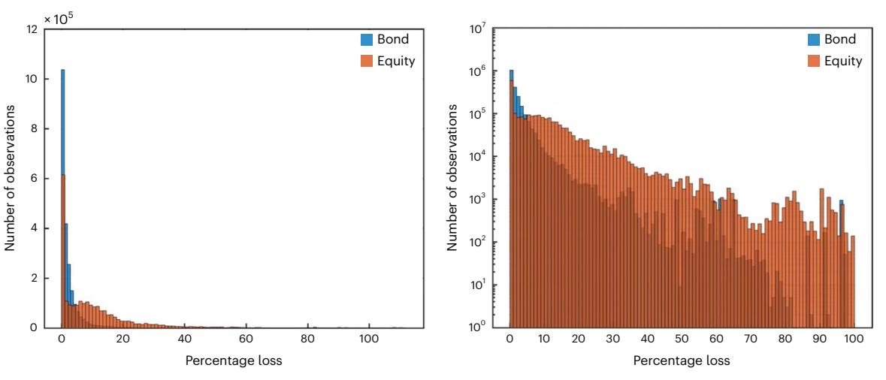
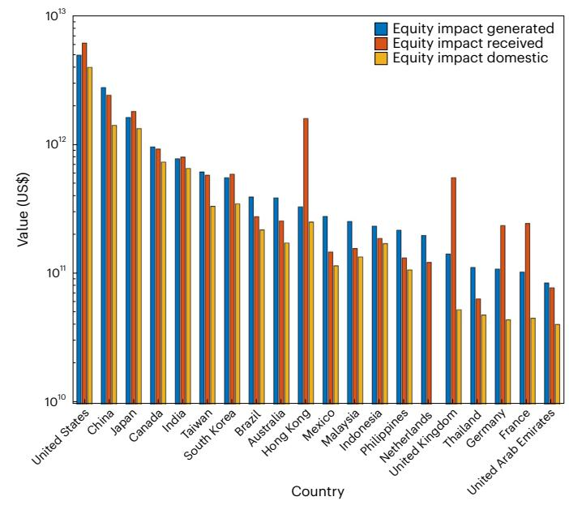

# nature climate change

**Analysis** 

https://doi.org/10.1038/s41558-025-02244-x

# Mapping global financial risks under climate change

Received: 7 January 2024

Accepted: 3 January 2025

Published online: 5 February 2025

Antoine Mandel 1,2, Stefano Battiston3,4,5 & Irene Monasterolo 5,6

There is growing concern about the potential impacts of climate change on financial stability but little quantitative evidence available on the potential magnitude of financial risks induced by climate extremes. Here we provide a forward-looking assessment of the impacts of floods, storms, and wildfires on a universe of securities representative of global market capitalization, using the structural climate credit-risk model CLIMACRED-PHYS. We show that there can be a substantial amplification of direct economic losses arising from firms' financial leverage. We highlight the importance of cross-border climate financial risks, notably the transfer of impacts from production facilities in emerging economies to firms in developed economies. Finally, we quantify the potential increase of financial risks induced by climate change. Overall, our results emphasize the relevance of asset-level climate risk assessment for financial regulation and the importance of integrating financial impacts in the assessment of adaptation policies.

There is substantial concern among financial regulators about the potential risks to financial stability induced by climate change  $^{1-3}$ . This concern hinges on previous occurrences of extreme events with very large fiscal and financial costs (for example, hurricanes Katrina and Harvey  $^4$ , 2020 South Asian floods  $^5$  and Australian bushfires of 2019–2020 (ref. 6) had costs on the order of US\$100 billion), projections of increasing intensity and frequency of extreme events under climate change  $^7$  and theoretical analysis emphasizing that the most relevant economic and financial impacts of climate change might come from tail events  $^{8-10}$ .

An accurate assessment of climate physical risk is thus fundamental for global financial risk management. Such an assessment requires the identification of the hazards that are the main sources of risk in an area, of the assets located in the area (that is, geolocated production facilities) and of the economic actors that own these assets and are thus exposed to the risk. Furthermore, one needs to identify the mechanisms through which economic impacts translate into financial risks and affect financial asset valuation.

The existing literature provides a very partial mapping of these risks, focusing on specific hazards, markets and geographies or deriving aggregate measures of risk from macro-economic assessment

of impacts14. In finance, most analyses focus on past occurrences of hazards, thus neglecting future climate change. The financial industry relies on aggregate risk scores that often lack granularity, transparency or consistency15. Hence, the link between a granular assessment of climate impacts and the valuation of financial assets is missing in the literature.

The main contribution of this Analysis is to fill this methodological gap by proposing a structural model for the valuation of climate financial risks. Our model assesses climate financial impacts from the bottom up by (1) geolocating the production facilities underlying a portfolio of financial assets, (2) sampling trajectories of climate-related hazards at the corresponding locations, (3) assessing impacts on production facilities through capital destruction and business interruption, (4) inferring resulting impacts on the cash flow and the balance sheet of firms and (5) deriving therefrom the risk of default and the value of the financial assets of the issuer.

Our framework introduces several new features. It enables the identification of key hazards driving climate-related financial risks, their spatial and economic transmission channels and their quantitative impacts on financial assets. In addition, it facilitates the assessment of the marginal contributions of specific hazards, economic sectors and geographic regions to the overall risk of a financial portfolio.

1Climate Finance Alpha, Paris, France. 2Centre d'Economie de la Sorbonne, Paris School of Economics, University Paris 1 Pantheon-Sorbonne, Paris, France. 3Department of Economics, Ca' Foscari University of Venice, Venice, Italy. 4Department of Finance, University of Zurich, Zurich, Switzerland. 5Centre for Economic Policy Research (CEPR), London, UK. 6School of Economics, Utrecht University, Utrecht, the Netherlands.

⊠e-mail: antoine.mandel@climafin.com

**Table 1 | Descriptive statistics of the impact distribution by type of hazards and climate scenarios**

| Scenario                    | Hazard          | Tropical cyclone | Winter storm | Coastal flood | River flood | Wildfire | Compound |
|-----------------------------|-----------------|------------------|--------------|---------------|-------------|----------|----------|
| Destroyed capital (%)       | Mean            | 0.63             | 0.18         | 0.48          | 0.45        | 0.17     | 1.87     |
| RCP 2.6 2020                | 99th pctile     | 2.10             | 0.27         | 0.56          | 0.54        | 0.35     | 3.34     |
| Number of interruption days | Mean            | 1.01             | 0.24         | 0.69          | 0.20        | 0.20     | 2.71     |
| RCP 2.6 2020                | 99th percentile | 3.25             | 0.36         | 0.89          | 0.76        | 0.74     | 4.89     |
| Destroyed capital (%)       | Mean            | 0.68             | 0.20         | 0.69          | 0.54        | 0.17     | 2.22     |
| RCP 6.0 2050                | 99th pctile     | 2.29             | 0.29         | 0.81          | 0.64        | 0.35     | 3.80     |
| Number of interruption days | Mean            | 1.09             | 0.25         | 1.07          | 0.77        | 0.20     | 3.27     |
| RCP 6.0 2050                | 99th percentile | 3.37             | 0.39         | 1.41          | 0.89        | 0.74     | 5.43     |
| Destroyed capital (%)       | Mean            | 0.95             | 0.23         | 0.76          | 0.59        | 0.17     | 2.62     |
| RCP 8.5 2080                | 99th pctile     | 2.65             | 0.35         | 0.90          | 0.69        | 0.35     | 4.32     |
| Number of interruption days | Mean            | 1.52             | 0.30         | 1.18          | 0.83        | 0.20     | 3.88     |
| RCP 8.5 2080                | 99th percentile | 3.86             | 0.46         | 1.53          | 0.95        | 0.74     | 6.14     |

Productive capital destroyed is measured in percentage of total capital destroyed per year. Days of business interruption are measured in number of days per year.

The framework supports risk computation at the firm level (for example, through the probability of default) as well as the estimation of regulatory-relevant risk measures at the portfolio level, such as value at risk (VaR). Moreover, it provides capabilities for scenario-contingent valuation of financial assets, aligning with the requirements outlined by financial regulator[s16](#page-5-13)[–18](#page-5-14).

We apply our model to the assessment of risks on a universe of financial assets representing over 80% of global equity markets. Our analysis identifies the combinations of hazards, geographical locations and economic sectors that are the main drivers of risk. It maps the transmission of impacts from economics production units to financial assets and hence highlights the importance of cross-border risks. Overall, our findings matter for the design of adequate risk management strategies and targeted adaptation policies.

# **Results**

We focus on a set of firms representative of global market capitalization, that is the MSCI all countries world index (ACWI)[19](#page-5-15). The index consists of 2,934 firms from 23 developed markets and 24 emerging markets covering approximately 85% of the global investable equity opportunity set.

#### **Firms and their geolocated production facilities**

To mitigate potential geographical bias in the composition of the index, we normalize portfolio weights proportionally to total market capitalization by country. We geolocate the production facilities of all firms in the index and assign to each facility a share of the revenues and of the productive capital of the firm (Methods). This defines a set *N* of 129,721 production facilities characterized by their geolocation, their revenue, their productive capital stock and their industrial sector. The productive capital stock of each firm is further partitioned between tangible capital, which is exposed to natural hazards, and intangible capital, which is not directly exposed to natural hazards.

#### **Climate hazard trajectories**

To proceed with the scenario-contingent valuation of the financial assets (equity and corporate bonds) issued by the firms, we consider a climate scenario *S* (representative concentration pathways (RCPs); see Methods) and a time interval [0, *T*] where 0 is the valuation time and *T* the time horizon. We consider the following set of climate-related extreme events: coastal and river floods, tropical and winter storms, landslides and wildfires. Each type of extreme is characterized by scenario and time-dependent distributions of intensity at each location. By repeatedly drawing from these distributions, we generate samples of trajectories of hazards at each productive location (Methods). Such trajectories are characterized at each productive location and each date by flood depth for river and coastal flooding, maximum wind gust for tropical and winter storms, and a binary indicator of occurrence for wildfires or landslides. Vulnerability metrics then allow us to infer for each productive location, each date, each scenario and each hazard the share of tangible capital destroyed. In the following, we shall investigate the cumulative impact of hazards as well as the individual contribution of each type of hazard to the aggregate impact. Our default assumption is that the cumulative impact at a given date and location is determined by the hazard with the largest magnitude. Note that the co-occurrence of multiple hazards at a given date and location being rare, the alternative assumption that impacts cumulate additively yields similar results (Supplementary Information 1.2.3).

On the basis of the share of tangible capital destroyed, we determine the share of total capital destroyed and the extent of business interruption measured as the share of the year for which business is interrupted at a production facility. Total capital destroyed depends on the share of tangible capital at the production facility, which we determine using sectoral averages from the EU KLEMS (capital, labour, energy, materials and service) database[20.](#page-5-11) To determine the extent of business interruption, we use the vulnerability metrics developed in ref. [21,](#page-5-12) which provide sector-specific correspondence tables between the share of capital destroyed and the number of business interruption days (details in Methods).

#### **A structural credit-risk model for climate impact valuation**

We develop a structural climate credit-risk model, CLIMACRED-PHYS, that provides climate scenario-contingent valuation of the financial assets issued by a firm (details in Methods). In each scenario, the realization of climate impacts induces capital destruction and business interruptions for the firm. The magnitude of these impacts is stochastic and depends on the location of the firm's production facilities and its type of activity. CLIMACRED-PHYS provides a micro-economic representation of these impacts on the production and capital accumulation process. It infers therefrom impacts on the financial structure of the firm (assets and liabilities), on its probability of default and on the value of the securities it issues (bonds and equities). The model allows us to identify the channels through which climate impacts affect financial asset valuation. First, the destruction of productive capital diminishes the assets of the firm and increases its debt because of reconstruction costs. This increases the probability of default and decreases the net worth at maturity. Second, business interruptions reduce the cash flow of the firm. This negatively impacts capital accumulation, self-financing capacity and dividends distributed. Eventually, both effects negatively impact the value of bonds and equities.

#### **Financial impacts of climate change**

We empirically investigate the financial impact of physical risks on portfolios of bonds and equities invested in the MSCI ACWI, proportionally

**Table 2 | Summary table about the regional distribution of value and impacts**

| Region                       | Value share (%) | Impacts share (%) | Impact-to-value ratio | Tropical cyclone impacts (%) | Winter storm impacts (%) | Coastel-flood impacts (%) | River-flood impacts (%) | Wildfire impacts (%) | Compound impacts (%) |
|------------------------------|--------------------|----------------------|--------------------------|------------------------------------|-----------------------------|------------------------------|----------------------------|-------------------------|-------------------------|
| Australia and New Zealand | 2.81               | 1.54                 | 0.55                     | 0.16                               | 0                           | 0.22                         | 0.43                       | 0.39                    | 1.19                    |
| Central Asia                 | 0.06               | 0.03                 | 0.49                     | 0                                  | 0                           | 0                            | 0.06                       | 1.00                    | 1.06                    |
| Eastern Asia                 | 23.69              | 39.36                | 1.66                     | 2.04                               | 0                           | 1.01                         | 0.64                       | 0.02                    | 3.59                    |
| Eastern Europe               | 1.92               | 0.63                 | 0.33                     | 0.01                               | 0.16                        | 0.09                         | 0.38                       | 0.08                    | 0.70                    |
| Latin America                | 4.03               | 4.01                 | 1.00                     | 0.36                               | 0.01                        | 0.16                         | 0.90                       | 0.76                    | 2.15                    |
| Melanesia                    | 0.04               | 0.02                 | 0.51                     | 0.49                               | 0                           | 0.03                         | 0.10                       | 0.49                    | 1.10                    |
| Micronesia                   | 0                  | 0                    | 1.80                     | 3.89                               | 0                           | 0                            | 0                          | 0                       | 3.89                    |
| Northern Africa              | 0.22               | 0.21                 | 0.99                     | 0                                  | 0.35                        | 0.16                         | 1.62                       | 0.01                    | 2.13                    |
| Northern America             | 36.77              | 22.04                | 0.60                     | 0.49                               | 0                           | 0.20                         | 0.45                       | 0.19                    | 1.30                    |
| Northern Europe              | 6.37               | 4.81                 | 0.76                     | 0.01                               | 1.40                        | 0.13                         | 0.12                       | 0.01                    | 1.63                    |
| Polynesia                    | 0                  | 0                    | 0.78                     | 0.09                               | 0.22                        | 1.37                         | 0.02                       | 0                       | 1.68                    |
| Southeastern Asia            | 5.61               | 7.51                 | 1.34                     | 0.71                               | 0                           | 1.06                         | 0.97                       | 0.25                    | 2.89                    |
| Southern Asia                | 3.49               | 6.21                 | 1.78                     | 0.18                               | 0                           | 0.49                         | 1.81                       | 1.48                    | 3.84                    |
| Southern Europe              | 3.03               | 0.98                 | 0.32                     | 0                                  | 0.28                        | 0.07                         | 0.14                       | 0.21                    | 0.70                    |
| Sub-Saharan Africa           | 1.06               | 1.14                 | 1.08                     | 0.05                               | 0                           | 0.21                         | 0.49                       | 1.58                    | 2.33                    |
| Western Asia                 | 2.68               | 3.48                 | 1.30                     | 0.08                               | 0.08                        | 2.58                         | 0.08                       | 0                       | 2.80                    |
| Western Europe               | 8.23               | 8.03                 | 0.98                     | 0                                  | 0.41                        | 1.54                         | 0.26                       | 0                       | 2.11                    |

'Value share' is the percentage of global capital located in the region. 'Impacts share' is the percentage of impacts affecting the region (considering the mean of impacts across simulations). 'Impact-to-value ratio' is the ratio of share of value over the share of impact: a ratio above (below) 1 indicates that capital in the region is more (less) impacted than the average. 'Tropical cyclone impacts' to 'compound impacts' provide a measure of the intensity of risk per hazard and region corresponding to the ratio between the value of impacts and that of exposed capital.

to market capitalization. The index is representative of global market capitalization. Thus, the impacts of physical risks on the corresponding portfolios can be considered as representative of the impacts on global financial markets. The magnitude of physical risks depends on the extent of anthropogenic climate change. In this respect, uncertainty about future climate policies and socioeconomic dynamics induces uncertainty about the magnitude of future human-related forcing and thus of physical risks. This uncertainty is usually captured by considering a set of RCP[22](#page-5-16). These pathways describe future GHG concentrations and are labelled according to the corresponding radiative forcing in the year 2100: RCP 2.6, RCP 4.5, RCP 6 and RCP 8.5 (2.6, 4.5, 6.0 and 8.5 W m–2, respectively). Increasing radiative forcing, over time and across pathways, corresponds to increasing the range of global warming (Supplementary Table 7). Here we consider three climate scenarios: (1) a 'current' scenario corresponding to current climate conditions, based on RCP 2.6 projections in 2020, (2) a high-end scenario corresponding to RCP 8.5 at 2080 and (3) an intermediary scenario corresponding to RCP 6.0 at 2050, which is the one for which we report results.

We first investigate the magnitude of economic impacts in terms of (1) share of capital lost and (2) number of days of business interruptions induced by climate-related hazards. At the aggregate level, in the current scenario (RCP 2.6), we find that the mean impact of hazards amounts to the yearly destruction of 1.9% of productive capital and 2.68 days of business interruptions. The 99th percentile of the distribution amounts to a destruction of 3.34% of productive capital and 4.89 days of business interruption at the portfolio level (Table [1\)](#page-1-0). The potential occurrence of very large events and the geographical concentration of production facilities lead to the presence of a non-negligible mass in the tail of the distribution of impacts across firms. Accordingly, certain realizations of hazards lead to the complete destruction of certain production facilities (Supplementary Fig. 1).

As for the drivers of impacts, at the aggregate level, the most material hazards are, by order of importance, tropical cyclones,

**Table 3 | Summary table of total financial impacts**

| Baseline pd (%) | Mean bond loss (%) | VaR bond (%) | Mean equity loss (%) | VaR equity (%) |
|--------------------|-----------------------|-----------------|-------------------------|-------------------|
| 0.15               | 3.68                  | 8.24            | 12.88                   | 17.36             |
| 0.05               | 2.36                  | 5.61            | 10.69                   | 14.53             |
| 0.02               | 1.54                  | 3.90            | 10.12                   | 13.78             |

Values correspond to percentage of mean losses and of the VaR at the 99th percentile over 1,000 climate realizations for portfolios of bonds and equities built on the MSCI ACWI universe reweighted proportionally to country-level market capitalization. Each line corresponds to a different level of baseline risk measured by the baseline probability of default.

coastal floods, river floods, winter storms and wildfires (Table [1\)](#page-1-0). Landslides do not appear material in our setting and are thus not reported in the remainder of this Analysis. We also observe that the magnitude of impact increases with the severity of the climate scenario (Table [1\)](#page-1-0). In the high-end scenario, we observe an increase of approximately 40% of the average impact and of approximately 30% of the 99th percentile of impacts, with respect to the current scenario. This increase is driven mainly by tropical cyclones and coastal flooding.

The aggregate results are explained by the geographical distribution of exposure and impacts (Table [2](#page-2-0) and Supplementary Fig. 2). North America and eastern Asia appear as the main sources of exposure in terms of value of capital, followed by western and northern Europe. The intensity of risk is particularly high in eastern and southern Asia due to the relative importance of impacts from tropical cyclones and coastal floods in these areas. The combination of high exposure in terms of capital and large impacts from tropical cyclones in eastern Asia represents a key source of risk. Wildfires also are a substantial source of risk in the area between 30° and 45° N latitude.

**Fig. 1**| **Distribution of losses over the universe of bonds and equities.** The histogram represents the distribution of losses for bonds and equities for 1,000 climate realizations in the intermediary climate scenario with  $pd_{bau} = 5\%$ . Values are expressed in percentage loss with respect to a baseline of no climate-related impacts. Log scale used on the right panel.

We then investigate the impact of climate-induced shocks on financial asset valuation using our structural valuation model. We consider aggregate impacts at the portfolio level for equity and (1 year) bonds, for the three climate scenarios considered in the preceding.

Beyond the climate scenario and the time horizon, key determinants of financial impact are the financial structure and the economic behaviour of the firm. We calibrate key financial characteristics of the firms, including debt-to-capital ratio, profit margin and dividend rate using average sectoral values from ref. 23. We also set by default the target growth rate of the firms othat, in expectation, the debt-to-capital ratio remains constant. We then parameterize the level of risk through the baseline probability of default pd\_bau, that is, the probability of default in absence of climate impacts (see Methods for details on the calibration).

In this setting, we first investigate impacts on equity and bonds for varying levels of risk under the intermediary climate scenario. We report the expected loss and the VaR (the 99th percentile of the loss distribution) at the aggregate level for a portfolio of bonds and equity based on the MSCI ACWI universe (Table 3). These results shall first be compared with the magnitude of direct impacts, which amount to a mean loss of 2.22% and a 99th percentile loss of 3.8% for physical capital (see RCP 6.0 results in Table 1). We observe a substantial amplification of losses for financial assets, with the mean loss on bonds ranging between 1.54% and 3.68% and the mean loss on equity ranging between 10.12% and 12.88%. We also observe an increase in the impact on financial assets with the increase in the baseline level of risk and more acute amplification in the tail of the distributions, as the VaR ranges from 3.19% to 8.24% for the portfolio of bonds and from 13.78% to 17.36% for the portfolio of equities. Since equity serves as a risk buffer for the firm and its creditors, impacts on equity are larger than impacts on bonds. The distribution of losses over the bond and equity portfolios highlights these differences (Fig. 1). One observes a substantial mass in the tail of both distributions, more prominently for the equity distribution, with climate impacts potentially wiping out completely some issuers' equity for specific climate realizations.

The analysis of the geographical distribution of the financial impacts highlights the importance of cross-border climate risks. Direct impacts occurring in eastern, southeastern and southern Asia are partly exported towards firms headquartered in Europe and North America (Table 4). In particular, European firms display large ratios for equity impacts over direct impacts. In addition, they are the primary recipients of external impacts, that is, impacts on facilities they own outside their

country of incorporation (Fig. 2). By contrast, losses on Asian equities are driven mostly by domestic impacts, that is, impacts on facilities in the country of incorporation.

Our results—when the valuation contingent to a climate scenario is compared with a baseline without climate-related impacts—shall be interpreted as the change in the valuation of an investor's financial assets between an assessment where climate impacts are not accounted for and one where they are accounted for on the basis of a forward-looking assessment of the distribution of impacts. To account specifically for the potential impacts of climate change, one shall rather compare outcomes in the intermediary and high-end scenarios with outcomes in the current scenario (based on current climatic conditions). The corresponding results shall be interpreted as the changes in the valuation of financial assets between a financial risk assessment based on current climate impacts and one based on future climate impacts (a scenario counterfactual to the current situation). The results show that the potential impacts of climate change are important. In particular, in the high-end scenario (Supplementary Table 3), the additional loss with respect to the current scenario can reach up to 3% for the equity portfolio and 80 basis points for the bond portfolio.

#### **Discussion**

Our analysis provides an assessment of climate-related physical risks for financial markets at the global scale. In an adverse context where the baseline level of risk is large, the climate VaR at the 99th percentile on a portfolio representative of global equity market reaches up to 15% of market capitalization. This VaR quantifies the change in valuation with respect to a scenario without climate impacts. Its computation is based on direct climate impacts only and thus neglects possible amplifications of losses arising from feedback loops between the real economy and the financial sector. The magnitude of these direct impacts nevertheless hints at a potential systemic impact of climate physical risks, in particular if they compound with a high level of baseline risk.

Our findings are driven by the amplification of economic risks through the financial leverage of the firms (the ratio of total assets over equity). The equity amplification ratio, that is, the ratio between financial loss and the direct impact on productive capital, ranges between 1 and 5, depending on the value of leverage across the firms. This is consistent with previous analyses focusing specifically on the case of flood risk  $^{12}$  and with the top-down estimates provided in ref. 14. Our findings also suggest that financial amplification ratios are consistently larger than economic amplification ratios (the ratio of overall production

Table 4 | Summary table about the regional distribution of impacts on equity shares

| Region                          | Share of direct impacts (%) | Share of equity impacts (%) | Share of equity value (%) | Equity-to-direct impacts ratio | Equity impact-to-value ratio |
|---------------------------------|-----------------------------|-----------------------------|---------------------------|--------------------------------|------------------------------|
| Australia and New Zealand       | 2.098200                    | 5.978700                    | 1.821000                  | 2.84940                        | 3.28310                      |
| Eastern Asia                    | 31.663200                   | 24.110900                   | 27.000800                 | 0.76148                        | 0.89297                      |
| Eastern Europe                  | 0.568550                    | 3.252800                    | 0.972820                  | 5.72120                        | 3.34370                      |
| Latin America and the Caribbean | 5.263400                    | 8.920200                    | 1.984300                  | 1.69480                        | 4.49530                      |
| Northern Africa                 | 0.085873                    | 0.013948                    | 0.047073                  | 0.16243                        | 0.29630                      |
| Northern America                | 31.664600                   | 32.702300                   | 42.468000                 | 1.03280                        | 0.77004                      |
| Northern Europe                 | 1.739700                    | 6.035900                    | 5.497800                  | 3.46950                        | 1.09790                      |
| Southeastern Asia               | 5.768900                    | 3.306400                    | 2.683900                  | 0.57315                        | 1.23190                      |
| Southern Asia                   | 4.300200                    | 2.551200                    | 2.904900                  | 0.59320                        | 0.87824                      |
| Southern Europe                 | 0.949070                    | 1.544000                    | 1.847300                  | 1.62680                        | 0.83580                      |
| Sub-Saharan Africa              | 0.637380                    | 0.671230                    | 1.167700                  | 1.05310                        | 0.57482                      |
| Western Asia                    | 0.908200                    | 1.924500                    | 2.982200                  | 2.11900                        | 0.64532                      |
| Western Europe                  | 2.651400                    | 8.988000                    | 8.622100                  | 3.38990                        | 1.04240                      |

'Share of direct impacts' is the distribution of direct impacts across regions in percentage terms. 'Share of equity value' is the distribution of equity value per regions of incorporation in percentage terms. 'Equity-to-direct impacts ratio' is the ratio between equity impact and direct impact and thus highlights the extent to which equity impacts faced by firms headquartered in the region are amplified (ratio>1) or dampened (ratio<1) by the allocation of global production. 'Equity impact-to-value ratio' is the ratio between equity impact and equity value and thus highlights whether the equity in the region is more (ratio>1) or less (ratio<1) at risk than the average equity.

losses over the direct economic losses $^{24}$ ) for which existing estimates range between 1 and 2 (ref. 25).

Furthermore, our results on the increase in financial risks with climate change imply that a mispricing of climate risk by financial markets arises if investors assess physical risks in a backward-looking manner and under an assumption of stationarity (as the literature suggests they do; see Methods).

In terms of the distribution of financial risk across issuers, we identify the existence of high-risk firms whose equity value could be completely wiped out for certain climate realizations. Nevertheless, there is substantial averaging out of impacts for large diversified portfolios so that tails are much thinner for the distribution of impacts at the aggregate portfolio level.

As for the geographical distribution of risk, we observe large direct risks in Asia stemming from the exposure of industrial facilities to storm and flood hazards. A substantial share of this risk is exported, notably to European companies whose portfolios of production facilities appear more globalized. The ratio between impact on equity and direct impacts is thus particularly high for European companies. These results emphasize, on the one hand, the importance of cross-boundary climate risks and, on the other hand, the role of financial markets in the propagation of climate physical risks.

These results echo the findings in ref. 26 where major net transfers of stranded assets and transition risks from companies operating fossil-fuel assets in producing countries to ultimate owners in developed economies have been identified. Our results also confirm the importance of carrying out climate physical risk assessments using a bottom-up, asset-level approach instead of relying on aggregate scores or country-based averages 27. Our results appear robust to alternative data collection methods (Methods) and for a range of financial characteristics as far as VaR is concerned (Table 3). We have also assessed the robustness of our approach to changes in firms' investment behaviour and to alternative assumptions about the compounding of climate hazards (Supplementary Information 1.2).

At this stage, an important limitation of our empirical analysis is that we neglect correlations across hazards and across space (beyond the resolution of climate model grid cells or storm trajectories). In this respect, our risk estimates regarding direct economic impacts can be

**Fig. 2** | **Summary of equity impacts generated and received per country.** For each country, the blue bar represents the total equity impacts generated, that is, the sum of equity impacts worldwide attributable to hazards occurring in the country. The red bar represents the total equity impacts received, that is, the sum of equity impacts affecting issuers listed in the country and due to hazards worldwide. The yellow bar represents domestic equity impacts, that is, impacts on equity listed in a country attributable to hazards occurring in the country. The yaxis has a logarithmic scale. Values correspond to the 99th percentile of impact.

considered conservative. With regard to estimate of financial risk, changes in investors' expectations on firms' profits induced by climate impacts has implications for the financial valuation of securities issued by the firms. Here we use the assumption that investors update fully their expectations on the basis of projected impacts. This leads to an amplification of impacts through expectations, as put forward in the case of transition risk. This expectation channel is particularly

relevant to represent rapid adjustment of financial valuations in a climate stress-testing context.

Our results have implications for the design and implementation of measures aiming at reducing climate-induced physical risk. First, climate risks should be assessed at the asset level to identify the most exposed assets and to factor in potential financial losses in the design of adaptation strategies.Second, financial risk could be decreased through policies aiming at limiting the financial leverage of firms that are most exposed to climate risks. In particular, risk could be reduced 'endogenously' if investors factor in climate-related risks in their credit-risk assessment or through regulatory measures such as making capital requirements conditional to the exposure to climate risks. From a broader perspective, our results highlight the importance of integrating financial impacts in the assessment of adaptation and mitigation policies.

# **Online content**

Any methods, additional references, Nature Portfolio reporting summaries, source data, extended data, supplementary information, acknowledgements, peer review information; details of author contributions and competing interests; and statements of data and code availability are available at<https://doi.org/10.1038/s41558-025-02244-x>.

# **References**

- 1. Carney, M. *Breaking the Tragedy of the Horizon—Climate Change and Financial Stability* (Bank of England, 2015); [https://www.](https://www.bankofengland.co.uk/speech/2015/breaking-the-tragedy-of-the-horizon-climate-change-and-financial-stability) [bankofengland.co.uk/speech/2015/breaking-the-tragedy-of-the](https://www.bankofengland.co.uk/speech/2015/breaking-the-tragedy-of-the-horizon-climate-change-and-financial-stability)[horizon-climate-change-and-financial-stability](https://www.bankofengland.co.uk/speech/2015/breaking-the-tragedy-of-the-horizon-climate-change-and-financial-stability)
- 2. *A Call for Action: Climate Change as a Source of Financial Risk* (NGFS, 2019).
- 3. *Conceptual Note on Short-Term Climate Scenarios* (NGFS, 2023).
- 4. Blake, E.S. et al. Costliest US Tropical Cyclones Tables Updated (National Hurricane Center, 2021); [https://www.nhc.noaa.gov/](https://www.nhc.noaa.gov/news/UpdatedCostliest.pdf) [news/UpdatedCostliest.pdf](https://www.nhc.noaa.gov/news/UpdatedCostliest.pdf)
- 5. *Weather and Climate Extremes in Asia Killed Thousands, Displaced Millions and Cost Billions in 2020* (World Meteorological Organization, 2021); [https://wmo.int/media/news/weather-and-climate-extremes](https://wmo.int/media/news/weather-and-climate-extremes-asia-killed-thousands-displaced-millions-and-cost-billions-2020#:~:text=Geneva%2C%2026%20October%202021%20(WMO,toll%20on%20infrastructure%20and%20ecosystems)[asia-killed-thousands-displaced-millions-and-cost-billions-2020#:~:](https://wmo.int/media/news/weather-and-climate-extremes-asia-killed-thousands-displaced-millions-and-cost-billions-2020#:~:text=Geneva%2C%2026%20October%202021%20(WMO,toll%20on%20infrastructure%20and%20ecosystems) [text=Geneva%2C%2026%20October%202021%20\(WMO,toll%20on%](https://wmo.int/media/news/weather-and-climate-extremes-asia-killed-thousands-displaced-millions-and-cost-billions-2020#:~:text=Geneva%2C%2026%20October%202021%20(WMO,toll%20on%20infrastructure%20and%20ecosystems) [20infrastructure%20and%20ecosystems](https://wmo.int/media/news/weather-and-climate-extremes-asia-killed-thousands-displaced-millions-and-cost-billions-2020#:~:text=Geneva%2C%2026%20October%202021%20(WMO,toll%20on%20infrastructure%20and%20ecosystems)
- 6. *Special Report: Update to the Economic Costs of Natural Disasters in Australia* (Deloitte, 2021); [https://www.deloitte.com/content/](https://www.deloitte.com/content/dam/assets-zone1/au/en/docs/services/economics/deloitte-au-economics-abr-natural-disasters-061021.pdf) [dam/assets-zone1/au/en/docs/services/economics/deloitte-au](https://www.deloitte.com/content/dam/assets-zone1/au/en/docs/services/economics/deloitte-au-economics-abr-natural-disasters-061021.pdf)[economics-abr-natural-disasters-061021.pdf](https://www.deloitte.com/content/dam/assets-zone1/au/en/docs/services/economics/deloitte-au-economics-abr-natural-disasters-061021.pdf)
- 7. IPCC *Climate Change 2021: The Physical Science Basis* (eds Masson-Delmotte, V. et al.) (Cambridge Univ. Press, 2021); <https://doi.org/10.1017/9781009157896>
- 8. Weitzman, M. L. On modeling and interpreting the economics of catastrophic climate change. *Rev. Econ. Stat.* **91**, 1–19 (2009).
- 9. Pindyck, R. S. Climate change policy: what do the models tell us? *J. Econ. Lit.* **51**, 860–872 (2013).
- 10. Bressan, G., Duranović, A., Monasterolo, I. & Battiston, S. Asset-level assessment of climate physical risk matters for adaptation finance. *Nat. Commun.* **15**, 5371 (2024).
- 11. Le Guenedal, T., Drobinski, P. & Tankov, P. Measuring and pricing cyclone-related physical risk under changing climate. *Amundi Research Working Paper* 111 (2021); [https://research-center.](https://research-center.amundi.com/files/nuxeo/dl/683eaa33-0ded-41e5-a604-8bea583d4def?inline=) [amundi.com/files/nuxeo/dl/683eaa33-0ded-41e5-a604-](https://research-center.amundi.com/files/nuxeo/dl/683eaa33-0ded-41e5-a604-8bea583d4def?inline=) [8bea583d4def?inline=](https://research-center.amundi.com/files/nuxeo/dl/683eaa33-0ded-41e5-a604-8bea583d4def?inline=)

- 12. Mandel, A. et al. Risks on global financial stability induced by climate change: the case of flood risks. *Climatic Change* **166**, 4 (2021).
- 13. Calabrese, R., Dombrowski, T., Mandel, A., Pace, R. K. & Zanin, L. Impacts of extreme weather events on mortgage risks and their evolution under climate change: a case study on florida. *Eur. J. Oper. Res.* **314**, 377–392 (2024).
- 14. Dietz, S., Bowen, A., Dixon, C. & Gradwell, P. Climate value at risk of global financial assets. *Nat. Clim. Change* **6**, 676–679 (2016).
- 15. Hain, L. I., Koelbel, J. F. & Leippold, M. Let's get physical: comparing metrics of physical climate risk. *Financ. Res. Lett.* **46**, 102406 (2022).
- 16. *Guide on Climate-Related and Environmental Risks: Supervisory Expectations Relating to Risk Management and Disclosure* (European Central Bank, 2020).
- 17. Basel Committee on Banking Supervision *Basel III: Finalising Post-crisis Reforms* (Bank for International Settlements, 2021).
- 18. Bertram, C. et al. *NGFS Climate Scenario Database: Technical Documentation* v2.2 (NGFS, 2021).
- 19. *MSCI ACWI Index (USD)* (MSCI, 2021); [https://www.msci.com/](https://www.msci.com/documents/10199/8d97d244-4685-4200-a24c-3e2942e3adeb) [documents/10199/8d97d244-4685-4200-a24c-3e2942e3adeb](https://www.msci.com/documents/10199/8d97d244-4685-4200-a24c-3e2942e3adeb)
- 20. Mahony, M. & Timmer, M. P. Output, input and productivity measures at the industry level: the EU KLEMS database. *Econ. J.* **119**, 374–403 (2009).
- 21. *Multi-hazard Loss Estimation Methodology, Earthquake Model, Hazus-mh 2.1, Technical Manual* (FEMA, 2013).
- 22. IPCC *Climate Change 2014: Synthesis Report* (eds Core Writing Team, Pachauri, R. K. & Meyer L. A.) (IPCC, 2014); [https://www.](https://www.ipcc.ch/report/ar5/syr/) [ipcc.ch/report/ar5/syr/](https://www.ipcc.ch/report/ar5/syr/)
- 23. Damodaran, A. *Damodaran Online* [https://pages.stern.nyu.](https://pages.stern.nyu.edu/~adamodar/) [edu/~adamodar/](https://pages.stern.nyu.edu/~adamodar/) (accessed 6 January 2024).
- 24. Hallegatte, S., Hourcade, J.-C. & Dumas, P. Why economic dynamics matter in assessing climate change damages: illustration on extreme events. *Ecol. Econ.* **62**, 330–340 (2007).
- 25. Oosterhaven, J. & Többen, J. Wider economic impacts of heavy flooding in germany: a non-linear programming approach. *Spat. Econ. Anal.* **12**, 404–428 (2017).
- 26. Semieniuk, G. et al. Stranded fossil-fuel assets translate to major losses for investors in advanced economies. *Nat. Clim. Change* **12**, 532–538 (2022).
- 27. Schubert, J. E., Mach, K. J. & Sanders, B. F. National-scale flood hazard data unfit for urban risk management. *Earths Future* **12**, 2024–004549 (2024).
- 28. Battiston, S., Monasterolo, I., Riahi, K. & Ruijven, B. J. Accounting for finance is key for climate mitigation pathways. *Science* **372**, 918–920 (2021).

**Publisher's note** Springer Nature remains neutral with regard to jurisdictional claims in published maps and institutional afiliations.

Springer Nature or its licensor (e.g. a society or other partner) holds exclusive rights to this article under a publishing agreement with the author(s) or other rightsholder(s); author self-archiving of the accepted manuscript version of this article is solely governed by the terms of such publishing agreement and applicable law.

© The Author(s), under exclusive licence to Springer Nature Limited 2025

# **Methods**

#### **Data**

**Financial universe.** To construct a portfolio of financial assets representative of global market capitalization, we have considered the constituents of the MSCI ACWI. It consists of 2,934 firms from 23 developed markets and 24 emerging markets covering approximately 85% of the global investable equity opportunity se[t19](#page-5-15). Developed market countries represented in the index are Australia, Austria, Belgium, Canada, Denmark, Finland, France, Germany, Hong Kong, Ireland, Israel, Italy, Japan, Netherlands, New Zealand, Norway, Portugal, Singapore, Spain, Sweden, Switzerland, the United Kingdom and the United States. Emerging market countries represented in the index are Brazil, Chile, China, Colombia, Czech Republic, Egypt, Greece, Hungary, India, Indonesia, Korea, Kuwait, Malaysia, Mexico, Peru, Philippines, Poland, Qatar, Saudi Arabia, South Africa, Taiwan, Thailand, Turkey and United Arab Emirates.

The main sectors represented in the index are information technology (21.9%), financials (15.61%), health care (11.58%), consumer discretionary (11.39%), industrials (10.47%), communication services (7.48%), consumer staples (7.16%), energy (4.73%), materials (4.63%), utilities (2.72%) and real estate (2.34%). The geographical weighting of the index is substantially biased towards developed countries, with the main countries represented in the index being the United States (61.95%), Japan (5.46%) and the United Kingdom (3.6%), followed by China (3.3%) and France (3%). To obtain a more accurate representation of global market capitalization, we have reweighted index weights proportionally to market capitalization (Supplementary Table 8).

**Geographical and economic characteristics of production facilities.** To apply our structural financial risk model to the MSCI ACWI universe, we need the following information for each company in the index: its market capitalization, its revenues, the share of tangible assets in its capital stock and its list of production units. Furthermore, for each production unit, we need its latitude, its longitude, the corresponding country and its sector of operation according to the NACE (statistical classification of economic activities in the European Community) classification. This information has been obtained as follows in collaboration with the financial risk assessment firm Sequantis:

- Market capitalization is obtained from market data.
- Revenues are obtained from the annual reports of companies.
- The main (NACE) sector of operation of the frm and the location of its headquarters is obtained from registration data.
- The list of production facilities and their locations is obtained from the annual report of companies.
- The sector of operation and the contribution to revenues of each production facility are then determined as follows.
  - By default, in absence of further information, each production facility is assumed to have the same sector of operation as the main sector of operation of the frm and the contribution to revenues is assumed to be uniform among production facilities.
  - If the annual report provides information about the geographical breakdown of revenues or production, revenues and capital stock are allocated proportionally to production facilities in the corresponding geographical area. Hence, the precision of the breakdown depends on the granularity of the reporting information.
  - If the annual report provides information about the geographical distribution of the frms' activities or information about the type of activity per production facility, the sector of operation of each production facility is determined accordingly.
- We then use average sectoral (and country) values of returns on capital from the Damadoran database[23](#page-5-17) to determine sectoral returns to capital, debt-to-equity ratios and depreciation rates (see Methods).

- We fnally use data from EU KLEMS[20](#page-5-11) on the sectoral composition of capital stocks to estimate the share of tangible assets for each production facility (the parameter *gi* ) as a function of its sector and country of operation.
- Overall, we obtain a consolidated database of 130,677 production facilities for which descriptive statistics are provided in Supplementary Table 1.

Data consolidated from annual reports might be incomplete, and the collation process is error-prone. To cross-check the validity of our results, we have developed a second version of the database using data from Explorium. Explorium provides a large global database of companies by enriching existing (public and private) databases with machine-learning techniques. We have extracted from their dataset similar information as that provided by Sequantis (list of production units, sectors of operations, geolocations and contribution to the company's revenues) and completed this database with estimated data on sectoral productivity and composition of the capital stock using the EU KLEMS database as described in the preceding. The machine-generated nature of the Explorium database implies, by construction, the presence of some misclassified and inaccurate entities. However, given that the Analysis focuses on aggregate and distributional characteristics, this does not affect the statistical validity of our results while providing an important robustness check. We thus obtain a consolidated database of 147,599 production facilities for which descriptive statistics are provided in Supplementary Table 2.

Descriptive statistics in Supplementary Tables 1 and 2 highlight the distribution of capital per regions and the relative homogeneity of capital intensity and profitability across and within regions.

#### **Climate impact assessment**

**Risk assessment methodology.** The initial building block of our financial risk valuation methodology is the assessment of the distribution of economic risks induced by climate-related hazards on each productive unit. This assessment is based on the exposure, hazard, vulnerability paradigm.

- For each productive unit *i*, its relative exposure is characterized by its sector, sector*i* , and the share of its capital formed of tangible capital *gi* ∈ [0, 1]. The latter is determined as a function of the sector and country of the production unit using the EU KLEMS database[20.](#page-5-11) More precisely, we consider that the share of tangible capital is given by the share of 'machinery and equipment', 'cultivated assets', 'dwellings' and 'other buildings and structures' in the productive capital of the sector according to the breakdown reported in ref. [20](#page-5-11).
- We consider the following types of hazard: tropical storms, winter storms, coastal foods, river foods, landslides and wildfres. For each type of hazard, haz, we obtain from the existing literature (see the following for details), distribution of the magnitude of impacts for each location (lat, lon) where a production facility has been identifed. These distributions are conditional on climate scenario and time as they evolve under climate change (details follow). Formally, these can be represented as probability measures *P*scen,t,haz,lat,lon where *P*scen,t,haz,lat,lon(*x*) is the probability that a hazard haz of magnitude *x* occurs at the location (*lat*, *lon*) within year *t* under the scenario scen.
- We measure the vulnerability along two dimensions: capital destruction and business interruption.
  - As for capital destruction, we use vulnerability metrics from the literature (see hazard-specifc details in the following) that specify the share of capital destroyed as a function of the magnitude of the event. Formally, it can be represented as a function that associates to a hazard haz of magnitude *x*, the share *f*haz,country,sector(*x*) of tangible capital destroyed by the

hazard (in general, the function is country and/or sector specific). Accordingly, if a hazard of magnitude x affects asset i, a share  $f_{\text{haz,country}_{l},\text{sector}_{l}}(x)$  of its tangible capital, corresponding to a share  $g_i \times f_{\text{haz,country}_{l},\text{sector}_{l}}(x)$  of its total capital, will be destroyed. The random variables  $\text{rf}_{i,t}^S$  for river flood,  $\text{cf}_{i,t}^S$  for coastal floods,  $\text{ts}_{i,t}^S$  for tropical storms,  $\text{ws}_{i,t}^S$  for winter storms,  $\text{wf}_{i,t}^S$ , for wildfires and  $\text{ld}_{i,t}^S$  for landslides are hence determined, their probability distribution being derived from the corresponding  $P_{\text{scent,haz,lat,lon}}$ .

As for the number of business-day interruptions, it formally can be represented as a function that associates to a hazard haz of magnitude x, the number  $g_{\text{haz,country,sector}}(x)$  of days during which business is interrupted in the affected facility (in general, the function is country and/or sector specific). In fact, we derive this vulnerability from the capital vulnerability metrics using the sector-specific coefficients provided by FEMA (Federal Emergency Management Agency) in ref. 21. More precisely, given the FEMA coefficient ndsector,country specifying the number of days of business interruptions following the complete destruction of the capital stock of a productive facility in a given sector and country, we assume proportional interruption for partial destruction, that is  $g_{\text{haz,country,sector}}(x) = \text{nd}_{\text{sector,country}} \times g_{\text{sector}} \times g_{\text{sector}}$  $f_{\text{haz,country,sector}}(x)$ . We hence determine the random variable  $\tau_{i,t}^{S}$ representing the share of year t for which business has been interrupted for production facility i.

Climate projections. Our analysis considers an array of climate-related extreme events: tropical storms, winter storms, coastal floods, river floods, landslides and wildfires. Consistency of the projections between these different types of hazards is ensured by considering the same set of climate scenarios  $^{29}$  (RCP 2.6, RCP 6 and RCP 8.5), the climate-forcing data from the Inter-Sectoral Impact Model Intercomparison Project (ISIMIP) 2b protocol  $^{30,31}$  and the same set of climate models (by default, the IPSL-CM5 earth system model  $^{32}$ ). ISIMIP is an international collaboration that offers a framework for consistently projecting the impacts of climate change across affected sectors and spatial scales. In particular, ISIMIP provides a set of bias-corrected climate data to make consistent historical hindcast and future climate impact projections.

**Tropical storms.** We build on the approach introduced in ref. 33 for the projection of future impacts of tropical cyclones. As for hazards. we consider the set of post-1980 storm tracks from the International Best Track Archive for Climate Stewardship34. For each historical track, we generate  $n_{\text{synth}} = 20$  synthetic storm tracks using a directed random walk following the approach in ref.33. Each synthetic track is assumed to have a yearly probability of occurrence of  $1/n_{\text{synth}}$  its historical frequency. This ensemble of synthetic tracks defines in particular, for each location, the distribution of yearly maxima for sustained wind speed that we consider as the reference distribution of intensity for the tropical storm hazard. This reference distribution is based on historical data. To integrate the impact of climate change, we generate distribution of future events for a given RCP and year by interpolating changes in intensity and frequency from the projections in ref. 35, which are basin specific. From this ensemble of future events, we infer distribution of yearly maxima for sustained wind speed conditional on year and scenario. We then measure vulnerability to sustained wind speed form tropical storms using the damage functions introduced in ref. 36 whereby the fraction *f* of tangible capital destroyed is determined by:

(1) Normalizing wind speed v according to

$$v_{\text{nor}} = \frac{\max(v - v_{\text{thresh}}, 0)}{v_{\text{half}} - v_{\text{thresh}}} \tag{1}$$

where  $v_{\rm thresh}$  is the wind speed belowwhich no damage occurs, and  $v_{\rm half}$  is the wind speed at which half the property value is lost.

(2) Letting the fraction of damage scale up with the cube of the normalized speed:

$$f = \frac{v_{\text{nor}}^3}{1 + v_{\text{nor}}^3} \tag{2}$$

Winter storms. The approach for assessing the impact of winter storms is conceptually similar to that for tropical storms. We consider as a default set of events the Copernicus synthetic windstorm events for Europe37. This ensemble of synthetic tracks defines in particular, for each location, the distribution of yearly maxima for sustained wind speed that we consider as the reference distribution of intensity for the winter storm hazard. As for the impact of climate change, the recent literature7,38 finds no clear trend in frequency but mostly agrees on increasing storm intensity. Accordingly, following the meta-analysis by ref. 39, we assume an increase in damage of 8% per degree of warming. The vulnerability function for winter storm has the same functional form as that for tropical storm, but it is calibrated on EU data following ref. 40.

Coastal and river floods. As for coastal and river floods, we extract distribution of hazards from the hazard maps for riverine and coastal flood risks from ref. 41. These hazard maps are derived from simulations of flood risk using a cascade of models within the Global Flood Risk with IMAGE Scenarios modelling framework42. Conditional on climate scenario and time horizons, they provide at a resolution of  $30 \times 30$  arcsec (1 × 1 km at the Equator) the extent and depth of floods for return periods ranging from 2 to 1,000 years. Hence, for each scenario, year and location, we obtain the distribution of maximal yearly flood depth that is used as a measure of intensity of flooding. The impact of thee flooding events is then inferred from the vulnerability curve introduced in ref. 43 that determines the share of capital destroyed as a function of flood depth. The depth-damage curves in ref. 43 have been developed in view of providing a globally consistent database. Concave damage curves have been developed for each continent on the basis of an extensive literature survey, while differentiation in flood damage between countries is established by determining maximum damage values at the country scale.

**Wildfires.** As for wildfire, we first estimate a baseline distribution of hazard from historical burned-area data from the MODIS (moderate resolution imaging spectrometer) instrument44. More precisely, we first consolidate a database of time series of 'burnable area burned' with a resolution of 0.25 latitude by 0.25 longitude by combining MODIS data with data on burnable area from the European Space Agency Land Cover Climate Change Initiative with 300 m resolution45. Burnable area excludes water bodies, permanent snow and ice, urban areas and bare areas46. We then estimate for each grid cell a zero-inflated lognormal distribution consisting of (1) the probability of occurrence of a wildfire and (2) conditional on the occurrence of a wildfire, a lognormal distribution for the share of burnable area burned. From this baseline distribution, we derive distributions corresponding to a given climate scenario and time horizon by translating the distribution according to estimates from changes in the average burned area under climate change from ref. 47. Therefrom, we derive the probability of occurrence of a wildfire for each productive unit location as follows. If the production facility is not located in a burnable area according to the Climate Change Initiative data, we assume that the probability of occurrence of a wildfire is null. If the production facility is located in a burnable area, we consider that the probability of occurrence of a wildfire is given by the zero-inflated lognormal distribution for the corresponding grid cell. As for vulnerability, we make the simplifying assumption that tangible capital affected by a wildfire is fully destroyed.

Landslides. We infer default landslide risk from the atlas of global landslide and avalanche hotspots of ref. 48, which has a resolution of 30 arcsec × 30 arcsec. More precisely, following table 7 in ref. 48. the atlas provides for each grid cell the probability of occurrence of a landslide per square kilometre. We consider this as the baseline probability that a productive facility located in the corresponding grid cell faces a landslide event. As for the impact of climate change, we use projections of precipitation from ISIMIP to infer changes in the probability of occurrence using the parametric relation between mean annual rainfall and landslide frequency established in refs. 49,50. Namely, frequency of occurrence F is assumed to vary with mean annual precipitation *P* through a relationship of the form  $F \propto P^{-0.8939}$ . Accordingly, we compute the ratios for the corresponding frequency factors between the projected precipitation level for a given year and scenario and the historical average to determine the climate-induced change in frequency of occurrence. Beyond frequency correlation through this dependency on projected precipitations, the occurrence of each landslide event is assumed to be independent. As for vulnerability, we assume that tangible capital affected by a landslide is fully destroyed.

Labour productivity. We infer location-specific trajectories for labour productivity with a daily resolution following the approach of ref. 51. Namely, we build on the parametric relation established in ref. 52 to derive wet bulb globe temperature (WBGT) from ISIMIP data on daily maximum temperature and mean relative humidity. We then use the linear approximation proposed in ref. 51 for the effect of WBGT on labour productivity assuming a linear decrease between 25.0° and 39.5°. We further assume, following ref. 53, that WBGT is increased by 3° for outdoor activities in the sun. To obtain consistent measures of vulnerability, we transform linearly productivity losses in business-day interruptions to integrate into equation (12).

**Distribution of extremes.** We generate the time-dependent realization of extremes as follows:

- For each year of the time frame, we draw a yearly realization of each hazard for each location according to the distribution corresponding to the given year and climate scenario.
- We further draw uniformly at random (within the potential period of occurrence) the starting date of the hazard.
- Realizations can be correlated across hazards and locations because they are induced by the same event (for example, a tropical storm yielding wind- and flood-related impacts at multiple contiguous locations) or because they are driven by the same climatic conditions (for example, landslide and river flooding events driven by the same temperature and precipitation patterns).
- For each realized hazard and each agent i, we use vulnerability functions taking into account the intensity of the hazard at the location of i as well as the technological and geographical characteristics of i to determine the impact in terms of capital destruction and business interruption.

#### Detailed derivation of the financial valuation model

We assume that the firm produces output from capital at facility *i* according to a linear production technology of the form:

$$f_i(K) = \lambda_i K \tag{3}$$

Each productive facility is initially equipped with an amount  $K_{0,i} \in \mathbb{R}_+$  of capital, so that the total capital of the firm is given by

$$K_0 = \sum_{i \in I} K_{0,i}.$$
(4)

Capital is assumed to depreciate at a rate  $\delta \in [0,1]$ . Furthermore, the firm has a target growth rate (net of depreciation) for its capital stock  $\rho \in [-\delta,1]$ , which is assumed to be determined exogenously by market and technological factors and, for the sake of simplicity, considered constant across time and production facilities. Thus, the target trajectory of capital is such that for all  $i \in I$ 

$$K_{t,i} = (1 + \rho)^t K_{0,i} \tag{5}$$

and thus:

$$K_t := \sum_{i \in I} K_{t,i} = (1 + \rho)^t K_0$$
 (6)

whereby gross investment in productive facility i is given by

$$G_{t,i} = (\delta_i + \rho_i)K_{t,i} \tag{7}$$

In this setting, the realization of climate impacts implies that in scenario s, in period t at facility i, a volume  $\sigma_{i,t}^S K_{t,i}$  is destroyed and a volume  $\tau_{i,t}^S \lambda_i K_{t,i}$  is missing from production.

The financial structure of the firm is then determined as follows. The initial capital is assumed to be financed through amounts  $D_0 \in \mathbb{R}_+$  of debt and  $E_0 \in \mathbb{R}_+$  of equity; that is, one has:

$$K_0 = D_0 + E_0. (8)$$

Uncertainty (non-climate related) about the economic performance of facility i is captured through a random and time-dependent profit margin  $\pi_{i,t}$ . Combined with climate impacts on revenues through business interruption, this implies that the profits of the firm in period t are given by

$$\Pi_{t}^{S} := \sum_{i \in I} \pi_{i,t} (1 - \tau_{i,t}^{S}) \lambda_{i} K_{t,i}$$
(9)

We then assume that a share  $\mu \in [0,1]$  of profit is distributed as dividend each period, and the remaining is used for self-financing. Given equation (6), this implies that the dynamics of the debt of the firm is given by:

$$D_{t+1}^{S} = (1+r)D_{t}^{S} + \left[ (1+\rho+\delta)K_{t} - \sum_{i \in I} (1-\sigma_{i,t}^{S})K_{t,i} \right] - (1-\mu)\sum_{i \in I} \pi_{i,t} (1-\tau_{i,t}^{S})\lambda_{i}K_{t,i}$$
(10)

where r is the interest rate on the debt,  $(1+\rho+\delta)K_t-\sum_{i\in I}(1-\sigma_{i,t}^S)K_{t,i}$  ) is the required investment for growth and reconstruction and  $(1-\mu)\sum_{i\in I}\pi_{i,t}(1-\tau_{i,t}^S)\lambda_iK_{t,i}=(1-\mu)\Pi_t$  is the self-financing capacity. These debt dynamics correspond to a situation where the firm has access to a credit line with maturity T and interest rate T. This assumption is consistent with empirical evidence on the structure of corporate lending deals; see, for example, ref. 54. We further assume that the value of assets at maturity is determined as a function of the discounted stream of revenues they are expected to generate (under climate impacts); that is:

$$K_{T}(\pi) = \sum_{i \in I} \sum_{t \in \mathbb{N}} \frac{(1-\delta)^{t}}{(1+r_{0})^{t}} (1+\rho)^{T} K_{0} \lambda \pi_{i,T} = \sum_{i \in I} (1+\rho)^{T} K_{0,i} \nu \left(1-\tau_{i,T}^{S}\right) \pi_{i,T}$$

where  $v = \lambda \frac{(1+r_0)}{(r_0+\delta)}$ 

Then, building on equations (5), (7) and (10), the no-default condition  $D_T \le K_T(\pi)$  can be expressed as:

$$\begin{split} &(1+r)D_{T-1}^S + \left[ (1+\rho+\delta)K_{T-1} - \sum_{i \in I} \left(1-\sigma_{i,t}^S\right)K_{T-1,i} ) \right] \\ &-(1-\mu) \sum_{i \in I} \pi_{i,T-1} \left(1-\tau_{i,T-1}^S\right) \lambda_i K_{T-1,i} \leq \sum_{i \in I} \left(1+\rho\right)^T K_{0,i} \nu \pi_{i,T} \end{split}$$

By recursion, this yields:

$$\begin{split} &(1+r)^{T}D_{0} + \sum_{t=0}^{T-1}\left(1+r\right)^{T-1-t}\sum_{i\in I}\left[\left(1+\rho+\delta\right) - \left(1-\sigma_{i,t}^{S}\right)\right.\\ &\left. - (1-\mu)\pi_{i,t}\left(1-\tau_{i,t}^{S}\right)\lambda_{i}\right.\left.\right]\left(1+\rho\right)^{t}K_{0,i} \leq \sum_{i\in I}\left(1+\rho\right)^{T}K_{0,i}\nu\pi_{i,T}K_{0,i} \end{split}$$

$$(1+r)^{T}D_{0} + \sum_{t=0}^{T-1} (1+r)^{T-1-t} \sum_{i \in I} \left[ \rho + \delta + \sigma_{i,t}^{S} - (1-\mu)\pi_{i,t} \left( 1 - \tau_{i,t}^{S} \right) \lambda_{i} \right]$$

$$(1+\rho)^{t}K_{0,i} \leq \sum_{i \in I} (1+\rho)^{T}K_{0,i} \nu \pi_{i,T}$$

$$(11)$$

Let us then set

$$\gamma_{i,t}^{S} := \left[ (1 - \mu) \pi_{i,t} \left( 1 - \tau_{i,t}^{S} \right) \lambda_i - \rho - \delta - \sigma_{i,t}^{S} \right]. \tag{12}$$

One can then rewrite equation (11) as:

$$(1+r)^{T}D_{0} \leq \sum_{l \in I} \left[ (1+\rho)^{T} \nu \pi_{i,T} + \sum_{t=0}^{T-1} (1+r)^{T-1-t} (1+\rho)^{t} \gamma_{i,t}^{S} \right] K_{0,i}$$
 (13)

The left-hand side of equation (13) corresponds to the initial debt with interest compounded over T periods. On the right-hand side, the term  $(1+\rho)^T v \pi_{i,T} K_{0,i}$  corresponds to the value of capital held by the firm, while the term  $[(1+r)^{T-1-t}(1+\rho)^t \gamma_{i,t}^S] K_{0,i}$  corresponds to the excess cash flow in period t (profits net of dividends and investments). The value of the latter term (and its sign) is determined by the random realization of profits and climate impacts in period t. More broadly, the probability of default is determined by the distribution of profit margins and climate impacts. Namely, the probability of default is given by:

$$PD^{S}(D_{0}, K_{0}, r, \rho, \mu, \delta)$$

$$= \mathbb{P}\left((1+r)^{T}D_{0} \ge \sum_{i \in I} \left[ (1+\rho)^{T} \nu \pi_{i,T} + \sum_{t=0}^{T-1} (1+r)^{T-1-t} (1+\rho)^{t} \gamma_{i,t}^{S} \right] K_{0,i} \right)$$
(14)

The present value of equity  $E^S(D_0, K_0, r, \rho, \mu, \delta)$  is then given by the expected discounted value of the dividends and of the net worth of the firm at maturity in absence of default, that is,

$$E^{S}(D_{0}, K_{0}, r, \rho, \mu, \delta) = \mathbb{E}_{\mathbb{P}} \left( \sum_{t=0}^{T-1} (1 + r_{0})^{-t} \mu \Pi_{t}^{S} + (1 + r_{0})^{-T} (K_{T}(\pi) - D_{T}^{S})_{+} \right)$$
(15)

where  $r_0$  is the risk-free rate and following equations (9) and (13), one has:

$$\begin{split} \Pi_{t}^{S} &= \sum_{t=0}^{T-1} \left( 1 + r_{0} \right)^{-t} (1 + \rho)^{t} \sum_{i \in I} \pi_{i,t} \left( 1 - \tau_{i,t}^{S} \right) \lambda_{i} K_{0,i} \\ K_{T}(\pi) &- D_{T}^{S} \\ &= \sum_{i \in I} \left[ \left( 1 + \rho \right)^{T} v \pi_{i,T} + \sum_{t=0}^{T-1} \left( 1 + r \right)^{T-1-t} (1 + \rho)^{t} \gamma_{i,t}^{S} \right] K_{0,i} - \left( 1 + r \right)^{T} D_{0}. \end{split}$$

Hence, the value of equity is impacted by climate shocks through three channels: (1) the value of dividends that is decreased by business interruption, (2) the probability of default that increases with cumulative destruction of productive capital and reduced cash flow through business interruptions and (3) the net worth at maturity that decreases with cumulative destruction of productive capital and reduced cash flow through business interruptions.

The present value of a zero-coupon bond  $B(D_0, K_0, r, \rho)$  of face value 1 and maturity T is given by discounted expected payment at maturity that is

$$B^{S}(D_{0}, K_{0}, r, \rho, \mu, \delta) = (1 + r_{0})^{-T} \left[ 1 - PD^{S} + PD^{S} \kappa \mathbb{E}_{\mathbb{P}} \left( \frac{K_{T}}{D_{T}^{S}} | K_{T}(\pi) < D_{T}^{S} \right) \right]$$
(16)

where  $\kappa \in [0, 1]$  is the bankruptcy cost coefficient and  $\frac{\kappa_r(n)}{D_s^s}$  is the

capital-to-debt ratio. Hence, the value of bonds is impacted by climate shocks through two channels: (2) the probability of default that increases with cumulative destruction of productive capital and reduced cash flow through business interruptions and (3) the net worth at maturity that decreases with cumulative destruction of productive capital and reduced cash flow through business interruptions.

Finally, the enterprise value of the firm  $V^{S}(D_{0}, K_{0}, r, \rho)$  at date 0 can be computed as the expected discounted sum of cash flow generated from initial capital, that is:

$$V^{S}(D_{0}, K_{0}, r, \rho, \mu, \delta) = \mathbb{E}_{\mathbb{P}} \left( \sum_{i \in I} \sum_{t=0}^{+\infty} (1 + r_{0})^{-t} \pi_{i,t} \left( 1 - \tau_{i,t}^{S} \right) \lambda_{i} \prod_{v=0}^{t-1} \left( 1 - \delta - \sigma_{i,v}^{S} \right) K_{0,i} \right)$$
(17)

Hence, enterprise value is impacted by climate shocks through (1) destruction of the capital stock and (1) decreased cash flow due to business interruption.

#### Remark

One can establish a formal link between our approach and the Merton model55 under the assumption that the debt issued in period t > 1 is senior to the initial debt  $D_0$ . In this setting, the value of concern at maturity for the holders of  $D_0$  is the enterprise value net of senior debt, that is,  $A_T^S = K_T - (D_T^S - (1+r)^T D_0)$ . Indeed, the value of the initial debt, denoted  $D^S(D_0, K_0, r, \rho)$ , can then be expressed, as in the Merton model, as the value of a zero-coupon minus the value of a put on the net enterprise value:

$$D^{S}(D_{0}, K_{0}, r, \rho, \mu, \delta) = (1 + r_{0})^{-T} (1 + r)^{T} D_{0}$$
$$-\mathbb{E}_{\mathbb{P}} \left( (1 + r_{0})^{-T} \max \left( (1 + r)^{t} D_{0} - A_{T}^{S}, 0 \right) \right)$$
(18)

Accordingly, the value of equity  $E_0$  can then be expressed as the value of distributed dividends plus a call option on the net enterprise value at maturity; that is, one has

$$E^{S}(D_{0}, K_{0}, r, \rho, \mu, \delta) = \mathbb{E}_{\mathbb{P}} \left( \sum_{t=0}^{T-1} (1 + r_{0})^{-t} \mu \Pi_{t}^{S} \right)$$

$$+ \mathbb{E}_{\mathbb{P}} \left( \left( (1 + r_{0})^{-T} \max \left( A_{T}^{S} - (1 + r)^{t} D_{0}, 0 \right) \right) \right)$$
(19)

Furthermore, following equations (5) and (10), one can characterize the dynamic evolution of the net enterprise value as follows.

$$\begin{split} A_t &= K_t - (D_t - (1+r)^t D_0) \\ &= (1+\rho)K_{t-1} - (1+r) \left[ D_{t-1} - (1+r)^{t-1} D_0 \right] + \sum_{i \in I} \gamma_{i,t-1}^S K_{t-1,i} \\ &= (1+\rho)A_{t-1} + (\rho-r) \left[ D_{t-1} - (1+r)^{t-1} D_0 \right] + \sum_{i \in I} \gamma_{i,t-1}^S (1+\rho)^{t-1} K_{0,i} \end{split}$$

Under the approximation  $\rho \simeq r$ , the dynamics simplify to:

$$A_t^S = (1+\rho)A_{t-1}^S + \sum_{i=t} \gamma_{i,t-1}^S (1+\rho)^{t-1} K_{0,i}$$
 (20)

The resulting dynamics are very similar to those considered in the Merton model. The evolution of the net enterprise value in our framework is characterized by a geometric trend and stochastic volatility. However, a key difference is that, in our framework, beyond a pure economic component given by the random profit margin, the volatility is also influenced by the distribution of climate impacts. Relatedly, volatility is not necessarily normally distributed in our framework.

Nevertheless, this analogy with the Merton model highlights how scenario-contingent valuation could be implemented in a Merton model. An increase in the expected value of impacts across scenarios can be represented as a proportional decrease in the trend component of the Merton model. An increase in the volatility of impacts across scenarios can be represented as a proportional increase in the volatility component of the Merton model.

#### Calibration

We calibrate the model using the following procedure.

- The baseline risk-free-rate is set to  $r_0 = 0.02$ .
- We use data on earnings before interest, taxes, depreciation and amortization (EBITDA), earnings before interest and taxes, and return on capital from the Damadoran database to calibrate, at the sectoral level, the profit margin and the depreciation rate. More precisely, depreciation is calibrated on the basis of the difference between EBITDA and earnings before interest and taxes and (the mean) return on capital on the basis of the EBITDA-to-capital ratio. In this latter respect, note that the return on capital in the model is given by  $\lambda_i \pi_i$  where  $\lambda_i$  is the productivity of capital and  $\pi_i$  is the profit margin.
- The EBITDA-to-capital ratio also allows us to provide an estimate
  of the intial capital stock of a firm from its EBITDA. We thus impute
  the initial level of capital stock for each production facility using
  contribution to revenues as a proxy for contribution to EBITDA.
- We also use data from the Damadoran database23 to determine sector-specific debt-to-capital ratio and thus express the initial debt as a function  $D_0 = \chi K_0$  of the initial capital stock,
- Finally, we use the dividend payouts from ref. 23 to calibrate the dividend share *μ* at the sectoral level.
- We then set the default value of the target growth rate  $\rho$  so that, in expectation, the debt-to-capital ratio at maturity remains equal to  $\chi$ .
- As for the calibration of risk, the baseline probability of default pdbau and loss given default ratio lgdbau are set exogenously (and uniformly across firms for sake of comparability). On this basis, we infer the baseline interest rate on a firm's debt by assuming that the bond assumes its risk-adjusted equilibrium price, that is, by solving the equation

$$(1+r_0)^{-1}[(1+r)(1-pd_{bau})+pd_{bau}(1-lgd_{bau})]=1$$

• Eventually, we assume that the profit margin  $\pi$  follows a lognormal distribution whose parameters we determine by taking as given the mean profit margin and the probability of default; that is, we assume that the standard deviation parameter of the lognormal distribution is such that the probability of default in absence of climate shocks is  $pd_{bau}$ . More formally, one can express the default condition through the following sequence of equations:

$$(1+r)^{T} \chi K_{0} + \xi [\rho + \delta - (1-\mu)\pi\lambda] K_{0} \le (1+\rho)^{T} K_{0} \nu \pi$$
 (21)

$$(1+r)^{T}\chi + \xi[\rho + \delta - (1-\mu)\pi\lambda] \le (1+\rho)^{T}\nu\pi$$
 (22)

$$(1+r)^{T}\chi + \xi[\rho + \delta - (1-\mu)\pi\lambda] \le (1+\rho)^{T}\nu\pi$$
 (23)

$$(1+r)^{T}\chi + \xi[\rho + \delta] \le (1+\rho)^{T}\nu\pi + \xi(1-\mu)\pi\lambda$$
 (24)

$$(1+r)^{T}\chi + \xi[\rho + \delta] \le \pi \left[ (1+\rho)^{T}\nu + \xi(1-\mu)\lambda \right]$$
 (25)

$$\pi \le \frac{(1+r)^T \chi + \xi[\rho + \delta]}{(1+\rho)^T \nu + \xi(1-\mu)\lambda}$$
 (26)

and then determine the parameters  $(\alpha, \beta)$  of the lognormal distribution such that the expected return  $\mathbb{E}_{\alpha,\beta}(n)$  is equal to the mean profit margin and the probability of default satisfies:

$$\mathbb{P}_{\alpha,\beta}\left(\pi \le \frac{(1+r)^T \chi + \xi[\rho + \delta]}{(1+\rho)^T \gamma + \xi(1-\mu)\lambda}\right) = \mathrm{pd}_{\mathrm{bau}}.\tag{27}$$

#### **Integration of physical and transition risks**

In a companion paper 56, we propose a related structural risk model, referred to as CLIMACRED (without the postfix -PHYS), focusing on the assessment of transition risk. Similar to the model described here, our transition-risk model describes the endogenous evolution of a firm's capital and debt. The default at maturity depends on whether the stochastic profit margin falls below a threshold. Differently from the present model, there the default threshold turns out to depend on the change in markets' expectations about the future trajectory of demand. Such a change in expectations characterizes transition risk in that model. More precisely, transition shock arises from the change in the value of capital and debt induced by the change in expectations from a baseline (high-carbon) to a policy (low-carbon) scenario.

The approach described in ref. 56 could be used to integrate transition risk in the framework of the current Analysis. Implementing this here would be out of scope. However, it may be of interest to describe briefly the procedure to carry out the integration of physical and transition risk. We characterize a climate scenario C by the output trajectories  $\mathbf{X}^C := \{X_{\text{sec},t}^C\}_{\{\text{sec}=1,\dots,S,t=0,\dots,T\}}$ , it projects for each climate policy-relevant sector sec (for example, energy, oil and gas) over the time horizon [0,T] (where  $X_{\text{sec},t}^C$  denotes the projected output in scenario C, sector sec and period t). Such trajectories can be obtained, for example, from the Network for Greening the Financial System scenario platform18. If a production unit t is assumed to hold a market share  $m_{t,\text{sec}}$  in sector sec, its projected output trajectory under scenario C is then given by  $m_{t,\text{sec}}X_{\text{sec},t}^C$ . Under equation (3), this implies that the target trajectory of capital for production unit t is given by  $K_t^C = \frac{m_{t,x}X_{\text{sec},t}^C}{m_{t,x}X_{\text{sec},t}^C}$ .

capital for production unit i is given by  $K_{t,i}^C = \frac{m_{l,x}X_{sect}^C}{\lambda_i}$ . One can then use for physical risk valuation the target capital trajectory  $(K_{t,i}^B)_{t=1,\dots,T}$  corresponding to a baseline climate policy scenario B instead of the exponential trajectory  $(K_{t,i})_{t=1,\dots,T}$ , considered in the preceding. One can then derive, using equations (3)–(16), the probability of default  $\text{PD}^{S_B,B}(D_0,K_0,r,\rho,\mu,\delta)$ , the value of equity  $E^{S_B,B}(D_0,K_0,r,\rho,\mu,\delta)$  and the value of a bond  $B^{S_B,B}(D_0,K_0,r,\rho,\mu,\delta)$  conditional on the baseline climate policy scenario B and the corresponding climate scenario  $S_B$ .

One could similarly use the target capital trajectory corresponding to a climate policy scenario P,  $(K_{t,l}^P)_{t=1,\cdots,T}$ , to determine estimates of the probability of default  $\operatorname{PD}^{S_p,P}(D_0,K_0,r,\rho,\mu,\delta)$ , the value of equity  $E^{S_p,P}(D_0,K_0,r,\rho,\mu,\delta)$  and the value of a bond  $B^{S_p,P}(D_0,K_0,r,\rho,\mu,\delta)$  conditional on a climate policy scenario P and the associated climate policy scenario  $S_p$ . In this setting, to ensure consistency with ref. 56, one would however use  $K^P$  only for the computation of revenues and replace  $K^P$  with  $C_{\operatorname{strand}}K^B$  in the computation of debt to account for stranded capital proportionally to a coefficient of stranding asset  $C_{\operatorname{strand}}$ .

In this framework, one could then decompose the changes in risk (for example, expressed in terms of default probability) between a baseline scenario *B* and a climate policy scenario *P* as:

$$PD^{S_p,P} - PD^{S_B,B} = \underbrace{PD^{S_p,P} - PD^{S_p,B}}_{transition risk} + \underbrace{PD^{S_p,B} - PD^{S_B,B}}_{physical risk}$$
(28)

where  $PD^{S_p,P} - PD^{S_p,B}$  corresponds to the transition risk induced by the shift from baseline B to climate policy scenario P in the climate environment  $S_P$  while  $PD^{S_p,B} - PD^{S_B,B}$  corresponds to the change in physical risk

induced by the transition between climate scenario *SB* and *SP* in the policy environment *B*. This decomposition highlights that, in first approximation, transition risk and physical risk can be separated additively. This implies in particular that the estimates focusing on physical risk provided in this Analysis provide a lower bound for total climate-related risks. Estimates of transition risk, for example, from ref. [56,](#page-12-0) shall be added to provide a comprehensive picture.

#### **Related literature**

The sustainable finance literature lacks consensus on the financial relevance of climate physical risks and the extent to which it is currently priced in the value of financial assets (for example, refs. [57](#page-12-1),[58](#page-12-2) for mortgages, refs. [59](#page-12-3)[,60](#page-12-4) for stocks and ref. [61](#page-12-5) for bonds). For example, in the loan market, ref. [57](#page-12-1) finds evidence on limited pricing of floods in UK loans, while ref. [58](#page-12-2) finds evidence of more substantial pricing in mortgages for properties exposed to sea-level-rise risk in the United States. In the stock market, ref. [62](#page-12-6) finds that investors substantially underestimate extreme weather uncertainty in the case of hurricanes; ref. [63](#page-12-7) finds that markets price hurricane risk only partially in US stocks (limited to firms' operating facilities but neglecting the broader impacts on the economic tissue); ref. [59](#page-12-3) finds no evidence of incorporation of disaster losses into stock market reaction; ref. [64](#page-12-8) finds that one standard deviation higher cyclone exposure is associated with a 2.2% higher annual return during months of quiet cyclone activity, while it is associated with a –1.7% annual return during months of intense cyclone activity. For droughts, ref. [65](#page-12-9) shows that markets are not efficiently pricing drought trend information. For heatwaves, ref. [61](#page-12-5) finds that local exposure to heat stress is associated with higher yield spreads for bonds and conditional expected returns for stocks, which are mostly absent for other physical risks. Using the aggregate risk score from MSCI, ref. [60](#page-12-4) finds that only a share of physical risk factors is priced in stocks, ranging from 8 to 38% depending on the type of hazard.

However, the mentioned works focus on past occurrences of hazards[65,](#page-12-9) thus not considering scenarios of future climate impacts. Many of them are not conducted at a granular spatial resolution, and most often they use aggregate risk scores provided by the industry. From a scientific point of view, these scores suffer from the limitation that there is little transparency on their computation. Moreover, there is substantial divergence of commercial risk scores[15.](#page-5-10) Finally, the information on firms' assets is often not considered, which leads to a potentially large underestimation of financial risk for investor[s10.](#page-5-7)

# **Data availability**

All data on natural hazards used in our analysis are publicly available from their respective sources mentioned in Methods. Data on firms' geolocation can be requested from Sequantis (alou@sequantis.com).

# **Code availability**

Replication code is available from the corresponding author on request but requires at this stage over 1 terabyte of storage space to be executed.

# **References**

- 29. Moss, R. H. et al. The next generation of scenarios for climate change research and assessment. *Nature* **463**, 747–756 (2010).
- 30. Warszawski, L. et al. The Inter-sectoral Impact Model Intercomparison Project (ISI–MIP): project framework. *Proc. Natl Acad. Sci. USA* **111**, 3228–3232 (2014).
- 31. Frieler, K. et al. Assessing the impacts of 1.5 °C global warming– simulation protocol of the Inter-sectoral Impact Model Intercomparison Project (ISIMIP2b). *Geosci. Model Dev.* **10**, 4321–4345 (2017).
- 32. Dufresne, J.-L. et al. Climate change projections using the IPSLl-CM5 Earth system model: from CMIP3 to CMIP5. *Clim. Dyn.* **40**, 2123–2165 (2013).

- 33. Aznar-Siguan, G. & Bresch, D. N. Climada v1: a global weather and climate risk assessment platform. *Geosci. Model Dev.* **12**, 3085–3097 (2019).
- 34. Knapp, K. R., Kruk, M. C., Levinson, D. H., Diamond, H. J. & Neumann, C. J. The International Best Track Archive for Climate Stewardship (IBTRACS) unifying tropical cyclone data. *Bull. Am. Meteorol. Soc.* **91**, 363–376 (2010).
- 35. Knutson, T. R. et al. Global projections of intense tropical cyclone activity for the late twenty-first century from dynamical downscaling of CMIP5/RCP4.5 scenarios. *J. Clim.* **28**, 7203–7224 (2015).
- 36. Emanuel, K. Global warming efects on US hurricane damage. *Weather Clim. Soc.* **3**, 261–268 (2011).
- 37. *Synthetic Windstorm Events for Europe from 1986 to 2011* (Copernicus Climate Change Service Climate Data Store, 2022); <https://doi.org/10.24381/cds.ce973f02>
- 38. Feser, F. et al. Storminess over the North Atlantic and northwestern European review. *Q. J. R. Meteorol. Soc.* **141**, 350–382 (2015).
- 39. Ranson, M., Tarquinio, L. & Lew, A. Modeling the Impact of Climate Change on Extreme Weather Losses. *Environmental Economics Working Paper Series 02* (US Environmental Protection Agency, 2016); [https://www.epa.gov/sites/default/files/2016-05/](https://www.epa.gov/sites/default/files/2016-05/documents/2016-02.pdf) [documents/2016-02.pdf](https://www.epa.gov/sites/default/files/2016-05/documents/2016-02.pdf)
- 40. Feuerstein, B. et al. Towards an improved wind speed scale and damage description adapted for central europe. *Atmos. Res.* **100**, 547–564 (2011).
- 41. Ward, P. J. et al. *Aqueduct Floods Methodology* (World Resources Institute, 2020).
- 42. Winsemius, H., Van Beek, L., Jongman, B., Ward, P. & Bouwman, A. A framework for global river flood risk assessments. *Hydrol. Earth Syst. Sci.* **17**, 1871–1892 (2013).
- 43. Huizinga, J. et al. *Global Flood Depth–Damage Dunctions: Methodology and the Database with Guidelines* (Joint Research Centre, 2017).
- 44. *Fire Burned Area from 2001 to Present Derived from Satellite Observations* (Copernicus Climate Change Service (Climate Data Store, 2019);<https://doi.org/10.24381/cds.f333cf85>
- 45. *Land Cover CCI Product User Guide Version 2.0* (ESA, 2017). [http://maps.elie.ucl.ac.be/CCI/viewer/download/ESACCI-LC-Ph2-](http://maps.elie.ucl.ac.be/CCI/viewer/download/ESACCI-LC-Ph2-PUGv2_2.0.pdf) [PUGv2\\_2.0.pdf](http://maps.elie.ucl.ac.be/CCI/viewer/download/ESACCI-LC-Ph2-PUGv2_2.0.pdf)
- 46. Pettinari, M.L., Lizundia-Loiola, J. & Chuvieco, E. *ESA CCI ECV Fire Disturbance: D4.2 Product User Guide - MODIS* v.1.0. (ESA, 2020); <https://www.esa-fire-cci.org/documents>
- 47. Sullivan, A. et al. *Spreading Like Wildfire: The Rising Threat of Extraordinary Landscape Fires* (United Nations Environment Programme, 2022); [https://wedocs.unep.org/bitstream/](https://wedocs.unep.org/bitstream/handle/20.500.11822/38372/wildfire_RRA.pdf) [handle/20.500.11822/38372/wildfire\\_RRA.pdf](https://wedocs.unep.org/bitstream/handle/20.500.11822/38372/wildfire_RRA.pdf)
- 48. Nadim, F., Kjekstad, O., Peduzzi, P., Herold, C. & Jaedicke, C. Global landslide and avalanche hotspots. *Landslides* **3**, 159–173 (2006).
- 49. Hicks, D. A way to estimate the frequency of rainfall-induced mass movements (note). *J. Hydrol.* **33**, 59–67 (1995).
- 50. Crozier, M. J. Deciphering the efect of climate change on landslide activity: a review. *Geomorphology* **124**, 260–267 (2010).
- 51. Dasgupta, S. et al. Efects of climate change on combined labour productivity and supply: an empirical, multi-model study. *Lancet Planet. Health* **5**, 455–465 (2021).
- 52. Stull, R. Wet-bulb temperature from relative humidity and air temperature. *J. Appl. Meteorol. Climatol.* **50**, 2267–2269 (2011).
- 53. Kjellstrom, T. et al. *Occupational Heat Stress: Contribution to WHO Project on "Global assessment of the health impacts of climate change", Which Started in 2009* (HEIT, 2014).
- 54. Santos, J.A. & Viswanathan, S.V. *Bank Syndicates and Liquidity Provision* (NBER, 2020).
- 55. Merton, R. C. On the pricing of corporate debt: the risk structure of interest rates. *J. Financ.* **29**, 449–470 (1974).

- 56. Battiston, S., Mandel, A., Monasterolo, I. & Roncoroni, A. Climate credit risk and corporate valuation. *SSRN* [https://doi.org/10.2139/](https://doi.org/10.2139/ssrn.4124002) [ssrn.4124002](https://doi.org/10.2139/ssrn.4124002) (2023).
- 57. Garbarino, N. & Guin, B. High water, no marks? Biased lending after extreme weather. *J. Financ. Stab.* **54**, 100874 (2021).
- 58. Nguyen, D. D., Ongena, S., Qi, S. & Sila, V. Climate change risk and the cost of mortgage credit. *Rev. Financ.* **26**, 1509–1549 (2022).
- 59. Deghi, A. et al. *Global Financial Stability Report: Markets in the Time of COVID-19* (IMF, 2021).
- 60. Gostlow, G. Anything goes: pricing physical climate risk*. SSRN* <https://ssrn.com/abstract=3501013> (2024).
- 61. Acharya, V.V., Johnson, T., Sundaresan, S. & Tomunen, T. *Is Physical Climate Risk Priced? Evidence from Regional Variation in Exposure to Heat Stress* (NBER, 2022).
- 62. Kruttli, M.S., Roth Tran, B. & Watugala, S.W. Pricing Poseidon: extreme weather uncertainty and firm return dynamics. *SSRN* <https://doi.org/10.2139/ssrn.3284517>(2023).
- 63. Braun, A., Braun, J. & Weigert, F. Extreme weather risk and the cross-section of stock returns. *SSRN* [https://doi.org/10.2139/](https://doi.org/10.2139/ssrn.3952620) [ssrn.3952620](https://doi.org/10.2139/ssrn.3952620) (2021).
- 64. Briere, M., Duranovic, A., Huynh, K., Monasterolo, I. & Ramelli, S. *Does the Stock Market Price Physical Climate Risks?* (Amundi, 2024).
- 65. Hong, H., Li, F. W. & Xu, J. Climate risks and market eficiency. *J. Econ.* **208**, 265–281 (2019).

# **Acknowledgements**

The authors acknowledge the financial support from the European Union's Horizon Europe research and innovation programme under the grant agreement no. 101056898 DECIPHER (Decision-making Framework and Processes for Holistic Evaluation of Environmental and Climate policies). In particular, the work of A.M. on this paper has been entirely supported by CLIMAFIN through the DECIPHER project.

# **Author contributions**

A.M., S.B. and I.M. designed the research. A.M. designed the model and the computational framework. A.M. wrote the paper. S.B. and I.M. provided comments and suggestions.

# **Competing interests**

The authors declare no competing interests.

# **Additional information**

**Supplementary information** The online version contains supplementary material available at [https://doi.org/10.1038/s41558-025-02244-x.](https://doi.org/10.1038/s41558-025-02244-x)

**Correspondence and requests for materials** should be addressed to Antoine Mandel.

**Peer review information** *Nature Climate Change* thanks Gregor Semieniuk and the other, anonymous, reviewer(s) for their contribution to the peer review of this work.

**Reprints and permissions information** is available at [www.nature.com/reprints](http://www.nature.com/reprints).