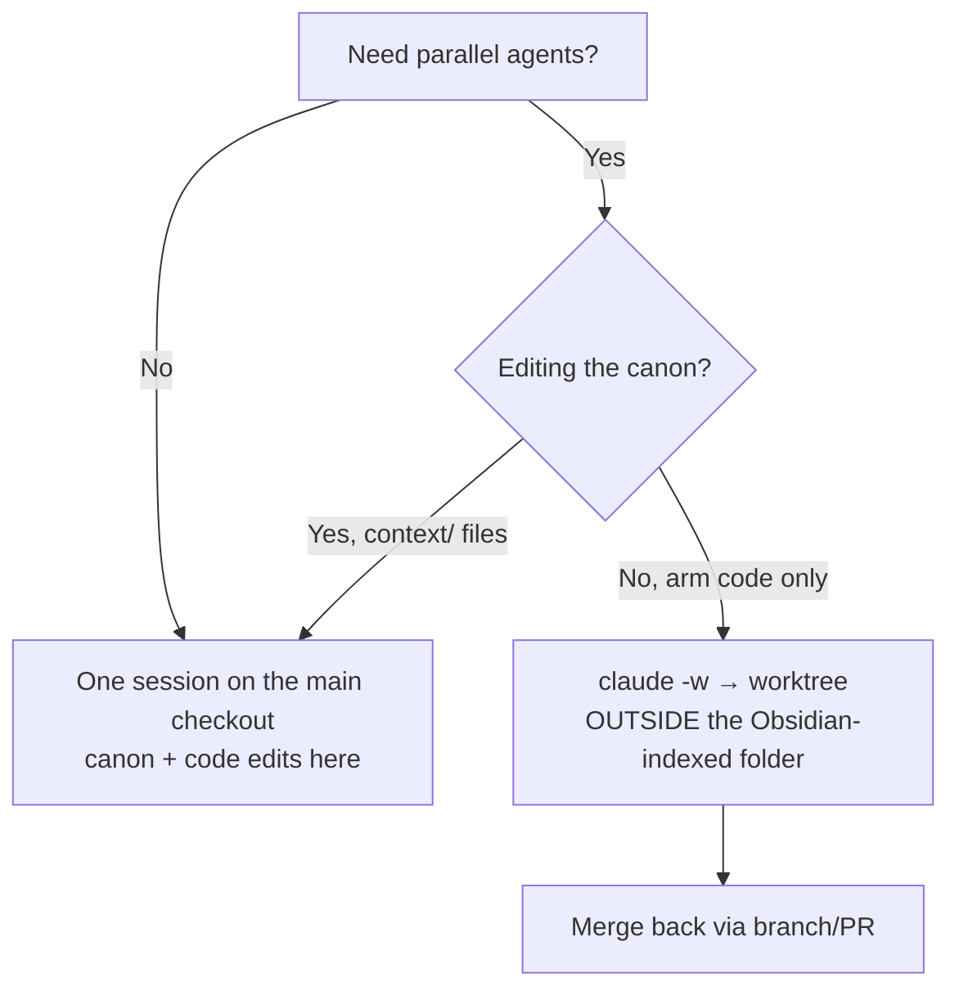

# CLAUDE_CODE_ONBOARDING — first-run guide for climateCCR

A companion reference (like `RETURN_TO_CLAUDE_AI.md` and `mkdp-tweaks.md`), **not** part of the seven-file canon. Suggested home: repo root, or `notes/setup/`. Verified against the official Claude Code docs (links inline) on 2026-06-27 — including the settings-precedence and permissions pages (<https://code.claude.com/docs/en/settings>, <https://code.claude.com/docs/en/permissions>); behaviour and version-gated features change, so re-check the docs map at <https://docs.claude.com/en/docs/claude-code/overview> when something looks off.

---

## TL;DR answers to the five questions

| # | Question | Short answer |
|---|---|---|
| 1 | System-wide file access? | **No.** Scoped to the directory you launch it in (cwd), plus `CLAUDE.md` files found walking up the parent chain. First launch per folder asks "do you trust the files here?". |
| 2 | Write to an external HDD without opening up everything? | **Yes.** Add *exactly that one path* with `--add-dir` / `/add-dir`, or pin it in `.claude/settings.local.json` via `additionalDirectories`. Grants that directory only — nothing else. (Use the **local** file, not the committed one — see §2.3.) |
| 3 | Can it do the climateCCR rewiring from the context files? | **Yes**, and it's a good fit — point `CLAUDE.md` at the canon, work in Plan mode, and stage the migration the way `GEN-09` already prescribes. |
| 4 | Pick a model per session? Different models per task in one session? | **Per session: yes** (`--model` at launch, `/model` to switch live). **Different models at once in one session: via subagents** — the main thread is one model at a time, but subagents can each run their own (e.g. Opus main + Haiku lookups). |
| 5 | Multiple sessions in one folder? | **Possible but risky** if they edit concurrently. The supported answer is **git worktrees** (`claude -w`) — one isolated checkout per agent. With your Obsidian vault there's a wrinkle worth reading (§5). |

---

## 1. File-access scope

By default Claude Code can read and edit files in **the directory where you launched it**, and it reads memory (`CLAUDE.md` / `CLAUDE.local.md`) recursively from the cwd up to — but not including — the filesystem root. It is **not** system-wide. See <https://code.claude.com/docs/en/permissions>.

The first time you run `claude` in a given folder it records a trust decision in `~/.claude.json`; on later launches in that same folder it won't re-prompt. (If you ever need to revoke trust, remove that folder's entry from `~/.claude.json`.)

On top of the directory scope sits a **tiered permission system** (allow / ask / deny) that lives in your `settings.json` files and that you can inspect with the `/permissions` command. The three settings files are:

```text
~/.claude/settings.json              # your personal, global defaults
<repo>/.claude/settings.json         # project rules (commit this)
<repo>/.claude/settings.local.json   # your machine-only overrides (git-ignore)
```

What belongs in each, how they merge, and how the permission rules work is detailed in §2.

## 2. Settings files, permissions, and data outside the repo

### 2.1 The three settings files — what goes where

Claude Code merges several `settings.json` layers. Precedence, highest to lowest: **managed** (IT-deployed `managed-settings.json`; not relevant to a solo thesis) > **command-line args** > **`.claude/settings.local.json`** (machine-local, git-ignored) > **`.claude/settings.json`** (project, committed) > **`~/.claude/settings.json`** (user/global). Arrays (`allow`/`ask`/`deny`/`additionalDirectories`) **concatenate** across layers; scalar keys are overridden by the higher-precedence layer; and a **deny at any layer beats an allow at any other**. Because arrays concatenate, you never repeat a rule across files — but it is safe to duplicate a critical `deny` for belt-and-suspenders.

The rule of thumb for which file to write to:

| File | Scope | Committed? | Put here |
|---|---|---|---|
| `~/.claude/settings.json` | every repo on this machine | n/a | personal defaults (model, subagent model) + your universal safety net: secret-file and destructive-command **deny** rules |
| `<repo>/.claude/settings.json` | this repo, anywhere/anyone | **yes** | project allow/ask/deny rules that should travel with the repo (and across the `/handoff-to-claude-ai` bundle) |
| `<repo>/.claude/settings.local.json` | this repo, this machine | no (git-ignored) | machine-specific paths and personal overrides — e.g. the HDD `additionalDirectories` (§2.3) |

One footgun: `~/.claude/settings.json` (settings) is **not** `~/.claude.json` (a separate state file holding theme, OAuth, and user/local-scope MCP servers). Putting settings keys into `~/.claude.json` triggers a schema error and is silently ignored. Add `"$schema": "https://json.schemastore.org/claude-code-settings.json"` at the top of each settings file for editor autocomplete and inline validation.

### 2.2 Permissions: `/permissions` is a command, not a folder

There is no `/permissions` directory and no per-rule file. `/permissions` is an **interactive UI inside the Claude Code REPL** that lists every permission rule and shows which `settings.json` each one came from. The three rule kinds are just arrays inside one `permissions` object:

```json
{
  "permissions": {
    "allow": [],
    "ask":   [],
    "deny":  []
  }
}
```

- **allow** — run the named tool with no prompt
- **ask** — always prompt for confirmation
- **deny** — block outright

Rules evaluate **deny → ask → allow**; the first match wins, and a broad deny (e.g. `Bash(git push *)`) cannot carry a narrower allow exception. Read-only commands (`ls`, `cat`, `grep`, `find`, `cd` inside the working dir, read-only `git` forms) already run without a prompt, so your allow lists only need the things that **write or execute**. You edit these arrays by hand, or let the `/permissions` UI (or a "Yes, don't ask again" prompt) write them back to whichever file you point it at.

Rule syntax is `Tool` or `Tool(specifier)`: `Bash(...)` uses shell-glob `*` (the space in `Bash(ls *)` enforces a word boundary, so it matches `ls -la` but not `lsof`); `Read`/`Edit`/`Write(...)` use gitignore-style path patterns; `WebFetch(domain:...)`; `mcp__server__tool`; `Agent(Name)`. Note that `Read`/`Edit` deny rules cover Claude's file tools and recognized file commands (`cat`, `sed`, …) but **do not** stop a Python or R script from opening a path itself — for OS-level enforcement you'd need the sandbox.

Two project-specific conventions are baked into the committed `settings.json`:

- `Edit(context/**)` sits on **ask**, so every canon edit is a deliberate checkpoint — the "promote, don't duplicate / one source of truth" rule (`WORKFLOW.md` §2, `00_README_CONTEXT.md` §4a). Because `ask` beats `allow`, this holds even if a broader allow is added later.
- `Edit(data/**)` and `Edit(results/**)` are **denied**, so Claude never hand-edits artifacts that must come from deterministic reconstructor scripts (`GEN-04`). Pipeline scripts still produce them through Bash (`python …`), which `Edit` deny rules don't touch — exactly the intended split.
- `Bash(* --forzar*)` is on **ask**, turning the idempotency override (`GEN-05`) into a confirmation point; `Bash(Rscript *)` (and any Stan-via-`Rscript` step) is gated the same way since it executes arbitrary code.

> Formatting hooks: a `PostToolUse` `ruff format` hook is *not* configured, deliberately — the
> `pre-commit` gate (`GEN-11`) already formats at commit time, and a per-edit hook would be redundant
> and could fight it. If you ever want one, it goes under a `hooks` key in the committed
> `settings.json`.

### 2.3 Writing data outside the repo (e.g. an external HDD)

This is exactly what "additional directories" are for, and it does **not** open up your whole disk — you add precisely the path(s) you name.

Three ways, in increasing permanence:

1. **One session, ad hoc:** start in the repo, then run `/add-dir /Volumes/ClimateHDD/climateCCR_data` (or run it at launch: `claude --add-dir /Volumes/ClimateHDD/climateCCR_data`).
2. **Always-on for this machine:** pin it in `additionalDirectories` in **`.claude/settings.local.json`** (git-ignored) so every launch includes it. Use the **local** file, not the committed `settings.json`: the mount path (`/Volumes/ClimateHDD/…`) is machine- and OS-specific, so committing it would ship dead config to any other checkout and into the `/handoff-to-claude-ai` bundle. *(This corrects an earlier draft of this doc, which placed it in the committed `settings.json`.)*
3. **Relocate the session entirely:** `/cd <path>` moves the *primary* working directory (loads that folder's `CLAUDE.md`, and `--resume` finds the session there). Requires Claude Code ≥ v2.1.169. This is heavier than you need for "also write data over there" — prefer `--add-dir` for the HDD.

```jsonc
// <repo>/.claude/settings.local.json   (git-ignored: machine-specific path)
{
  "permissions": {
    "additionalDirectories": ["/Volumes/ClimateHDD/climateCCR_data"]
  }
}
```

Files in an added directory follow the **same** permission rules as the repo: readable without prompts, edits gated by the current permission mode. One caveat from the docs: an added directory is **not** a full configuration root — most `.claude/` config is still only discovered from your primary repo, so keep your real settings/commands/agents in the repo, not on the HDD.

**Fit with your canon.** This dovetails with `GEN-10` (`data/` and `results/` are git-ignored; large data lives out-of-band) and `DC-CONV-1` (data under `data/<source>/{raw,interim,processed}`). The clean pattern: keep the repo on your SSD, point the pipelines' output roots at the HDD via `infra.ProjectPaths` / `configs/*.yaml` (`GEN-08`), and add the HDD path to `additionalDirectories` so Claude can write there. The provenance/manifest rules (`GEN-02`, `GEN-06`) don't care which physical disk the bytes land on.

> Practical note: mount the HDD at a stable path before launching (e.g. a fixed
> `/Volumes/ClimateHDD` or a symlink), so the configured directory always resolves. If it's
> unmounted, Claude simply can't see it — it won't silently write elsewhere.

## 3. Letting Claude Code do the climateCCR rewiring

Yes — refactoring scattered scripts into the installable `climateCCR` package is squarely what it's good at, and your canon is an asset here, not dead weight. A few things make this go well:

**Give it the canon as memory.** Put a short `CLAUDE.md` at the repo root that points at `context/` and states the house rules, rather than pasting everything in. Something like:

```markdown
# climateCCR — agent brief
Context canon is authoritative and lives in `context/`:
00_README_CONTEXT, DECISIONS, DATA_CONTRACTS, GLOSSARY, REFERENCES, OPEN_QUESTIONS, WORKFLOW.
Read DECISIONS.md and DATA_CONTRACTS.md before changing code in a given arm.

Rules:
- Package layout INT-01/CCR-ARCH-01: installable `src/climateCCR/...`, editable install.
- GEN-09: separate *behaviour* changes from *packaging/move* changes into distinct commits.
- GEN-01: every analytical decision cites a real ref or is marked [eng]; no invented citations.
- INT-07: English public API; Spanish data identifiers/CLI flags kept verbatim.
- PEP 8 + type hints on public APIs; tests per module (GEN-11).
- At end of a working session, produce the WORKFLOW.md closing digest.
```

**Work in Plan mode for the migration.** Ask it to read the relevant decisions and *propose* the move plan before touching anything, so you approve the shape first. This pairs naturally with `CCR-MIG-01` (move PIMPA in "behaviour-unchanged" first) and `CCR-MIG-03` (lock the EE/PE regression test *before* refactoring — have Claude write/confirm that test as step one, then refactor against it).

**Use checkpoints + git.** Claude Code checkpoints let you rewind its edits (`/rewind` or double-Esc) independently of git; combined with small commits (`GEN-09`) the migration stays auditable. Resolve the five missing HAZ files (`campo_viento.py`, `descarga_cenapred.py`, `agregacion_sequia.py`, `aliases_cnsf.json`, `explorar_xlsx_cnsf.py`) from your local machine first, or have Claude flag and stub them so imports don't break mid-rewire.

**One genuine limitation:** the read-only `/mnt/project/` copies that the claude.ai side sees do not sync back. In Claude Code the repo *is* read-write, so this is the side where canon edits should happen — then your existing `/handoff-to-claude-ai` bundle carries them across.

## 4. Model selection — per session and per task

**Per session:** pick at launch with `--model` (e.g. `claude --model opus`) or switch live with the `/model` picker — it takes effect immediately, no restart. `/status` shows the active model. The default depends on your plan, and is also settable as the `model` key in `~/.claude/settings.json` (the global file sets `opus` here). See <https://support.claude.com/en/articles/11940350-claude-code-model-configuration> and <https://code.claude.com/docs/en/model-config>.

**Different models for different tasks *within the same session*:** the main conversation runs **one model at a time**, but you have two levers:

- **Switch on the fly** with `/model` — but note that switching mid-session makes the new model reprocess the whole conversation so far (token cost). For long sessions, a fresh session per model is often cheaper.
- **Subagents, each on their own model** — this is the real answer to "Opus for hard stuff, Haiku for quick lookups in one session." A subagent's model is set in its definition frontmatter (`model: haiku`), via the Task tool's `model` parameter, or the `/agents` picker; you can also set `CLAUDE_CODE_SUBAGENT_MODEL` as a global default (the global `settings.json` sets it to `haiku`). The built-in **Explore** agent already runs on a Haiku-tier model for fast read-only searches, while your main thread stays on Opus. Each subagent has its own context window, so noisy exploration doesn't burn your main context.

A sensible default for this project: **main session on an Opus-tier model** for the cross-arm integration reasoning (jump-diffusion wiring, `INT-10`/`OQ-INT-*`), with **Haiku-tier subagents** for grep-style lookups across the canon and `find the five missing files`-type chores. Drop the *whole* session to Sonnet/Haiku for routine mechanical edits where Opus is overkill.

```markdown
<!-- .claude/agents/canon-lookup.md -->
---
name: canon-lookup
description: Fast read-only lookups across context/ and src/. Use for "where is X / which decision says Y".
model: haiku
---
You answer questions about the climateCCR canon and code by reading files only.
Cite decision IDs (e.g. CCR-MIG-03) and file paths. Do not edit anything.
```

## 5. Multiple sessions in one project/folder

You *can* open several `claude` sessions, but **two agents editing the same working tree at once** will step on each other (and on git). The supported pattern for parallel work is **git worktrees**:

- `claude -w` starts a session in a fresh worktree — its own checkout of the repo, isolated from the others. Agents then run in parallel without interfering, each on its own branch.
- `/batch` can fan a large, parallelizable job out across many worktree agents (built for exactly the "large code migration" case).
- Merge back through normal branches/PRs.

See the CLI reference (<https://code.claude.com/docs/en/cli-reference>) for worktree flags.

**Your Obsidian wrinkle — read this before you run `claude -w`.** A worktree is a *second copy of the tracked files on disk*. Your vault already had trouble with duplicate note names (that's why the rollback bundle is git-ignored — to stop Obsidian wikilink resolution from seeing two copies of a note). A worktree under or near the vault root would reintroduce exactly that: two `DECISIONS.md`, two `_INDEX.md`, ambiguous `[[wikilinks]]`. Mitigations:

- Create worktrees **outside** the vault's indexed folder (e.g. `~/worktrees/climateCCR-haz/`, with the vault pointed only at the canonical checkout), so Obsidian never indexes the parallel copy.
- Reserve worktrees for **code-heavy** parallel work (the arm pipelines), and keep **canon edits** (the `context/` files) to a **single** session on the main checkout — the canon is the one thing where two writers genuinely corrupts the source of truth, per the "promote, don't duplicate" rule in `WORKFLOW.md` §2 and `00_README_CONTEXT.md` §4(a).

If you don't need true parallelism, the simplest safe setup is **one Claude Code session per repo at a time**, which also matches your manual, ritual-driven workflow.



---

## First-run checklist

A linear path for your very first session. Assumes the repo is already a git repo (it is) and the canon is in `context/`.

1. **Confirm / install Claude Code.** If `claude --version` works, skip. Otherwise install per <https://docs.claude.com/en/docs/claude-code/overview> (native installer, or `npm install -g @anthropic-ai/claude-code` with a current Node LTS). Authenticate on first run.

2. **Launch in the repo root** (not a sub-folder), so it sees the whole package and the canon:
   ```bash
   cd ~/path/to/climateCCR && claude
   ```
   Answer **"Yes, proceed"** to the trust prompt (records to `~/.claude.json`).

3. **Add the `CLAUDE.md` brief** at the repo root (template in §3). Commit it.

4. **Add the HDD data path** if you're using one — `/add-dir /Volumes/ClimateHDD/climateCCR_data` for now, then promote it to `additionalDirectories` in **`.claude/settings.local.json`** (§2.3) once you're happy.

5. **Drop in the three settings files.** Personal/global defaults + safety-net denies go in `~/.claude/settings.json`; the committed project allow/ask/deny rules go in `<repo>/.claude/settings.json`; machine-local overrides (the HDD path) go in `<repo>/.claude/settings.local.json` (§2.1/§2.2). Commit the first two-relevant ones — i.e. commit `.claude/settings.json`; git-ignore `.claude/settings.local.json` (Claude Code auto-adds it to `.gitignore`). Then run `/permissions` to review what loaded and from where.

6. **Point it at the canon explicitly** for the first task:
   > Read `context/00_README_CONTEXT.md`, `context/DECISIONS.md`, and `context/DATA_CONTRACTS.md`.
   > Today I'm working on **[arm/module]**. In Plan mode, recall the decisions and open questions
   > that gate this, then propose a plan before editing.

   (This is your `WORKFLOW.md` §8 warm-start, adapted.)

7. **Pick your model.** `/model` → choose Opus-tier for the integration/migration reasoning. Add a Haiku-tier `canon-lookup` subagent (§4) for fast searches.

8. **Re-create your vault-aware slash commands** in `.claude/commands/` (`/link-check`, `/new-note`, `/handoff-to-claude-ai`) if they aren't committed yet, so they travel with the repo.

9. **Wire the Neovim bridge** — your `coder/claudecode.nvim` runs `provider="none"` alongside a Kitty split, so launch `claude` in the Kitty pane and let the WebSocket MCP bridge connect Neovim to it. Confirm the bridge sees the running session before relying on in-editor actions.

10. **Close with the ritual.** Before quitting, ask for the `WORKFLOW.md` closing digest (Decided /
    Changed / Open, each with an arm-prefixed ID + date + ref key), fold it into `DECISIONS.md`,
    update any contract/term/ref/open-item, and commit naming the module touched (`GEN-09`).

---

## Candidate canon entries (for you to ratify, not auto-applied)

If you want these recorded per the ritual, here are draft lines — verify and date them yourself:

```text
Decided:
- GEN-15 [2026-06-27] Bulk data writes target an external HDD path exposed to Claude Code via
  `additionalDirectories` in git-ignored `.claude/settings.local.json` (machine-specific mount path,
  not committed); repo stays on SSD, output roots set in configs via ProjectPaths (GEN-08/GEN-10).
  — [eng]
- GEN-16 [2026-06-27] Parallel Claude Code work uses git worktrees created OUTSIDE the Obsidian-
  indexed folder; canon (`context/`) edits are restricted to a single session on the main checkout
  to preserve one source of truth. — [eng]
- GEN-17 [2026-06-27] Claude Code settings layering: model + subagent-model defaults and secret-file
  / destructive-command `deny` rules in global `~/.claude/settings.json`; project allow/ask/deny in
  committed `.claude/settings.json` — with `Edit(context/**)` on `ask` (canon checkpoint) and
  `Edit(data/**)` / `Edit(results/**)` denied (artifacts come from reconstructors, GEN-04);
  machine-specific `additionalDirectories` in git-ignored `.claude/settings.local.json`. Rule
  evaluation is deny → ask → allow; arrays merge across layers; deny anywhere beats allow anywhere.
  — [eng]
Changed:
- CLAUDE_CODE_ONBOARDING §2: `additionalDirectories` moves from committed `.claude/settings.json` to
  `.claude/settings.local.json` (machine-specific path) — was: project settings.json.
```

(Whether these rise to canon decisions or stay in this setup doc is your call — they're tooling, not modelling, so `[eng]` either way.)

---

## Related
Pairs with: `WORKFLOW.md` (the ritual these steps feed) · `00_README_CONTEXT.md` (§4 maintenance rules) · `RETURN_TO_CLAUDE_AI.md` (the rollback path). Canon home: `_INDEX`.

#arm/int #type/workflow
